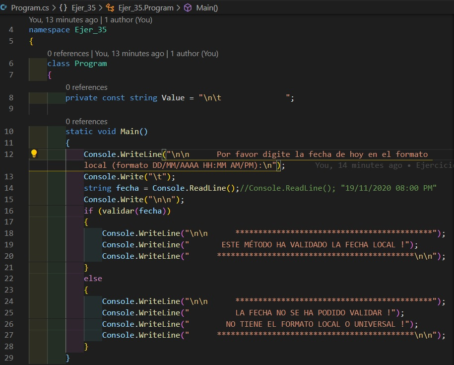
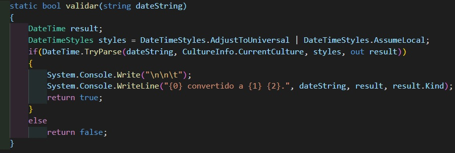
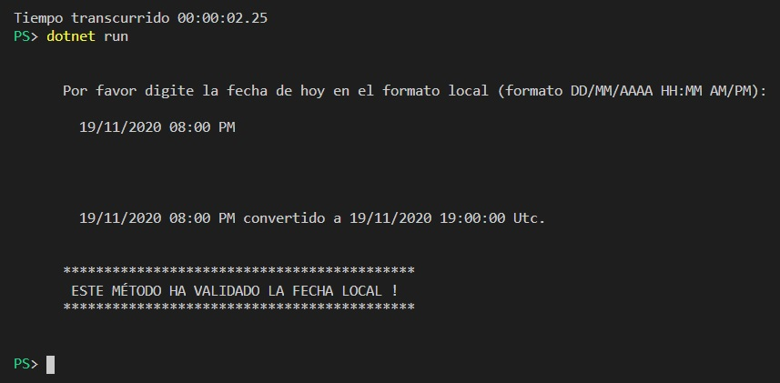

# Ejercicios Propuestos para el Examen de CSharp

## Entregar el url de GitHub con la solución y un readme con las siguiente información:

1. **Nombres y apellidos:** José René Fuentes Cortez
2. **Fecha:** 30 de Octubre 2020.
3. **Resumen de la Entrega:** La tarea individual consta de 15 ejercicios individuales a mi han tocados los siguientes:

##  Ejercicio CSharp No. 16
Las condiciones generales del ejercicio:

### Archivos:
- Archivo con el planteamiento del ejercicio en formato html:
[Ejercicio CSharp No. 16 - HTML](https://github.com/jfetff/CSharp-Programming/blob/master/EjerCShar-Examen/Ejer-CSharp-No-16.html)

- Archivo con el código CSharp para la solución del ejercicio:
[Ejercicio CSharp No. 16 -  C\#](./CSharp-Codigo/Ejer-16/Ejer-No-16.cs)

### Imagen con el Código del proyecto:

- La representación visual del codigo del ejercicio se muestra en la siguiente imagen:

### Imagen con el resultado después de la ejecución del proyecto:

- La representación visual de la resolución del ejercicio se muestra en la siguiente imagen:

---
##  Ejercicio CSharp No. 34
Las condiciones generales del ejercicio:

### Archivos:
- Archivo con el planteamiento del ejercicio en formato html:
[Ejercicio CSharp No. 34 - HTML](https://github.com/jfetff/CSharp-Programming/blob/master/EjerCShar-Examen/Ejer-CSharp-No-34.html)

- Archivo con el código CSharp para la solución del ejercicio:
[Ejercicio CSharp No. 34 -  C\#](./CSharp-Codigo/Ejer-34/Program.cs)

### Código:

- La representación visual del codigo del ejercicio se muestra en la siguiente imagen:

### Resultado:

- La representación visual de la resolución del ejercicio se muestra en la siguiente imagen:

---
##  Ejercicio CSharp No. 35
Las condiciones generales del ejercicio:

### Archivos:
- Archivo con el planteamiento del ejercicio en formato html:
[Ejercicio CSharp No. 35 - HTML](https://github.com/jfetff/CSharp-Programming/blob/master/EjerCShar-Examen/Ejer-CSharp-No-34.html)

- Archivo con el código CSharp para la solución del ejercicio:
[Ejercicio CSharp No. 35 -  C\#](./CSharp-Codigo/Ejer-35/Program.cs)

### Código:

- La representación visual de la implementación del método main del programa que llama al método bool que se implementa para la correcta resolución del ejercicio se muestra en la siguiente imagen:

- La representación visual de la implementación del método bool del ejercicio en su código C\# del ejercicio se muestra en la siguiente imagen:

### Resultado:

- La representación visual de la resolución del ejercicio se muestra en la siguiente imagen:

---
##  Ejercicio CSharp No. 38
La descripción del ejercicio se encuentra en el html que se describe a continuación:
<a href='Ejer-CSharp_No-.38html'>CSharp No. 38</a>

### Código:

- La representación visual del codigo del ejercicio se muestra en la siguiente imagen:

### Resultado:

Es necesario introducir la fecha en un formato de los siguientes:
- 19/11/2020
- 19/11/2020 06:00 PM
- Cualquier otro formato de fecha en castellano.
- La representación visual de la resolución del ejercicio se muestra en la siguiente imagen:

---
##  Ejercicio CSharp No. 104
La descripción del ejercicio se encuentra en el html que se describe a continuación:
<a href='Ejer-CSharp_No-104.html'>CSharp No. 104</a>

### Código:

- La representación visual del codigo del ejercicio se muestra en la siguiente imagen:

### Resultado:

- La representación visual de la resolución del ejercicio se muestra en la siguiente imagen:

---
##  Ejercicio CSharp No. 105
La descripción del ejercicio se encuentra en el html que se describe a continuación:
<a href='Ejer-CSharp_No-105.html'>CSharp No. 105</a>

### Código:

- La representación visual del codigo del ejercicio se muestra en la siguiente imagen:

### Resultado:

- La representación visual de la resolución del ejercicio se muestra en la siguiente imagen:

---
##  Ejercicio CSharp No. 157
La descripción del ejercicio se encuentra en el html que se describe a continuación:
<a href='Ejer-CSharp_No-157.html'>CSharp No. 157</a>

### Código:

- La representación visual del codigo del ejercicio se muestra en la siguiente imagen:

### Resultado:

- La representación visual de la resolución del ejercicio se muestra en la siguiente imagen:

---
##  Ejercicio CSharp No. 158
La descripción del ejercicio se encuentra en el html que se describe a continuación:
<a href='Ejer-CSharp_No-158.html'>CSharp No. 158</a>

### Código:

- La representación visual del codigo del ejercicio se muestra en la siguiente imagen:

### Resultado:

- La representación visual de la resolución del ejercicio se muestra en la siguiente imagen:

---
##  Ejercicio CSharp No. 182
La descripción del ejercicio se encuentra en el html que se describe a continuación:
<a href='Ejer-CSharp_No-182.html'>CSharp No. 182</a>

### Código:

- La representación visual del codigo del ejercicio se muestra en la siguiente imagen:

### Resultado:

- La representación visual de la resolución del ejercicio se muestra en la siguiente imagen:

---
##  Ejercicio CSharp No. 199
La descripción del ejercicio se encuentra en el html que se describe a continuación:
<a href='Ejer-CSharp_No-199.html'>CSharp No. 199</a>

### Código:

- La representación visual del codigo del ejercicio se muestra en la siguiente imagen:

### Resultado:

- La representación visual de la resolución del ejercicio se muestra en la siguiente imagen:

---
##  Ejercicio CSharp No. 216
La descripción del ejercicio se encuentra en el html que se describe a continuación:
<a href='Ejer-CSharp_No-216.html'>CSharp No. 216</a>

### Código:

- La representación visual del codigo del ejercicio se muestra en la siguiente imagen:

### Resultado:

- La representación visual de la resolución del ejercicio se muestra en la siguiente imagen:

---
##  Ejercicio CSharp No. 233
La descripción del ejercicio se encuentra en el html que se describe a continuación:
<a href='Ejer-CSharp_No-233.html'>CSharp No. 233</a>

### Código:

- La representación visual del codigo del ejercicio se muestra en la siguiente imagen:

### Resultado:

- La representación visual de la resolución del ejercicio se muestra en la siguiente imagen:

---
##  Ejercicio CSharp No. 250
La descripción del ejercicio se encuentra en el html que se describe a continuación:
<a href='Ejer-CSharp_No-250.html'>CSharp No. 250</a>

### Código:

- La representación visual del codigo del ejercicio se muestra en la siguiente imagen:

### Resultado:

- La representación visual de la resolución del ejercicio se muestra en la siguiente imagen:

---
##  Ejercicio CSharp No. 251
La descripción del ejercicio se encuentra en el html que se describe a continuación:
<a href='Ejer-CSharp_No-251.html'>CSharp No. 251</a>

### Código:

- La representación visual del codigo del ejercicio se muestra en la siguiente imagen:

### Resultado:

- La representación visual de la resolución del ejercicio se muestra en la siguiente imagen:

---
##  Ejercicio CSharp No. 272
La descripción del ejercicio se encuentra en el html que se describe a continuación:
<a href='Ejer-CSharp_No-272.html'>CSharp No. 272</a>

### Código:

- La representación visual del codigo del ejercicio se muestra en la siguiente imagen:

### Resultado:

- La representación visual de la resolución del ejercicio se muestra en la siguiente imagen:

