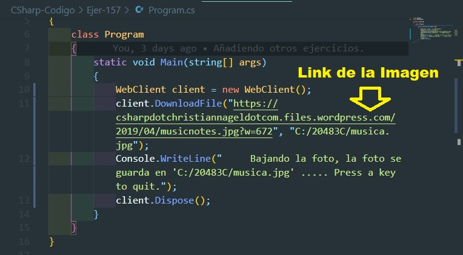
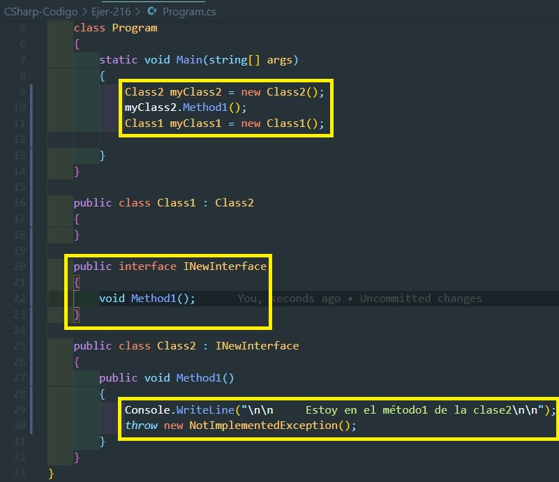
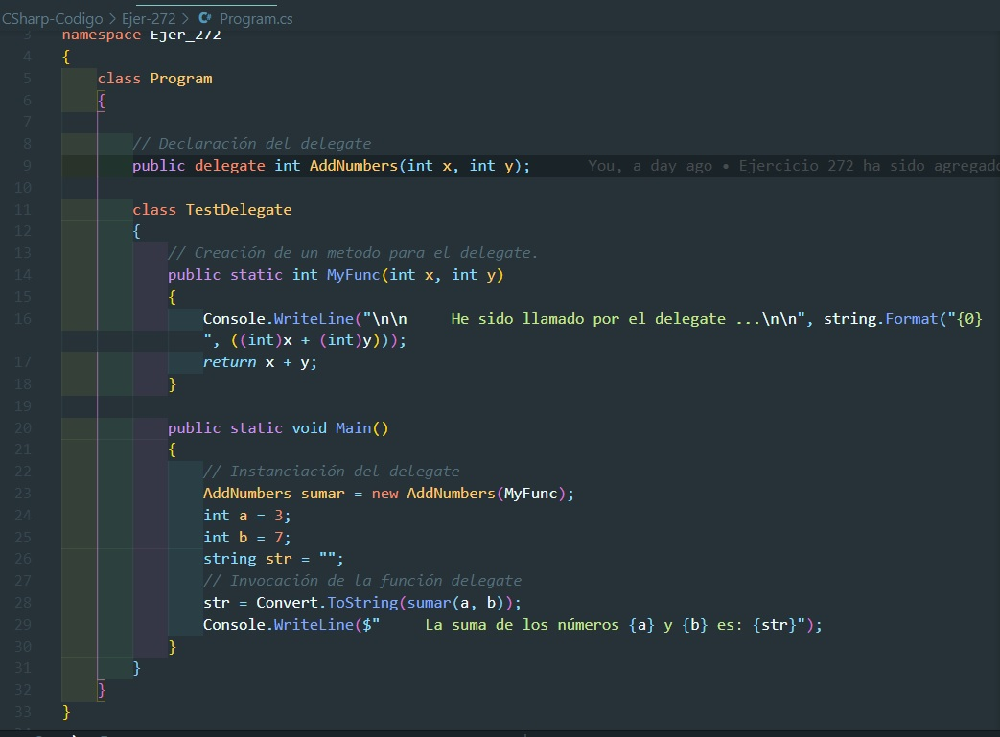

# Ejercicios Propuestos para el Examen de CSharp

## Entregar el url de GitHub con la solución y un readme con las siguiente información:

1. **Nombres y apellidos:** José René Fuentes Cortez
2. **Fecha:** 30 de Octubre 2020.
3. **Resumen de la Entrega:** La tarea individual consta de 15 ejercicios individuales a mi han tocados los siguientes:

##  Ejercicio CSharp No. 16
Las condiciones generales del ejercicio:

### Archivos:
- Archivo con el planteamiento del ejercicio en formato html:
[Ejercicio CSharp No. 16 - HTML](https://github.com/jfetff/CSharp-Programming/blob/master/EjerCShar-Examen/Ejer-CSharp-No-16.html)

- Archivo con el código CSharp para la solución del ejercicio:
[Ejercicio CSharp No. 16 -  C\#](./CSharp-Codigo/Ejer-16/Ejer-No-16.cs)

### Imagen con el Código del proyecto:

- Archivo con el código CSharp para la solución del ejercicio:
[Ejercicio CSharp No. 16 - C\#](./CSharp-Codigo/Ejer-CSharp-No-16/Ejer-No-16/Program.cs)

- La representación visual del codigo del ejercicio se muestra en la siguiente imagen:

### Imagen con el resultado después de la ejecución del proyecto:

- La representación visual de la resolución del ejercicio se muestra en la siguiente imagen:

---
##  Ejercicio CSharp No. 34
Las condiciones generales del ejercicio:

### Archivos:
- Archivo con el planteamiento del ejercicio en formato html:
[Ejercicio CSharp No. 34 - HTML](https://github.com/jfetff/CSharp-Programming/blob/master/EjerCShar-Examen/Ejer-CSharp-No-34.html)

### Código:

- Archivo con el código CSharp para la solución del ejercicio:
[Ejercicio CSharp No. 34 -  C\#](./CSharp-Codigo/Ejer-34/Program.cs)

- La representación visual del codigo del ejercicio se muestra en la siguiente imagen:

### Resultado:

- La representación visual de la resolución del ejercicio se muestra en la siguiente imagen:

---
##  Ejercicio CSharp No. 35
Las condiciones generales del ejercicio:

### Archivos:
- Archivo con el planteamiento del ejercicio en formato html:
[Ejercicio CSharp No. 35 - HTML](https://github.com/jfetff/CSharp-Programming/blob/master/EjerCShar-Examen/Ejer-CSharp-No-34.html)

- Archivo con el código CSharp para la solución del ejercicio:

[Ejercicio CSharp No. 35 -  C\#](./CSharp-Codigo/Ejer-35/Program.cs)

### Código:

- La representación visual de la implementación del método main del programa que llama al método bool que se implementa para la correcta resolución del ejercicio se muestra en la siguiente imagen:

- La representación visual de la implementación del método bool del ejercicio en su código C\# del ejercicio se muestra en la siguiente imagen:

### Resultado:

- La representación visual de la resolución del ejercicio se muestra en la siguiente imagen:

---
##  Ejercicio CSharp No. 38
La descripción del ejercicio se encuentra en el html que se describe a continuación:
<a href='Ejer-CSharp-No-38.html'>CSharp No. 38</a>

### Código:

- Archivo con el código CSharp para la solución del ejercicio:
[Ejercicio CSharp No. 38 -  C\#](./CSharp-Codigo/Ejer-38/Program.cs)

### Resultado:

Si la instancia de la clase Inventory es nulo primero se pone en 'lock' si es nulo. Luego si es nulo se instancia. La imagen siguiente muestra que si la instacia del tipo de Inventario no es nulo entonces imprimimos en la pantalla diciendo "E inventario es nulo por eso lo instanciamos".

- La representación visual del codigo del ejercicio se muestra en la siguiente imagen:

El ejercicio exige que para que tengamos un objeto de tipo Inventory en 'lock' si es nulo. Luego si es nulo se instancia. La imagen anterior muestra que si la instacia del tipo de Inventario no es nulo este directamente llama al método pintar diciendo "En inventario se ha instanciado desde el constructor".

En la siguiente imagen muestra el compilado del programa donde se muestra el log en la consola acerca del objeto inventario.

- La representación visual de la resolución del ejercicio se muestra en la siguiente imagen:

---
##  Ejercicio CSharp No. 104
La descripción del ejercicio se encuentra en el html que se describe a continuación:
<a href='Ejer-CSharp-No-104.html'>CSharp No. 104</a>

### Código:

- Archivo con el código CSharp para la solución del ejercicio:
[Ejercicio CSharp No. 104 -  C\#](./CSharp-Codigo/Ejer-104/Program.cs)

### Resultado:

- La representación visual de la resolución del ejercicio se muestra en la siguiente imagen:

- La representación visual del codigo del ejercicio se muestra en la siguiente imagen:

---
##  Ejercicio CSharp No. 105
La descripción del ejercicio se encuentra en el html que se describe a continuación:
<a href='Ejer-CSharp-No-105.html'>CSharp No. 105</a>

### Código:

- Archivo con el código CSharp para la solución del ejercicio:
[Ejercicio CSharp No. 105 -  C\#](./CSharp-Codigo/Ejer-105/Program.cs)

### Resultado:

La opción B da error ya que en el código dado no tiene constructor por eso la opción B 
no se puede compilar.
- La representación visual del codigo del ejercicio se muestra en la siguiente imagen:

Tal y como se muestra en el código dado en este ejercicio se han desarrollado cada una de
las opciones y sus correspondientes resultados.

- La representación visual de la resolución del ejercicio se muestra en la siguiente imagen:

---
##  Ejercicio CSharp No. 157
La descripción del ejercicio se encuentra en el html que se describe a continuación:
<a href='Ejer-CSharp-No-157.html'>CSharp No. 157</a>

### Código:

- Archivo con el código CSharp para la solución del ejercicio:
[Ejercicio CSharp No. 157 -  C\#](./CSharp-Codigo/Ejer-157/Program.cs)

Para la resolución del ejercicio hemos escogido una imagen al azar de una página Web. 
La dirección así como parte del código se muestra en la imagen a continuación.

- La representación visual del codigo del ejercicio se muestra en la siguiente imagen:

Para poder bajar la imagen hemos usado el inspector de Google tal y como se muestra en 
siguiente página. La imagen así como la obtención del link y se muestran en la siguiente imagen

- La representación visual del codigo del ejercicio se muestra en la siguiente imagen:

### Resultado:

En la siguiente imagen se muestra la ejecución del program y el mensaje de la descarga de la imagen
en la carpeta elegida.

- La representación visual de la resolución del ejercicio se muestra en la siguiente imagen:

La imagen que se va a bajar le hemos cambiado el nombre a 'musica.jpg'. La página web de 
donde se baja se muetra en la siguiente imagen.

- La representación visual de la resolución del ejercicio se muestra en la siguiente imagen:

La descarga de la imagen, así como el nuevo nombre de la imagen se muestra en la siguiente imagen.

- La representación visual de la resolución del ejercicio se muestra en la siguiente imagen:

---
##  Ejercicio CSharp No. 158
La descripción del ejercicio se encuentra en el html que se describe a continuación:
<a href='Ejer-CSharp-No-158.html'>CSharp No. 158</a>

### Código:

- Archivo con el código CSharp para la solución del ejercicio:
[Ejercicio CSharp No. 158 -  C\#](./CSharp-Codigo/Ejer-158/Program.cs)

Para la solución del ejercicio es necesario tener un objeto JSON del tipo Employee, el cual primero es serializado a Byte y luego pasado como una cadena de bytes a la MemoryStream.

- La representación visual del codigo muestra el primer paso que es:
    1. Hard code el objeto JSON del tipo empleado, luego convertir esta cadena JSON a Byte tal y como se muestra en la siguiente imagen:

- Luego en un try - catch envolvemos el código que es la respuesta correcta del ejercicio al ejecutar exitosamente el proyecto. 

    2. El código que ejecuta de manera exitosa la opción se muestra a continuación en una imagen:

### Resultado:

Una vez ejecutado el código obtenemos la deserialización del objeto Empleado. Para ello hemos creado una Clase de tipo Empleado y método es Print que imprime en la consola los datos correspondiente del Empleado una vez serializado.

- La representación visual de la resolución de lo antes explicado se muestra en la siguiente imagen:

---
##  Ejercicio CSharp No. 182
La descripción del ejercicio se encuentra en el html que se describe a continuación:
<a href='Ejer-CSharp-No-182.html'>CSharp No. 182</a>

### Código:

- Archivo con el código CSharp para la solución del ejercicio:
[Ejercicio CSharp No. 182 -  C\#](./CSharp-Codigo/Ejer-182/Program.cs)

La respuesta de esta pregunta es más teórica que técnica. La solución o explicación de la
pregunta se describe en el HTML de la misma pregunta. Ver el HTML de la misma pregunta.

- La representación visual del codigo del ejercicio se muestra en la siguiente imagen:

### Resultado:

- La representación visual de la resolución del ejercicio se muestra en la siguiente imagen:

---
##  Ejercicio CSharp No. 199
La descripción del ejercicio se encuentra en el html que se describe a continuación:
<a href='Ejer-CSharp-No-199.html'>CSharp No. 199</a>

### Código:

- Archivo con el código CSharp para la solución del ejercicio:
[Ejercicio CSharp No. 199 -  C\#](./CSharp-Codigo/Ejer-199/Program.cs)

Este ejercicio requiere que código dado se coloque consecuentemente para que se pueda 
lograr el objetivo, el cual es usar la clase StreamWriter, crear, escribir en un archivo de 
texto. El trabajo principal es saber como usar la mencionada clase en el order que se debe usar
para la creación de un archivo:
1. Crear una instancia de StreamWriter
2. Instanciar la cadena del camino donde se va a escribir el archivo.
3. Tener listo el valor, cadena o texto que se va a escribir el archivo.
4. Usar la instancia de la clase mencionada con el camino y valor/texto a escribir.
5. Escribir con la instancia de la clase, el archivo y el texto dado.

- La representación visual del codigo del ejercicio se muestra en la siguiente imagen:

### Resultado:

Una vez creado el archivo con el texto proporcionado, ubicamos el archivo donde se ha guardado.
En la misma imagen se muestra el archivo con texto escrito dado.

- La representación visual de la resolución del ejercicio se muestra en la siguiente imagen:

---
##  Ejercicio CSharp No. 216
La descripción del ejercicio se encuentra en el html que se describe a continuación:
<a href='Ejer-CSharp-No-216.html'>CSharp No. 216</a>

### Código:

- Archivo con el código CSharp para la solución del ejercicio:
[Ejercicio CSharp No. 216 -  C\#](./CSharp-Codigo/Ejer-216/Program.cs)

- La representación visual del codigo del ejercicio se muestra en la siguiente imagen:

### Resultado:

1. Si al llamar al Method1 desde una instancia de la Class2 se alza una excepción. **VERDADERO**

Tal y como se muestra en la siguiente imagen al instanciar el método1 con la clase2 se ve que la excepción "Unhandled exception" o excepción no implementada.

- La representación visual de la resolución del ejercicio se muestra en la siguiente imagen:

2. Si hacemos un cast a una instancia de la clase1 con una INewInterface se alzará una excepción. **FALSO**

Lo primero que hacemos es hacer un cast tal y como se muestra en la imagen siguiente.

- La representación visual de la resolución del ejercicio se muestra en la siguiente imagen:

Al ejecutar después de la compilación del programa podemos ver que no se alza ningún error por eso la respuesta es **FALSO**

3. Si la Clase2 usa una implementación implicita de la Interfase INewInterface. **FALSO**

Con implementaciones de interfaz implícitas, los miembros de la interfaz son públicos en la clase. Con implementaciones explícitas, en la clase, los miembros de la interfaz no se declaran como miembros públicos y no se puede acceder a ellos directamente usando una instancia de la clase, pero una transmisión a la interfaz permite acceder a los miembros. Entremos en los detalles.

Al implementar interfaces explícitamente, la interfaz ya no se declara pública con la implementación, y el miembro de la interfaz tiene como prefijo el nombre de la interfaz:

Al ejecutar el código podemos ver que hemos accedido al método que es llamado de forma explícita a la interfase por la 
clase2. La imagen siguiente se puede ver la ejecución mencionada.

Al ejecutar después de la compilación del programa podemos ver que no se alza ningún error por eso la respuesta es **FALSO**

---
##  Ejercicio CSharp No. 233
La descripción del ejercicio se encuentra en el html que se describe a continuación:
<a href='Ejer-CSharp-No-233.html'>CSharp No. 233</a>

### Código:

- Archivo con el código CSharp para la solución del ejercicio:
[Ejercicio CSharp No. 233 -  C\#](./CSharp-Codigo/Ejer-233/Program.cs)

De todas las opciones dadas solo la opción B ofrece el par 'Key:Value', tal y como es requerido en los planteamientos del ejercicio. Por eso nos concentramos en solo esta solución. En el código presentados en la imagen se ve los elementos que se han agregados a cada uno de los diccionarios.

Aquí solo presentamos la Respuesta correcta, el código para la representación de ejemplos de diccionarios se muestra en la imagen siguiente.

- La representación visual del codigo del ejercicio se muestra en la siguiente imagen:

### Resultado:

Hemos creado dos diccionarios con elementos para cada uno de ellos. En la imagen siguientes mostramos el nombre de cada uno de ellos y el conteo de los elementos que contienen.

- La representación visual de la resolución del ejercicio se muestra en la siguiente imagen:

---
##  Ejercicio CSharp No. 250
La descripción del ejercicio se encuentra en el html que se describe a continuación:
<a href='Ejer-CSharp-No-250.html'>CSharp No. 250</a>

### Código y Resultado:

- Archivo con el código CSharp para la solución del ejercicio:
[Ejercicio CSharp No. 250 -  C\#](./CSharp-Codigo/Ejer-250/Program.cs)

1. Resolución de la Caja No. 1
La parte del código así como el resultado de la ejecución del programa para la caja No. 1
se puede ver en la siguiente imagen:

- La representación visual del codigo del ejercicio se muestra en la siguiente imagen:

2. Resolución de la Caja No. 2
La parte de la ejecución del programa para la caja No. 2
se puede ver en la siguiente imagen:

- La representación visual del codigo del ejercicio se muestra en la siguiente imagen:

La parte del código para la solución del programa para la caja No. 2
se puede ver en la siguiente imagen:

- La representación visual del codigo del ejercicio se muestra en la siguiente imagen:

3. Resolución de la Caja No. 3
La parte de la ejecución del programa para la caja No. 3
se puede ver en la siguiente imagen:

- La representación visual de la ejección del código del ejercicio se muestra en la siguiente imagen:

La parte del código para la solución del programa para la caja No. 3
se puede ver en la siguiente imagen:

- La representación visual del codigo del ejercicio se muestra en la siguiente imagen:

---
##  Ejercicio CSharp No. 251
La descripción del ejercicio se encuentra en el html que se describe a continuación:
<a href='Ejer-CSharp-No-251.html'>CSharp No. 251</a>

### Código:

- Archivo con el código CSharp para la solución del ejercicio:
[Ejercicio CSharp No. 251 -  C\#](./CSharp-Codigo/Ejer-251/Program.cs)

- La representación visual del codigo del ejercicio se muestra en la siguiente imagen:

### Resultado:

- La representación visual de la resolución del ejercicio se muestra en la siguiente imagen:

---
##  Ejercicio CSharp No. 272
La descripción del ejercicio se encuentra en el html que se describe a continuación:
<a href='Ejer-CSharp-No-272.html'>CSharp No. 272</a>

### Código:

- Archivo con el código CSharp para la solución del ejercicio:
[Ejercicio CSharp No. 272 -  C\#](./CSharp-Codigo/Ejer-272/Program.cs)

- La representación visual del codigo del ejercicio se muestra en la siguiente imagen:

- La representación visual de la ejecución del codigo del ejercicio se muestra en la siguiente imagen:

### Resultado:

Primero hay que mencionar que seguramente en este ejercicio hay una errata. Esta misma es el segundo argumento a rellenera o Target 2. Claramente se ve que en cuerpo del método dado, este mismo devuelve la suma x + y, que es un entero. Por lo escrito anteriormente Target 2 no puede ser void. Este último tiene que ser int o entero. De lo contrario la declaración del delegate estaría errada.

**Las opciones dadas son:**

- Target 1:

    * Esta no puede ser 'class' por que no debiera terminar con ';' y tendría que seguir el cuerpo de la clase.
    * La Opción 'delegate' en la correcta por que es una declaración o definición de una función.
    * Protected: podría ser protected pero el cuerpo de este método no existe.
    * public: esta opción al igual que la anterior también podría ser protected pero el cuerpo de este método no existe.

- Target 2:

    * Class: es una opción pero no puede ser, porque no debiera terminar con ';' y tendría que seguir el cuerpo de la clase.
    * El Target 2 no puede ser un modificar de acceso como protected, public, private, no puede ir en una segunda posición Los modificadores de accesso usualmente van de primero y no de segundo. En la segunda posisión de la firma del método es el tipo de valor devuelto. Para nosotros debería ser 'int' y no 'void' como es dado en el respuesta del ejercicio.

- Target 3:

    * La Opción 'class' no puede ser por la propia ubicación de esta palabra.
    * La Opción 'delegate' es la respuesta correcta y esta coincide con la definición, instanciación y llamado de un delegate.
    * Las Opciones 'int' 'interface' y 'void' no pueden ser ya que el Target 3 esta a la derecha de un '=' por lo que Claramente es una asignación y no pueden situarse en esa posición.

