# Laboratorio Módulo 2 - Creación de métodos, manejo de excepciones y aplicaciones de monitoreo


## Lab: Extendiendo la funcionalidad de la aplicación de inscripción de clases


Tiempo estimado: **90 minutos**

Fichero de Instrucciones: Instructions\20483C_MOD02_LAK.md

Entregar el url de GitHub con la solución y un readme con las siguiente información:

1. **Nombres y apellidos:** José René Fuentes Cortez
2. **Fecha:** 14 de Octubre 2020.
3. **Resumen del Modulo 2:** Este módulo consta de tres ejercicios:
    -  En el primer ejercio nos ayuda a actualizar la aplicación para refactorizar el código duplicado en métodos reutilizables.
    - En el ejercicio 2 los datos del estudiante serán validados antes de ser guardados por la aplicación.
    - En el ejercicio 3 hacemos que la aplicación pueda manipular los datos modificados del estudiante para que se  guarden en la base de datos.


4. **Dificultad o problemas presentados y como se resolvieron:** Ninguna.

**NOTA**: Si no hay descripcion de problemas o dificultades, y al yo descargar el código para realizar la comprobacion y el código no funcionar, el resultado de la califaciación del laboratorio será afectado.

---

### Configuración del Lab

1. Asegúrate de que has clonado el directorio 20483C de GitHub. Contiene los segmentos de código para los laboratorios y demostraciones de este curso. (**https://github.com/MicrosoftLearning/20483-Programming-in-C-Sharp/tree/master/Allfiles**
2. Prepare su base de datos:
   - Abre el **Explorador de Files** y navega a **[Repository Root]\Allfiles\Mod01\Labfiles\Databases**.
   - Haz doble clic en **SetupSchoolDB.cmd**.
      >**Nota:** Si aparece un diálogo de Windows protegido de tu PC, haz clic en **Más información** y luego en **Ejecutar de todos modos**.
   - Cierra **Explorador de Files**.


## Ejercicio 1: Refactorización del Código de Inscripción

### Tarea 1: Copiar el código para editar un estudiante en el manejador de eventos StudentsList_MouseDoubleClick

1. Abrir **Visual Studio 2019**.
2. En **Visual Studio**, en el menú **Archivo**, apunta a **Abrir**, y luego haz clic en **Proyecto/Solución**.
3. En el cuadro de diálogo **Abrir Proyecto**, apunta a **[Repository root]\Allfiles\Mod02\Labfiles\Starter\Exercise 1**, apunta a **School.sln**, y luego haz clic en **Abrir**.
   >**Nota :** Si aparece cualquier cuadro de diálogo de advertencia de seguridad, desmarca la casilla **Ask me for each project in this solution** y luego haz clic en **OK**.
4. En el menú **Ver**, haga clic en **Lista de tareas**.
5. Haga doble clic en el **// TODO: Ejercicio 1: Tarea 1a: Copie el código para editar los detalles de esa tarea del estudiante**, debajo del comentario localice el código, y luego copie el siguiente código al portapapeles:
    ```cs
    Student student = this.studentsList.SelectedItem as Student;

    // TODO: Exercise 1: Task 3a: Refactor as the editStudent method

    // Use the StudentForm to display and edit the details of the student
    StudentForm sf = new StudentForm();

    // Set the title of the form and populate the fields on the form with the details of the student
    sf.Title = "Edit Student Details";
    sf.firstName.Text = student.FirstName;
    sf.lastName.Text = student.LastName;
    sf.dateOfBirth.Text = student.DateOfBirth.ToString("d");

    // Format the date to omit the time element

    // Display the form
    if (sf.ShowDialog().Value)
    {
        // When the user closes the form, copy the details back to the student
        student.FirstName = sf.firstName.Text;
        student.LastName = sf.lastName.Text;
        student.DateOfBirth = DateTime.Parse(sf.dateOfBirth.Text);

        // Enable saving (changes are not made permanent until they are written back to the database)
        saveChanges.IsEnabled = true;
    }
    ```
6. Haga doble clic en el **TODO: Exercise 1: Task 1b: If the user double-clicks a student, edit the details for the student**
7. Pegue el código del portapapeles en el método **studentsList_MouseDoubleClick**.

### Tarea 2: Ejecutar la aplicación y verificar que el usuario puede ahora hacer doble clic en un estudiante para editar sus detalles

1. En el menú **Construir**, haga clic en **Construir solución**.
2. En el menú **Debug**, haga clic en **Iniciar sin depuración**.
3. Haga clic en la fila que contiene el nombre **Kevin Liu** y luego presione Enter.
4. Verifique que aparezca la ventana **Editar detalles del estudiante**, mostrando los detalles correctos.
5. En el cuadro de texto **Last Name**, borre el contenido existente, escriba **Cook** y luego presione **OK**.
6. Verifique que **Liu** ha cambiado a **Cook** en la lista de estudiantes, y que el botón **Guardar cambios** está ahora habilitado.

El resultado visual del punto anterior se muestra en la siguiente imagen:

  

7. Haga doble clic en la fila que contiene el nombre **George Li**.
8. Verifique que la ventana **Editar detalles del estudiante** aparece, mostrando los detalles correctos.
9. En el cuadro de texto **firstName**, borre el contenido existente, y luego escriba **Darren**.
10. En el cuadro de texto **Last Name**, borre el contenido existente, escriba **Parker**, y luego haga clic en **OK**.
11. Verifica que **George Li** ha cambiado a **Darren Parker**.
12. Cierre la aplicación.


### Tarea 3: Refactorizar la lógica que añade y elimina un estudiante en los métodos AddNewStudent y DeleteStudent y EditStudent

1. En la ventana **Task List**, haga doble clic en la tarea **TODO: Ejercicio 1: Tarea 3a: Refactor como el método AddNewStudent**.
2. En el editor de códigos, localice el bloque **case Key.Insert:**, y luego resalte el siguiente código:
    ```cs
    // TODO: Exercise 1: Task 3a: Refactor as the addNewStudent method

    // Use the StudentsForm to get the details of the student from the user
    sf = new StudentForm();

    // Set the title of the form to indicate which class the student will be added to (the class for the currently selected teacher)
    sf.Title = "New Student for Class " + teacher.Class;

    // Display the form and get the details of the new student
    if (sf.ShowDialog().Value)
    {
        // When the user closes the form, retrieve the details of the student from the form

        // and use them to create a new Student object
        Student newStudent = new Student();
        newStudent.FirstName = sf.firstName.Text;
        newStudent.LastName = sf.lastName.Text;
        newStudent.DateOfBirth = DateTime.Parse(sf.dateOfBirth.Text);

        // Assign the new student to the current teacher
        this.teacher.Students.Add(newStudent);

        // Add the student to the list displayed on the form
        this.studentsInfo.Add(newStudent);

        // Enable saving (changes are not made permanent until they are written back to the database)
        saveChanges.IsEnabled = true;
    }
    ```
3. En el menú **Editar**, apunte a **Refactor**, y luego haga clic en **Método de extracción**.
4. En el editor de código renombre el "NewMethod" a "AddNewStudent" y luego haga clic en **Aplicar**.
5. Localiza el método **AddNewStudent** y en el método, modifica el código **sf = new StudentForm();** para que se vea como el siguiente código:
    ```cs
    StudentForm sf = new StudentForm();
    ```
6. En la ventana **Task List**, haga doble clic en el **TODO: Ejercicio 1: Tarea 3b: Refactor como la tarea del método removeStudent**.
7. En el editor de códigos, localice el bloque **case Key.Delete** y corte el siguiente código en el portapapeles:
    ```cs
    // TODO: Exercise 1: Task 3b: Refactor as the removeStudent method

    // Prompt the user to confirm that the student should be removed
    MessageBoxResult response = MessageBox.Show(
    String.Format("Remove {0}", student.FirstName + " " + student.LastName),
    "Confirm",
    MessageBoxButton.YesNo,
    MessageBoxImage.Question,
    MessageBoxResult.No);

    // If the user clicked Yes, remove the student from the database
    if (response == MessageBoxResult.Yes)
    {
        this.schoolContext.Students.DeleteObject(student);

        // Enable saving (changes are not made permanent until they are written back to the database)
        saveChanges.IsEnabled = true;
    }
    ```
8. En el editor de códigos, en el bloque **case Key.Delete:**, haga clic al final de la línea de código **student = this.studentsList.SelectedItem as Student;** , presione Enter, y luego escriba el siguiente código:
    ```cs
    RemoveStudent(student);
    ```
9. Haga clic con el botón derecho del ratón en el método **RemoverStudent(student)**, apunte a **Acción rápida y refactorización...**, y luego haga clic en **Generar método 'MainWindow.RemoveStudent'**.
10. Localice el método **RemoveStudent** debajo del método **studentsList_KeyDown**, elimine todo el código generado en este método, y luego pegue el código del portapapeles.
11. Haga doble clic en la tarea **// TODO: Exercise 1: Task 3c: create Edit student method** debajo del comentario, añada el siguiente código:
    ```cs
    private void EditStudent(Student student)
    {

    }
    ```
12. Haga doble clic en el **// TODO: Exercise 1: Task 3d: Refactor as the EditStudent method**, debajo del comentario localizar el código, y cortar el siguiente código al portapapeles:
    >**Nota :** Asegúrate de que el cursor está en el método StudentList_KeyDown.
    ```cs
    // TODO: Exercise 1: Task 3d: Refactor as the EditStudent method

    // Use the StudentsForm to display and edit the details of the student
    StudentForm sf = new StudentForm();

    // Set the title of the form and populate the fields on the form with the details of the student
    sf.Title = "Edit Student Details";
    sf.firstName.Text = student.FirstName;
    sf.lastName.Text = student.LastName;
    sf.dateOfBirth.Text = student.DateOfBirth.ToString("d"); // Format the date to omit the time element

    // Display the form
    if (sf.ShowDialog().Value)
    {
        // When the user closes the form, copy the details back to the student
        student.FirstName = sf.firstName.Text;
        student.LastName = sf.lastName.Text;
        student.DateOfBirth = DateTime.Parse(sf.dateOfBirth.Text);

        // Enable saving (changes are not made permanent until they are written back to the database)
        saveChanges.IsEnabled = true;
    }
    ```
13. Reemplaza el código por el siguiente código:
    ```cs
    EditStudent(student);
    ```
14. Pega el código que cortaste de la tarea anterior al método **EditStudent**.
15. Localiza el método **studentsList_MouseDoubleClick** y sustituye el código dentro del método por el siguiente código:
    ```cs
    Student student = this.studentsList.SelectedItem as Student;
    EditStudent(student);
    ```

### Tarea 4: Verificar que los estudiantes aún pueden ser añadidos y eliminados de la aplicación

1. En el menú **Construir**, haga clic en **Construir solución**.
2. En el menú **Debug**, haga clic en **Iniciar sin depuración**.
3. Haga clic en la fila que contiene el nombre **Kevin Liu**, y luego presione Insertar.
4. Verifique que aparezca la ventana **Nuevo estudiante para la clase 3C**.
5. En el cuadro de texto **firstName**, escriba **Dominik**.
6. En el cuadro de texto de **Last Name**, escriba **Dubicki**.
7. En el cuadro de texto **Date Of Birth**, escriba **02/03/2006** y luego haga clic en **OK**.
8. Verifica que **Dominik Dubicki** ha sido añadido a la lista de estudiantes.

El resultado visual del punto anterior se muestra en la siguiente imagen:

  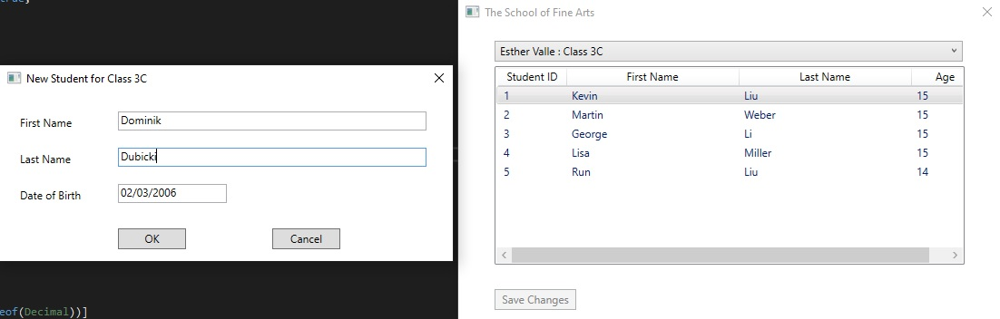

El resultado visual del punto anterior se muestra en la siguiente imagen:

  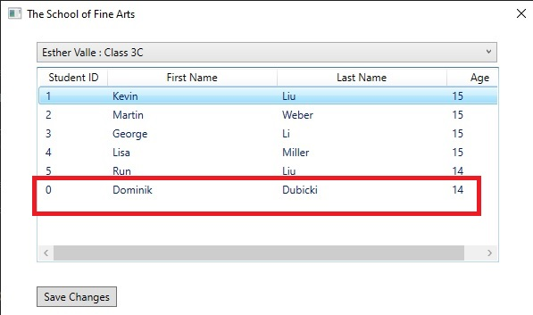

9. Haga clic en la fila que contiene el nombre **Run Liu**, y luego presione Borrar.
10. Verifique que aparezca el mensaje de confirmación.

El resultado visual del punto anterior se muestra en la siguiente imagen:

  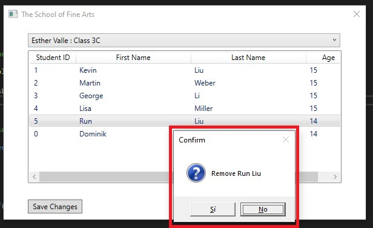

11. Haga clic en **Sí**, y luego verifique que **Corre Liu** sea eliminado de la lista de estudiantes.
12. Cierre la aplicación.


### Tarea 5: Depurar la aplicación y entrar en el nuevo método llama

1. En el editor de códigos, localiza el método **studentsList_KeyDown**, haz clic con el botón derecho del ratón en la frase **switch (e.key)**, apunta a **Breakpoint**, y luego haz clic en **Insert Breakpoint**.
2. En el menú **Debug**, haga clic en **Iniciar depuración**.
3. Haga clic en la fila que contiene el nombre **Kevin Liu** y pulse Intro.
4. En **Visual Studio**, haz clic en la pestaña **Call Stack**.
5. Tenga en cuenta que el nombre del método actual se muestra en la ventana **Call Stack**.
6. En **Visual Studio**, haga clic en la pestaña **Locals**.
7. Observe que las variables locales, **esto**, **remitente** y **e**, se muestran en la ventana **Locals**.

El resultado visual del punto anterior se muestra en la siguiente imagen:

  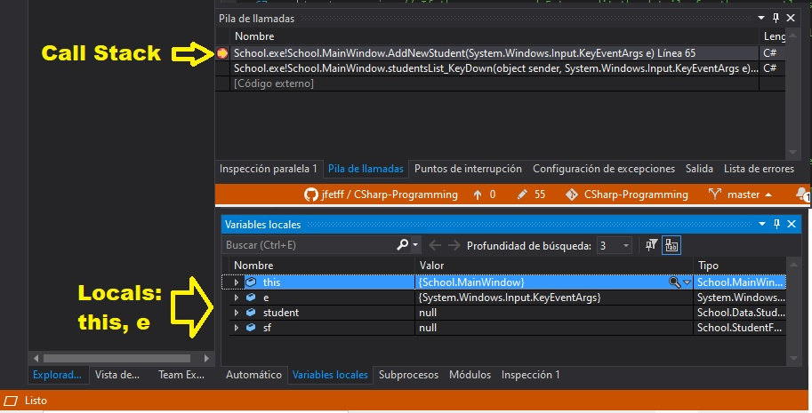


8. En el menú **Debug**, haga clic en **Step Over**.
9. Repita el paso 8.
10. Mira la ventana de **Locals**, y observa que después de pasar por encima del código **Estudiante estudiante = this.studentsList.SelectedItem as Student;**, el valor de la variable **student** ha cambiado de **null** a **School.Data.Student**.
11. En la ventana **Locals**, expande **student** y anota los valores de **_FirstName** y **_LastName**.
12. En el menú **Debug**, haga clic en **Paso a**.

El resultado visual del punto anterior se muestra en la siguiente imagen:

  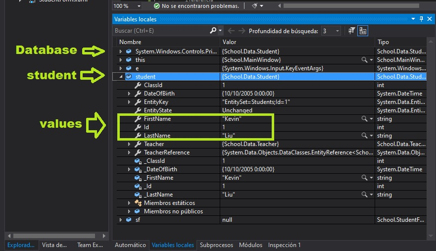

13. Observe que la ejecución pasa al método **EditStudent**, y el nombre de este método se ha añadido a la pila de llamadas.
14. En la ventana **Locals**, observe que las variables locales han sido cambiadas a **esto**, **student**, y **sf**.
15. En el menú **Debug**, haga clic en **Step Over**.
16. Repita el paso 15, cinco veces.
17. En la ventana de **Locals**, expande **student** y anota los valores para **dateOfBirth**, **firstName** y **Last Name**.
18. En el menú **Debug**, haga clic en **Step Out** para ejecutar el código restante en el método **editStudent** y salga de nuevo al método de llamada.
19. En la ventana **Editar detalles del estudiante**, haga clic en **Cancelar**.
20. Observe que la ejecución vuelve al método **studentsList_KeyDown**.
21. En el menú **Debug**, haga clic en **Step Over**.
22. En el menú **Debug**, haga clic en **Continuar**.
23. Haga clic en la fila que contiene el nombre **Kevin Liu** y pulse Insertar.
24. En el menú **Debug**, haga clic en **Step Over**.
25. En el menú **Debug**, haga clic en **Paso hacia adentro**.
26. Observe que la ejecución pasa al método **AddNewStudent**.
27. En el menú **Debug**, haga clic en **Step Out** para ejecutar el código restante en el método **AddNewStudent** y salga de nuevo al método de llamada.
28. En la ventana **Nuevo estudiante para la clase 3C**, haga clic en **Cancelar**.
29. Note que la ejecución regresa al método **studentsList_KeyDown**.
30. En el menú **Debug**, haga clic en **Step Over**.
31. En el menú **Debug**, haga clic en **Continuar**.
32. Haga clic en la fila que contiene el nombre **George Li** y presione Borrar.
33. En el menú **Debug**, haga clic en **Step Over**.
34. Repita el paso 33.
35. En el menú **Debug**, haga clic en **Paso hacia adentro**.

El resultado visual del punto anterior se muestra en la siguiente imagen:

  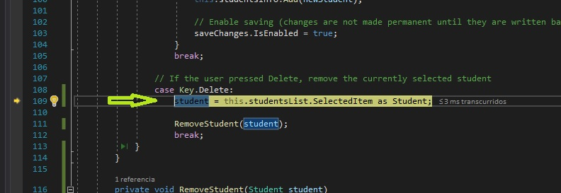

36. Observe que la ejecución pasa al método **RemoverStudent**.
37. En el menú **Debug**, haga clic en **Step Out** para ejecutar el código restante en el método **RemoveStudent** y salga de nuevo al método de llamada.

El resultado visual del punto anterior se muestra en la siguiente imagen:

  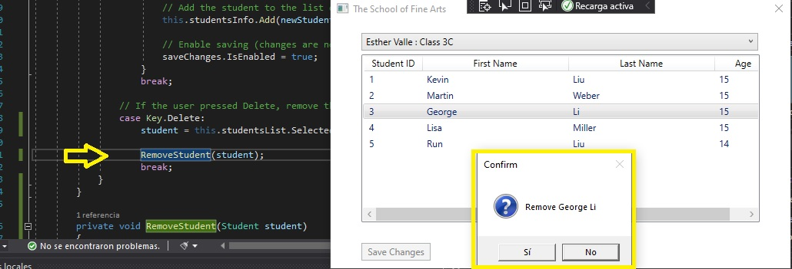


38. En el cuadro de mensaje **Confirmar**, haga clic en **No**.
39. Observe que la ejecución vuelve al método **studentList_KeyDown**.
40. En el menú **Debug**, haga clic en **Step Over**.
41. En el menú **Debug**, haga clic en **Continuar**.
42. Cierre la aplicación
43. En **Visual Studio**, en el menú **Debug**, haga clic en **Borrar todos los puntos de ruptura**.
44. En el cuadro de mensajes de **Microsoft Visual Studio**, haz clic en **Sí**.
45. En el menú **Archivo**, haz clic en **Cerrar solución**.

   >**Resultados:** Después de completar este ejercicio, deberías haber actualizado la aplicación para refactorizar el código duplicado en métodos reutilizables.


## Ejercicio 2: Validar la información del estudiante

### Tarea 1: Ejecutar la aplicación y observar que los detalles del estudiante que no son válidos pueden ser introducidos

1. En **Visual Studio**, en el menú **Archivo**, apunte a **Abrir**, y luego haga clic en **Proyecto/Solución**.
2. En el cuadro de diálogo **Abrir Proyecto**, apunta a **[Repository root]\Allfiles\Mod02\Labfiles\Starter\Exercise 2**, apunta a **School.sln**, y luego haz clic en **Abrir**.
   >**Nota :** Si aparece cualquier cuadro de diálogo de advertencia de seguridad, desmarca la casilla **Ask me for each project in this solution** y luego haz clic en **OK**.
3. En el menú **Construir**, haga clic en **Construir solución**.
4. En el menú **Debug**, haga clic en **Iniciar sin depuración**.
5. Haga clic en la fila que contiene el nombre **Kevin Liu**, y luego presione Insertar.
6. Deje los cuadros de texto **First Name** y **Last Name** vacíos.
7. En el cuadro de texto **Date Of Birth**, escriba **10/06/3012**, y luego haga clic en **OK**.

El resultado visual del punto anterior se muestra en la siguiente imagen:

  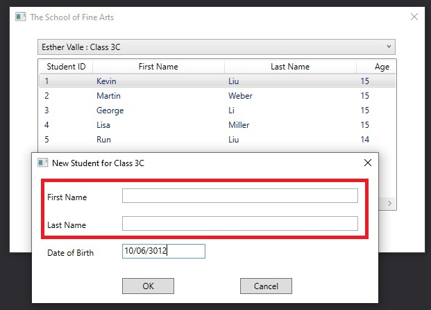

8. Verifique que se haya agregado una nueva fila a la lista de estudiantes, que contenga un nombre y apellido en blanco y una edad negativa.

El resultado visual del punto anterior se muestra en la siguiente imagen:

  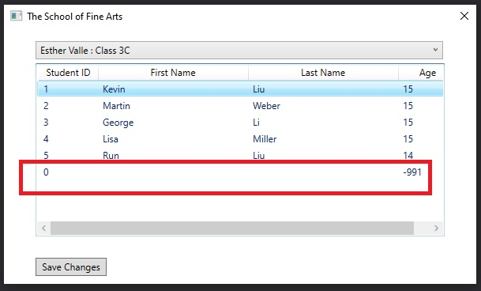

9. Cierre la aplicación.

### Tarea 2: Añadir código para validar los campos de nombre y apellido

1. En la ventana **Task List**, haga doble clic en el **TODO: Exercise 2: Task 2a: Check that the user has provided a first name** de tarea.
2. En el editor de códigos, haga clic al final de la línea de comentarios, presione Enter, y luego escriba el siguiente código:
    ```cs
    if (String.IsNullOrEmpty(this.firstName.Text))
    {
        MessageBox.Show("The student must have a first name", "Error", MessageBoxButton.OK, MessageBoxImage.Error);
        return;
    }
    ```
3. En la ventana **Task List**, haga doble clic en el **TODO: Exercise 2: Task 2b: Check that the user has provided a last name** tarea.
4. En el editor de códigos, haga clic al final de la línea de comentarios, presione Enter, y luego escriba el siguiente código:
    ```cs
    if (String.IsNullOrEmpty(this.lastName.Text))
    {
        MessageBox.Show("The student must have a last name", "Error", MessageBoxButton.OK, MessageBoxImage.Error);
        return;
    }
    ```

### Tarea 3: Añadir código para validar la fecha de nacimiento

1. En la ventana **Task List**, haga doble clic en la tarea **TODO: Exercise 2: Task 3a: Check that the user has entered a valid date for the date of birth** de la tarea.
2. En el editor de códigos, haga clic al final de la línea de comentarios, presione Enter, y luego escriba el siguiente código:  
    ```cs
    DateTime result;

    if (!DateTime.TryParse(this.dateOfBirth.Text, out result))
    {
        MessageBox.Show("The date of birth must be a valid date", "Error", MessageBoxButton.OK, MessageBoxImage.Error);
        return;
    }
    ```
3. En la ventana **Task List**, haga doble clic en el **TODO: Exercise 2: Task 3b: Verify that the student is at least 5 years old** tarea.
4. En el editor de códigos, haga clic al final de la línea de comentarios, presione Enter, y luego escriba el siguiente código:
    ```cs
    TimeSpan age = DateTime.Now.Subtract(result);

    if (age.Days / 365.25 < 5)
    {
        MessageBox.Show("The student must be at least 5 years old", "Error", MessageBoxButton.OK, MessageBoxImage.Error);
        return;
    }
    ```

### Tarea 4: Ejecutar la aplicación y verificar que la información de los estudiantes está ahora validada correctamente

1. En el menú **Construir**, haga clic en **Construir solución**.
2. En el menú **Debug**, haga clic en **Iniciar sin depuración**.
3. Haga clic en la fila que contiene el nombre **Kevin Liu**, y luego presione Insertar.
4. Deje los cuadros de texto **First Name**, **Last Name**, y **Date Of Birth** vacíos y haga clic en **OK**.
5. Verificar que aparezca un mensaje de error con el texto **The student must have a first name**.

El resultado visual del punto anterior se muestra en la siguiente imagen:

  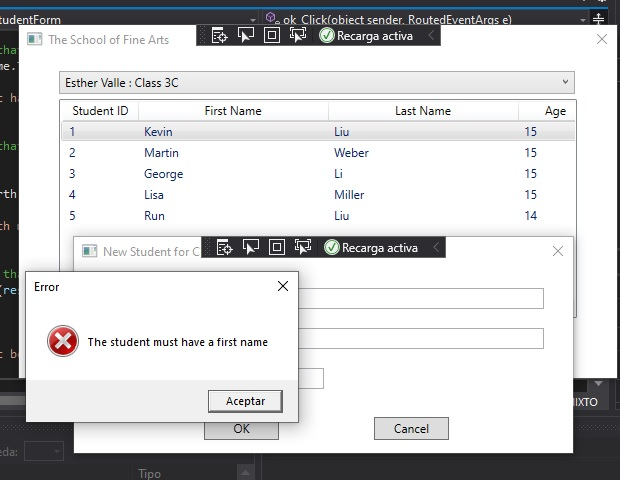

6. En el cuadro de mensaje **Error**, haga clic en **OK**.
7. En la ventana **new student**, en el cuadro de texto **First Name**, escriba **Darren**, y luego haga clic en **OK**.
8. Verifique que aparezca un mensaje de error con el texto **The student must have a last name**.

El resultado visual del punto anterior se muestra en la siguiente imagen:

  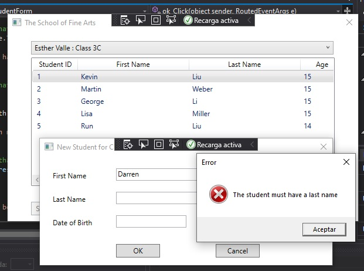

9. En el cuadro de mensaje **Error**, haga clic en **OK**.
10. En la ventana **new student**, en el cuadro de texto **Last Name**, escriba **Parker**, y luego haga clic en **OK**.
11. Verifique que aparezca un mensaje de error que diga **La fecha de nacimiento debe ser una fecha válida**.

El resultado visual del punto anterior se muestra en la siguiente imagen:

  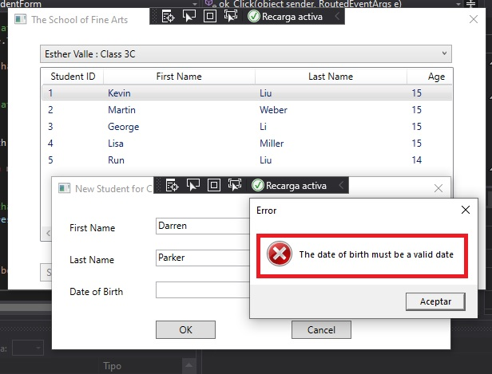

12. En el cuadro de mensaje **Error**, haz clic en **OK**.
13. En la ventana **new student**, en el cuadro de texto **Date Of Birth**, escriba **10/06/3012**, y luego haga clic en **OK**.
14. Verifica que aparezca un mensaje de error que diga **El estudiante debe tener al menos 5 años**.

El resultado visual del punto anterior se muestra en la siguiente imagen:

  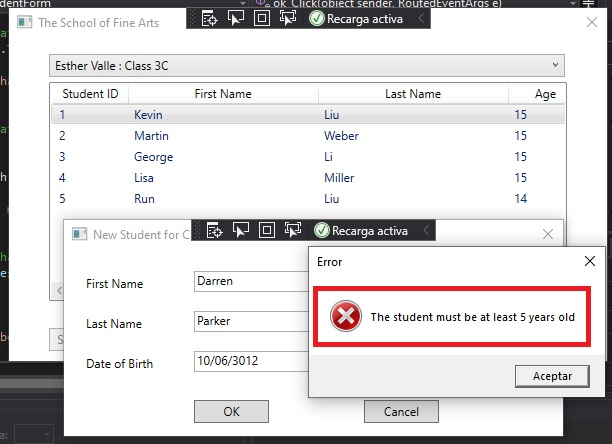

15. En el cuadro de mensaje de **Error**, haga clic en **OK**.
16. En la ventana **new student**, en el cuadro de texto **Date Of Birth**, borre la fecha existente, escriba **10/06/2006**, y luego haga clic en **OK**.
17. Verifique que **Darren Parker** se agregue a la lista de estudiantes con una edad apropiada a la fecha actual.

El resultado visual del punto anterior se muestra en la siguiente imagen:

  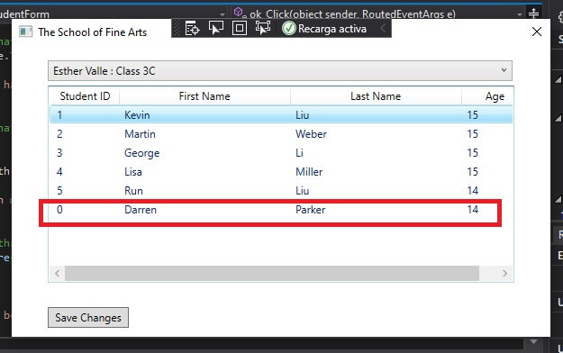

18. Cierre la aplicación.
19. En el menú **Archivo**, haga clic en **Cerrar solución**.

   >**Resultados:** Después de completar este ejercicio, los datos del estudiante serán validados antes de ser guardados.
 
 
## Ejercicio 3: Guardar los cambios en la lista de clases

### Tarea 1: Verificar que los cambios en los datos no persisten en la base de datos

1. En **Visual Studio**, en el menú **Archivo**, apunte a **Abrir**, y luego haga clic en **Proyecto/Solución**.
2. En el cuadro de diálogo **Abrir Proyecto**, apunta a **[Repository root]\Allfiles\Mod02\Labfiles\Starter\Exercise 3**, apunta a **School.sln**, y luego haz clic en **Abrir**.
   >**Nota :** Si aparece cualquier cuadro de diálogo de advertencia de seguridad, desmarca la casilla **Ask me for each project in this solution** y luego haz clic en **OK**.
3. En el menú **Construir**, haga clic en **Construir solución**.
4. En el menú **Debug**, haga clic en **Iniciar sin depuración**.
5. Haga clic en la fila que contiene el nombre **Kevin Liu**.
6. Presione Enter y verifique que aparezca la ventana **Editar detalles del estudiante** mostrando los detalles correctos.
7. En el cuadro de texto **Last Name**, borre el contenido existente, escriba **Cook**, y luego haga clic en **OK**.
8. Verifique que **Liu** ha cambiado a **Cook** en la lista de estudiantes, y que el botón **Guardar cambios** está ahora habilitado.

El resultado visual del punto anterior se muestra en la siguiente imagen:

  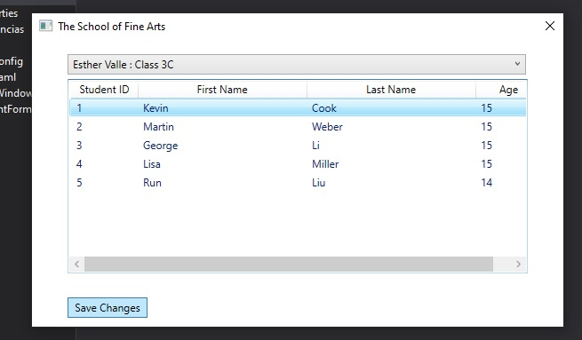

9. Haga clic en la fila que contiene el estudiante **George Li**, y luego presione Borrar.

El resultado visual del punto anterior se muestra en la siguiente imagen:

  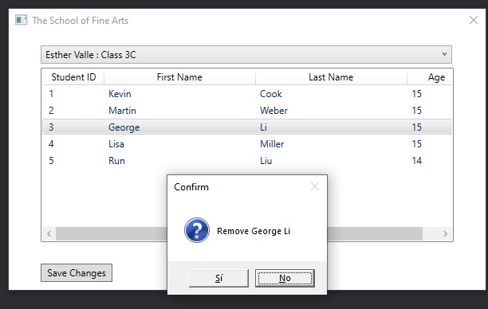

10. Verifique que aparezca el mensaje de confirmación, y luego presione **Sí**.
11. Verifique que **George Li** sea removido de la lista de estudiantes.
12. Cierre la aplicación.
13. En el menú **Debug**, haga clic en **Iniciar sin depuración**.
14. Verifique que la aplicación muestra la lista original de estudiantes.
15. Verifique que **Kevin Liu** aparece en la lista en lugar de **Kevin Cook** y **George Li** está de nuevo en la lista de estudiantes.

El resultado visual del punto anterior se muestra en la siguiente imagen:

  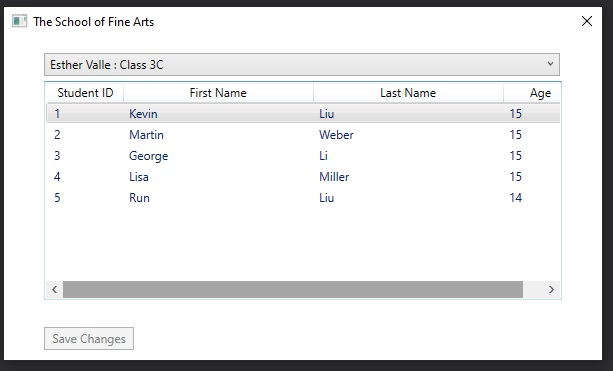

16. Cierre la aplicación.

### Tarea 2: Añadir el código para guardar los cambios de nuevo en la base de datos

1. En **Visual Studio**, en la ventana **Lista de tareas**, haga doble clic en la tarea **TODO: Exercise 3: Task 2a: Bring the System.Data and System.Data.Objects namespace into scope**.
2. En el editor de códigos, haga clic en la línea en blanco encima del comentario, y luego escriba el siguiente código:
    ```cs
    using System.Data;
    using System.Data.Objects;
    ```
3. En **Visual Studio**, en la ventana **Lista de tareas**, haga doble clic en la tarea **TODO: Exercise 3: Task 2b: Save the changes by calling the SaveChanges method of the schoolContext object**.
4. En el editor de códigos, haga clic al final de la línea de comentarios, presione Enter, y luego escriba el siguiente código:
    ```cs
    // Save the changes
    this.schoolContext.SaveChanges();

    // Disable the Save button (it will be enabled if the user makes more changes)
    saveChanges.IsEnabled = false;  
    ```

### Tarea 3: Añadir el manejo de excepciones al código para capturar la concurrencia, la actualización y las excepciones generales

1. En el editor de códigos, encierra el código que escribiste en la tarea anterior en un bloque de **try**. Tu código debería ser como el siguiente:
    ```cs
    try
    {
        // Save the changes
        this.schoolContext.SaveChanges();

        // Disable the Save button (it will be enabled if the user makes more changes)
        saveChanges.IsEnabled = false;
    }
    ```
2. En la ventana **Task List**, haga doble clic en la tarea **TODO: Exercise 3: Task 3a: If an OptimisticConcurrencyException occurs then another user has changed the same students earlier then overwrite their changes with the new data (see the lab instructions for details)**.
3. En el editor de códigos, haga clic al final de la línea de comentarios, presione Enter, y luego escriba el siguiente código:
    ```cs
    catch (OptimisticConcurrencyException)
    {  
        // If the user has changed the same students earlier, then overwrite their changes with the new data
        this.schoolContext.Refresh(RefreshMode.StoreWins, schoolContext.Students);
        this.schoolContext.SaveChanges();
    }
    ```
4. En la ventana **Task List**, haga doble clic en la tarea **TODO: Exercise 3: Task 3b: If an UpdateException occurs then report the error to the user and rollback (see the lab instructions for details)**.
5. En el editor de códigos, haga clic al final de la línea de comentarios, presione Enter y luego escriba el siguiente código:
    ```cs
    catch (UpdateException uEx)
    {
        // If some sort of database exception has occurred, then display the reason for the exception and rollback

        MessageBox.Show(uEx.InnerException.Message, "Error saving changes");
        this.schoolContext.Refresh(RefreshMode.StoreWins, schoolContext.Students);
    }
    ```
6. En la ventana **Task List**, haga doble clic en la tarea **TODO: Exercise 3: Task 3c: If some other sort of error has occurs, report the error to the user and retain the data so the user can try again - the error may be transitory (see the lab instructions for details)**.
7. En el editor de códigos, haga clic al final de la línea de comentarios, presione Enter y luego escriba el siguiente código:
    ```cs
    catch (Exception ex)
    {
        // If some other exception occurs, report it to the user
        MessageBox.Show(ex.Message, "Error saving changes");
        this.schoolContext.Refresh(RefreshMode.ClientWins, schoolContext.Students);
    }
    ```

### Tarea 4: Ejecutar la aplicación y verificar que los cambios de datos se mantienen en la base de datos

1. En el menú **Construir**, haga clic en **Construir solución**.
2. En el menú **Debug**, haga clic en **Iniciar sin depuración**.
3. Haga clic en la fila que contiene el estudiante **Kevin Liu**.
4. Presione Enter, en el cuadro de texto **Last Name** borre el contenido existente, escriba **Cook**, y luego haga clic en **OK**.

El resultado visual del punto anterior se muestra en la siguiente imagen:

  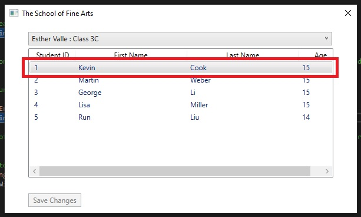

5. Verifique que **Liu** ha cambiado a **Cook** en la lista de estudiantes, y que el botón **Guardar cambios** está ahora habilitado.
6. Haga clic en **Guardar cambios** y verifique que el botón **Guardar cambios** está ahora desactivado.
7. Haga clic en la fila que contiene el estudiante **George Li** y presione Borrar.

El resultado visual del punto anterior se muestra en la siguiente imagen:

  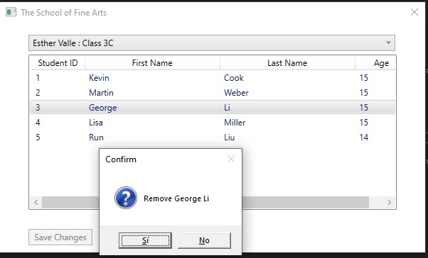

8. Verifique que aparezca el mensaje de confirmación y luego haga clic en **Sí**.
9. Verifique que el botón **Guardar cambios** esté ahora habilitado.

El resultado visual del punto anterior se muestra en la siguiente imagen:

  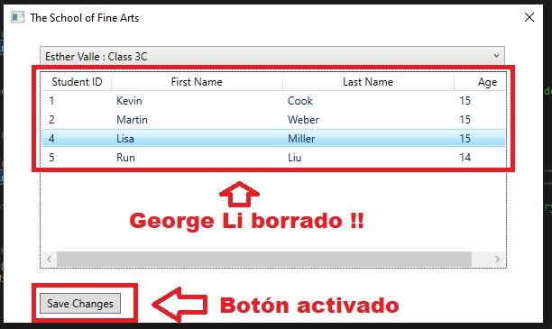

10. Haga clic en **Guardar cambios** y compruebe que el botón está ahora desactivado.
11. Cierre la aplicación.
12. En el menú **Debug**, haga clic en **Iniciar sin depuración**.
13. Verifique que los cambios que hizo a los datos de los estudiantes se han guardado en la base de datos y se reflejan en la lista de estudiantes.

El resultado visual del punto anterior se muestra en la siguiente imagen:

  

14. Cierre la aplicación.
15. En el menú **Archivo**, haga clic en **Cerrar solución**.

   >**Resultados:** Después de completar este ejercicio, los datos modificados del estudiante se guardarán en la base de datos.