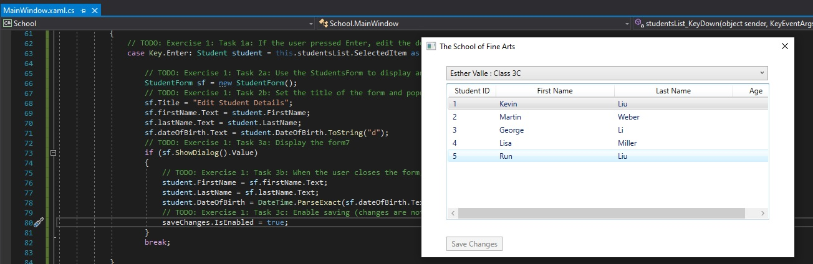
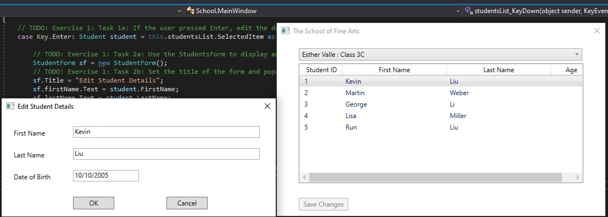
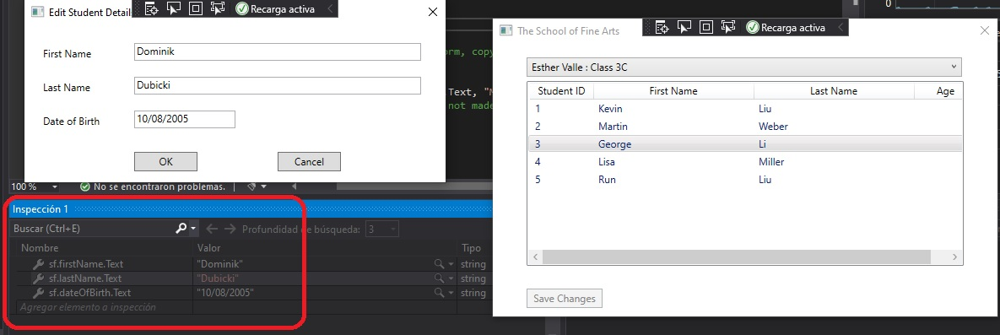
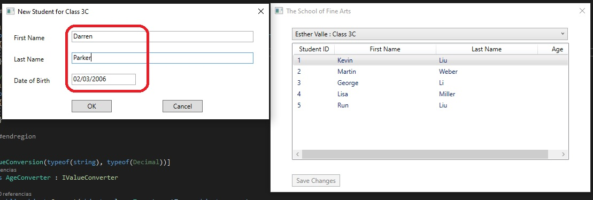
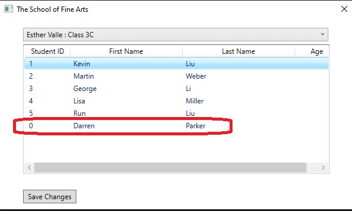
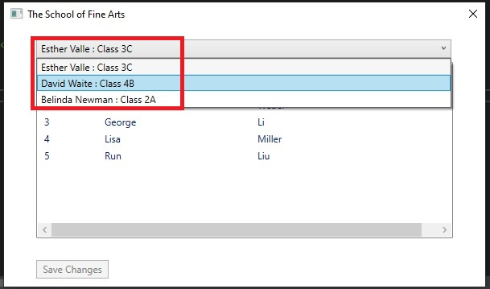
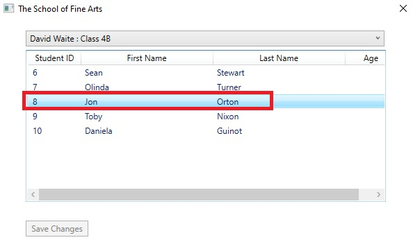
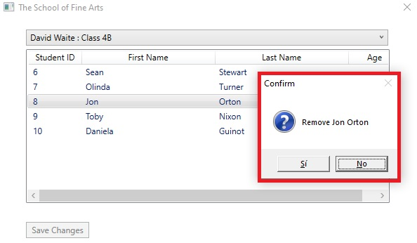
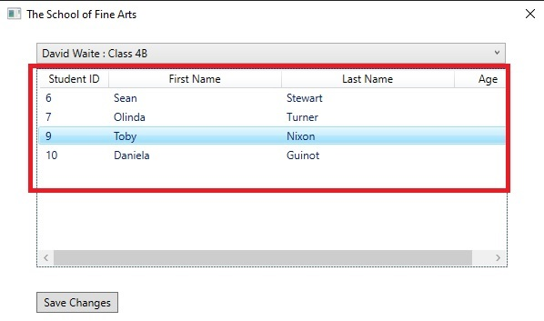

## Laboratorio Módulo 1

Fichero de Instrucciones: Instructions\20483C_MOD01_LAK.md

Entregar el url de GitHub con la solución y un readme con las siguiente información:

1. **Nombres y apellidos:** José René Fuentes Cortez
2. **Fecha:** 14 de Octubre 2020.
3. **Resumen del Modulo 1:** Este módulo consta de cuatro ejercicios:
    -  En el primer ejercio hacemos uso de la herramienta para la depuración para editar los detalles del estudiante haciendo uso de la inspección (Watch).
    - En el ejercicio 2 agregamos un nuevo estudiante a una clase. Para ellos modificamos el código correspondiente para que el botón "insert" sea escuchado por la aplicación.
    - En el ejercicio 3 hacemos posible para que los usuarios podrán eliminar a los estudiantes de las clases.
    - En el ejercicio 4

4. **Dificultad o problemas presentados y como se resolvieron:** Talvez es el uso del Visual Studio en castellano ya que las instrucciones están en inglés y al hacer los ejercicios por primera vez a veces cuesta encontrar las ventanas o herramientes en cuestión. Por ejemplo; el watch en castellano es "inspección" y es dificil al inicio poder encontrar la opción si uno no sabe.

**NOTA**: Si no hay descripcion de problemas o dificultades, y al yo descargar el código para realizar la comprobacion y el código no funcionar, el resultado de la califaciación del laboratorio será afectado.

---

# Módulo 1: Revisión de la sintaxis de Visual C#

## Lab: Desarrollo de la solicitud de inscripción en la clase

### Configuración del Lab

Tiempo estimado: **105 minutos**

### Pasos de Preparación

1. Asegúrate de que has clonado el directorio 20483C de GitHub. Contiene los segmentos de código para los laboratorios y demostraciones de este curso. (**https://github.com/MicrosoftLearning/20483-Programming-in-C-Sharp/tree/master/Allfiles**
2. Prepare su base de datos:
   - Abre el **Explorador de Files** y navega a **[Repository Root]\Allfiles\Mod01\Labfiles\Databases**.
   - Haz doble clic en **SetupSchoolDB.cmd**.
      >**Nota:** Si aparece un diálogo de Windows protegido de tu PC, haz clic en **Más información** y luego en **Ejecutar de todos modos**.
   - Cierra **Explorador de Files**.

## Ejercicio 1: Implementar la funcionalidad de edición para la lista de estudiantes

### Tarea 1: Detectar si el usuario ha pulsado la tecla Intro


1. Open **Visual Studio 2019**.
2. En **Visual Studio**, en el menú **File**, apunta a **Open**, y luego haz clic en **Project/Solución**.
3. En el cuadro de diálogo **Open Project**, apunta a **[Repository Root]\Allfiles\Mod01\Labfiles\Starter\Exercise 1**, apunta a **School.sln**, y luego haz clic en **Open**.
   >**Nota :** Si aparece cualquier cuadro de diálogo de advertencia de seguridad, desmarca la casilla de verificación **Pregúntame por cada Project de esta solución** y luego haz clic en **OK**.
4. En **Solution Explorer**, expandir **School**, y luego expandir **Ventana principal.xaml**.
5. Haga doble clic en **Ventana Principal.xaml.cs**.
6. En **Visual Studio**, en el menú **Ver**, haga clic en **Task List**.
7. En la ventana **Task List**, haga clic en otras ventanas y ahí buscar **Lista de tareas**, en la tarea **TODO: Ejercicio 1: Tarea 1a: Si el usuario pulsó Intro, edite los detalles de la tarea del estudiante** actualmente seleccionada.
8. En el editor de códigos, haga clic al principio de la línea de comentarios, presione Enter, y en el espacio en blanco sobre el comentario, escriba el siguiente código:
    ```cs
    switch (e.Key)
    {
    ```
9. En el editor de códigos, haga clic al final de la línea de comentarios, presione Enter y luego escriba el siguiente código:
    ```cs
        case Key.Enter: Student student = this.studentsList.SelectedItem as Student;
    ```
10. Después de todos los comentarios de este método, escriba el siguiente código:
    ```cs
            break;
    }
    ```

### Tarea 2: Iniciar la ventana del Formulario de Estudiante y rellenarla con los detalles del estudiante actualmente seleccionado

1. En la ventana **Task List**, haga doble clic en el **TODO: Ejercicio 1: Tarea 2a: Use el Formulario de Estudiantes para mostrar y editar los detalles de la tarea del estudiante**.
2. En el editor de códigos, haga clic al final de la línea de comentarios, presione Enter, y luego escriba el siguiente código:
    ```cs
    StudentForm sf = new StudentForm();
    ```

3. En la ventana **Task List**, haga doble clic en el **TODO: Ejercicio 1: Tarea 2b: Poner el título del formulario y rellenar los campos del formulario con los detalles de la tarea del estudiante**.
4. En el editor de códigos, haga clic al final de la línea de comentarios, presione Enter, y luego escriba el siguiente código:
    ```cs
    sf.Title = "Edit Student Details";
    sf.firstName.Text = student.FirstName;
    sf.lastName.Text = student.LastName;
    sf.dateOfBirth.Text = student.DateOfBirth.ToString("d");
    ```

### Tarea 3: Mostrar la ventana del Formulario de Estudiante y copiar los detalles actualizados del estudiante introducidos en el objeto de Estudiante

1. En la ventana **Task List**, haga doble clic en la tarea **TODO: Ejercicio 1: Tarea 3a: Mostrar el formulario** de la tarea.
2. En el editor de códigos, haga clic al final de la línea de comentarios, presione Enter, y luego escriba el siguiente código:
    ```cs
    if (sf.ShowDialog().Value)
    {
    ```
3. Después de todos los comentarios de este método, agregue el siguiente código:
    ```cs
    }
    ```
4. En la ventana **Task List**, haga doble clic en el **TODO: Ejercicio 1: Tarea 3b: Cuando el usuario cierre el formulario, copie los detalles en la tarea del estudiante**.
5. En el editor de códigos, haga clic al final de la línea de comentarios, presione Enter, y luego escriba el siguiente código:
    ```cs
    student.FirstName = sf.firstName.Text;
    student.LastName = sf.lastName.Text;
    student.DateOfBirth = DateTime.ParseExact(sf.dateOfBirth.Text, "MM/dd/yyyy", CultureInfo.InvariantCulture);
    ```
6. En la ventana **Task List**, haga doble clic en el **TODO: Ejercicio 1: Tarea 3c: Habilitar el guardado (los cambios no se hacen permanentes hasta que se escriben de nuevo en la base de datos)** tarea.
7. En el editor de códigos, haga clic al final de la línea de comentarios, presione Enter y luego escriba el siguiente código:
    ```cs
    saveChanges.IsEnabled = true;
    ```

### Tarea 4: Ejecutar la aplicación y verificar que la funcionalidad de edición funciona como se espera

1. En el menú **Build**, haga clic en **Build Solution**.
2. En el menú **Debug**, haga clic en **Iniciar sin depuración**.
3. Verifique que la aplicación se inicia y muestra la lista inicial de estudiantes.  
   
4. Haga clic en la fila que contiene el nombre **Kevin Liu**.
5. Pulse Intro y verifique que aparece la ventana **Editar detalles del estudiante** y que muestra los detalles correctos:  
   
6. En el cuadro de texto **Last Name**, borre el contenido existente, escriba **Cook**, y luego haga clic en **OK**.
7. Verifica que **Liu** ha cambiado a **Cook** en la lista de estudiantes, y que el botón **Save Changes** está ahora habilitado.
8. Cerrar la aplicación.

### Tarea 5: Usar el depurador de Visual Studio para pasar por el código

1. En **Visual Studio**, en la ventana **Task List**, haga doble clic en el **TODO: Ejercicio 1: Tarea 2b: Poner el título del formulario y rellenar los campos del formulario con los detalles de la tarea del estudiante**.
2. En la siguiente línea de código, haga clic con el botón derecho del ratón en la palabra **Título** en **sf.Title = "Editar detalles del estudiante";**, apunte a **Punto de interrupción**, y luego haga clic en **Insertar punto de interrupción** (Presione **F9**).
3. En el menú **Debug**, haga clic en **Iniciar depuración**.
4. Haga clic en la fila que contiene el nombre **George Li**, y luego presione Enter.
5. Cuando **Visual Studio** entre en el modo de descanso, en la ventana inferior izquierda, haz clic en la pestaña **Vigía 1**.
6. En la ventana **Watch 1**, haz clic debajo de **Name** para crear una fila en blanco.
7. En la columna **Name**, escribe **sf.Title** y luego pulsa Intro.
8. En la ventana **Ver 1**, haga clic debajo de **sf.Title** para crear una fila en blanco.
9. Escriba **sf.firstName.Text**, y luego presione Enter.
10. En la ventana **Ver 1**, haga clic debajo de **sf.firstName.Text** para crear una fila en blanco.
11. Escriba **sf.lastName.Text**, y luego presione Enter.
12. En la ventana **Ver 1**, haga clic debajo de **sf.lastName.Text** para crear una fila en blanco.
13. Escriba **sf.fechaDeNacimiento.Texto**, y luego presione Enter.
14. En el menú **Debug**, haga clic en **Step Over** (Presione F10).
15. Repita el paso 14, tres veces.
16. En la ventana inferior central, haga clic en la pestaña **Ventana inmediata**.
17. En la ventana **Inmediata**, escriba **sf.firstName.Text**, y luego presione Enter.
18. Verifique que aparezca **"George "**.
19. En la ventana **Vigía 1**, en la fila **sf.firstName.Text**, haga clic con el botón derecho del ratón en el campo **Valor**, y luego haga clic en **Editar valor**.
20. Escriba **"Dominik "** y pulse Intro.
21. En la ventana **Inmediato**, escriba **sf.lastName.Text**, y luego presione Enter.
22. Verifique que aparezca **"Li "** en la pantalla.
23. Escriba **sf.apellido.Texto = "Dubicki";**, y luego presione Enter.
24. En la ventana **Vigía 1**, en la fila **sf.lastName.Text**, verifique que la columna **Valor** ha cambiado a **"Dubicki "**.
25. En el menú **Debug**, haga clic en **Continuar** (Presione F5).

   
Fig-3-Dominik
26. Verifique que el formulario **Editar detalles del estudiante** contiene la información de la siguiente tabla:
    | **Field**     | **Value** |
    | ------------- |:---------:|
    | First Name    | Dominik   |
    | Last Name     | Dubicki   |
    | Date of Birth | 8/10/2005 |
27. Cierra la ventana de **Editar detalles del estudiante** y luego cierra la aplicación...
28. En **Visual Studio**, en el menú **Debug**, haga clic en **Borrar todos los puntos de ruptura**.
29. En el cuadro de diálogo **Microsoft Visual Studio**, haga clic en **Sí**.
30. En el menú **File**, haz clic en **Cerrar solución**.
31. Si aparece cualquier cuadro de diálogo **Microsoft Visual Studio**, haga clic en **Sí**.

>**Resultado:** Después de completar este ejercicio, los usuarios podrán editar los detalles de un estudiante.

## Ejercicio 2: Implementación de la funcionalidad de inserción para la lista de alumnos

### Tarea 1: Agregar lógica al método de pulsar la tecla para detectar si se ha pulsado la tecla de inserción

1. En **Visual Studio**, en el menú **File**, apunte a **Open**, y luego haga clic en **Project/Solución**.
2. En el cuadro de diálogo **Open Project**, apunta a **[Repository Root]\Allfiles\Mod01\Labfiles\Starter\Exercise 2**, apunta a **School.sln**, y luego haz clic en **Open**.
   >**Nota :** Si aparece cualquier cuadro de diálogo de advertencia de seguridad, desmarca la casilla de verificación **Pregúntame por cada Project de esta solución** y luego haz clic en **OK**.
3. En la ventana **Task List**, haga doble clic en el **TODO: Ejercicio 2: Tarea 1a: Si el usuario pulsó Insertar, añada una nueva tarea de estudiante**.
4. En el editor de códigos, haga clic al final de la línea de comentarios, presione Enter, y luego escriba el siguiente código:
    ```cs
    case Key.Insert:
    ```

### Tarea 2: Iniciar la forma de estudiante

1. En la ventana **Task List**, haga doble clic en el **TODO: Ejercicio 2: Tarea 2a: Use el Formulario de Estudiantes para obtener los detalles del estudiante de la tarea del usuario**.
2. En el editor de códigos, haga clic al final de la línea de comentarios, presione Enter, y luego escriba el siguiente código:
    ```cs
    sf = new StudentForm();
    ```

3. En la ventana **Task List**, haga doble clic en el **TODO: Ejercicio 2: Tarea 2b: Ponga el título del formulario para indicar a qué clase se añadirá el estudiante (la clase del profesor actualmente seleccionado)** tarea.
4. 4. En el editor de códigos, haga clic al final de la línea de comentarios, presione Enter, y luego escriba el siguiente código:

    ```cs
    sf.Title = "New Student for Class " + teacher.Class;
    ```

### Tarea 3: Mostrar la ventana del Formulario de Estudiante y permitir al usuario proporcionar los detalles del nuevo estudiante

1. En la ventana **Task List**, haga doble clic en el **TODO: Ejercicio 2: Tarea 3a: Mostrar el formulario y obtener los detalles de la nueva tarea del estudiante**.
2. En el editor de códigos, haga clic al final de la línea de comentarios, presione Enter, y luego escriba el siguiente código:
    ```cs
    if (sf.ShowDialog().Value)
    {
    ```
3. Después de todos los comentarios de este método, agregue el siguiente código:
    ```cs
    }

    break;
    ```

4. En la ventana **Task List**, haga doble clic en el **TODO: Ejercicio 2: Tarea 3b: Cuando el usuario cierre el formulario, recupere los detalles del estudiante del formulario y úselos para crear una nueva tarea de objeto de estudiante**.
5. En el editor de códigos, haga clic al final de la línea de comentarios, presione Enter, y luego escriba el siguiente código:
    ```cs
    Student newStudent = new Student();
    newStudent.FirstName = sf.firstName.Text;
    newStudent.LastName = sf.lastName.Text;
    newStudent.DateOfBirth = DateTime.ParseExact(sf.dateOfBirth.Text, "MM/dd/yyyy", CultureInfo.InvariantCulture);
    ```

### Tarea 4: Asignar al nuevo estudiante a una clase y permitir al usuario guardar los detalles del nuevo estudiante

1. En la ventana **Task List**, haga doble clic en el **TODO: Ejercicio 2: Tarea 4a: Asignar al nuevo estudiante a la tarea actual del profesor**.
2. En el editor de códigos, haga clic al final de la línea de comentarios, presione Enter, y luego escriba el siguiente código:
    ```cs
    this.teacher.Students.Add(newStudent);
    ```

3. En la ventana **Task List**, haga doble clic en el **TODO: Ejercicio 2: Tarea 4b: Añadir el estudiante a la lista que aparece en el formulario** de la tarea.
4. En el editor de códigos, haga clic al final de la línea de comentarios, presione Enter, y luego escriba el siguiente código:
    ```cs
    this.studentsInfo.Add(newStudent);
    ```

5. En la ventana **Task List**, haga doble clic en el **TODO: Ejercicio 2: Tarea 4c: Habilitar el guardado (los cambios no se hacen permanentes hasta que se escriben de nuevo en la base de datos)** tarea.
6. En el editor de códigos, haga clic al final de la línea de comentarios, presione Enter y luego escriba el siguiente código:
    ```cs
    saveChanges.IsEnabled = true;
    ```

### Tarea 5: Ejecutar la aplicación y verificar que la funcionalidad de inserción funciona como se espera

1. En el menú **Build**, haga clic en **Build Solution**.
2. En el menú **Debug**, haga clic en **Iniciar sin depuración**.
3. Verifique que la aplicación se inicia y muestra la lista inicial de estudiantes.
4. Haga clic en la fila que contiene el nombre **Kevin Liu**.
5. Presiona **Insertar** y verifica que aparece la ventana de nuevo estudiante.
6. En el cuadro de texto **Name**, escribe **Darren**.
7. En el cuadro de texto de **Apellido**, escriba **Parker**.
8. En el cuadro de texto **Fecha de nacimiento**, escriba **02/03/2006**, y luego haga clic en **OK**.

El resultado visual se muestra en la siguiente imagen:

  


9. Verifica que Darren Parker ha sido añadido a la lista de estudiantes, y que el botón **Guardar cambios** está ahora habilitado. El ID de un nuevo estudiante será 0 hasta que sea guardado en la base de datos del siguiente laboratorio.

El resultado visual se muestra en la siguiente imagen:


  

10. Cierre la aplicación.
11. En el menú **File**, haga clic en **Cerrar solución**.

 


>**Resultado:** Después de completar este ejercicio, los usuarios podrán agregar nuevos estudiantes a una clase.

## Ejercicio 3: Implementación de la función de eliminación de la lista de estudiantes

### Tarea 1: Agregar lógica al método de la tecla de bajada para detectar si se ha pulsado la tecla de borrado

1. En **Visual Studio**, en el menú **File**, apunte a **Open**, y luego haga clic en **Project/Solución**.
2. En el cuadro de diálogo **Open Project**, apunta a **[Repository Root]\Allfiles\Mod01\Labfiles\Starter\Exercise 3**, apunta a **School.sln**, y luego haz clic en **Open**.
   >**Nota :** Si aparece cualquier cuadro de diálogo de advertencia de seguridad, desactive la casilla **Ask me for each project in this solution** y luego haga clic en **OK**.
3. En la ventana **Task List**, haga doble clic en el ejercicio **TODO: 3: Tarea 1a: Si el usuario presionó Borrar, elimine la tarea del estudiante** actualmente seleccionada.
4. En el editor de códigos, haga clic al final de la línea de comentarios, presione Enter, y luego escriba el siguiente código:
    ```cs
    case Key.Delete: student = this.studentsList.SelectedItem as Student;
    ```

### Tarea 2: Solicitar al usuario que confirme que quiere eliminar al estudiante seleccionado de la clase

1. En la ventana **Task List**, haga doble clic en el **TODO: Ejercicio 3: Tarea 2a: Solicite al usuario que confirme que el estudiante debe ser retirado de la tarea**.
2. En el editor de códigos, haga clic al final de la línea de comentarios, presione Enter, y luego escriba el siguiente código:
    ```cs
    MessageBoxResult response = MessageBox.Show(
        string.Format("Remove {0}", student.FirstName + " " + student.LastName),
        "Confirm",
        MessageBoxButton.YesNo,
        MessageBoxImage.Question,
        MessageBoxResult.No);
    ```

### Tarea 3: Eliminar el estudiante y permitir al usuario guardar los cambios

1. En la ventana **Task List**, haga doble clic en la tarea **TODO: Ejercicio 3: Tarea 3a: Si el usuario hizo clic en Sí, elimine el estudiante de la base de datos** de tareas.
2. En el editor de códigos, haga clic al final de la línea de comentarios, presione Enter, y luego escriba el siguiente código:
    ```cs
    if (response == MessageBoxResult.Yes)
    {
        this.schoolContext.Students.DeleteObject(student);
    ```
3. Después del último comentario de este método, escriba el siguiente código:
    ```cs
    }

    break;
    ```
4. En la ventana **Task List**, haga doble clic en la tarea **TODO: Ejercicio 3: Tarea 3b: Habilitar el guardado (los cambios no se hacen permanentes hasta que se escriben de nuevo en la base de datos)**.
5. En el editor de códigos, haga clic al final de la línea de comentarios, presione Enter y luego escriba el siguiente código:
    ```cs
    saveChanges.IsEnabled = true;
    ```

### Tarea 4: Ejecutar la aplicación y verificar que la funcionalidad de borrado funciona como se espera

1. En el menú **Build**, haga clic en **Build Solution**.
2. En el menú **Debug**, haga clic en **Iniciar sin depuración**.
3. Verifique que la aplicación se inicia y muestra la lista inicial de estudiantes.
4. Haga clic en el menú desplegable que contiene el texto **Esther Valle: Clase 3C**.
5. Haga clic en el elemento de la lista que contiene el texto **David Waite : Clase 4B**.

El resultado visual se muestra en la siguiente imagen:

  


6. Haz clic en la fila que contiene el nombre **Jon Orton**.

El resultado visual se muestra en la siguiente imagen:

  

7. Presione Borrar y verifique que aparezca el mensaje de confirmación.

El resultado visual se muestra en la siguiente imagen:

  


8. En el cuadro de diálogo **Confirmar**, pulsa **Sí**, verifica que Jon Orton se ha eliminado de la lista de estudiantes y luego verifica que el botón **Guardar cambios** está activado.

El resultado visual se muestra en la siguiente imagen:

  


9. Cierre la aplicación.
10. En el menú **File**, haga clic en **Cerrar solución**.

>**Resultado:** Después de completar este ejercicio, los usuarios podrán eliminar a los estudiantes de las clases.

## Ejercicio 4: Mostrar la edad de un estudiante

### Tarea 1: Examinar la ventana principal XAML

1. En **Visual Studio**, en el menú **File**, apunte a **Open**, y luego haga clic en **Project/Solución**.
2. En el cuadro de diálogo **Open Project**, apunta a **[Raíz del Repositorio]\N-Todos los Files {Mod01\Labfiles\N-Ejercicio 4**, apunta a **School.sln**, y luego haz clic en **Open**.
   >**Nota :** Si aparece cualquier cuadro de diálogo de advertencia de seguridad, desactive la casilla **Ask me for each project in this solution** y luego haga clic en **OK**.
3. En el menú **Build**, haga clic en **Build Solution**.
4. En **Solution Explorer**, expanda **School**, y luego haga doble clic en **MainWindow.xaml** y vea la marca XAML.
5. Tome nota de las siguientes líneas en el marcado:
    ```xml
    <app:AgeConverter x:key="ageConverter"/>
    . . .
    <GridViewColumn Width="75" Header="Age"
        DisplayMemberBinding="{Binding Path=DateOfBirth, Converter={StaticResource  ageConverter}}" />
    ```

### Tarea 2: Agregar lógica a la clase del Conversor de Edad para calcular la edad de un estudiante a partir de su fecha de nacimiento

1. En la ventana **Task List**, haga doble clic en el **TODO: Ejercicio 4: Tarea 2a: Compruebe que el valor proporcionado no es nulo. Si lo es, devuelva una tarea de cadena** vacía.
2. En el editor de códigos, haga clic al final de la línea de comentarios, presione Enter, y luego escriba el siguiente código:
    ```cs
    if (value != null)
    {
    ```
3. En el editor de códigos, después de todos los comentarios de este método, borre la siguiente línea de código:
    ```cs
    return "";
    ```
4. En la ventana **Task List**, haga doble clic en el **TODO: Ejercicio 4: Tarea 2b: Convierta el valor proporcionado en una tarea de valor DateTime**.
5. En el editor de códigos, haga clic al final de la línea de comentarios, presione Enter, y luego escriba el siguiente código:
    ```cs
        DateTime studentDateOfBirth = (DateTime)value;
    ```
6. En la ventana **Task List**, haga doble clic en la tarea **TODO: Ejercicio 4: Tarea 2c: Calcule la diferencia entre la fecha actual y la tarea del valor proporcionado**.
7. En el editor de códigos, haga clic al final de la línea de comentarios, presione Enter, y luego escriba el siguiente código:

    ```cs
        TimeSpan difference = DateTime.Now.Subtract(studentDateOfBirth);
    ```
8. En la ventana **Task List**, haga doble clic en el **TODO: Ejercicio 4: Tarea 2d: Convierte este resultado en una tarea de varios años**.
9. En el editor de códigos, haga clic al final de la línea de comentarios, presione Enter, y luego escriba el siguiente código:
    ```cs
        int ageInYears = (int)(difference.Days / 365.25);
    ```

10. En la ventana **Task List**, haga doble clic en el **TODO: Ejercicio 4: Tarea 2e: Convierte el número de años en una cadena y devuelve la tarea.
11. En el editor de códigos, haga clic al final de la línea de comentarios, presione Enter, y luego escriba el siguiente código:
    ```cs
        return ageInYears.ToString();
    }
    else
    {
        return "";
    }
    ```

### Tarea 3: Ejecutar la aplicación y verificar que la edad del estudiante ahora aparece correctamente

1. En el menú **Build**, haga clic en **Build Solution**.
2. En el menú **Debug**, haga clic en **Iniciar sin depuración**.
3. Verifique que la aplicación se inicia y muestra la lista inicial de estudiantes, con sus edades.
4. Haga clic en la fila que contiene el nombre **Kevin Liu**.
5. Presiona **Insertar**.
6. En la ventana de Nuevo Estudiante para la clase 3C, introduzca su nombre en el cuadro de texto **Name**, su apellido en el cuadro de texto **Apellido** y su fecha de nacimiento en el cuadro de texto **Fecha de nacimiento** (formato de fecha - **mm/dd/aaaa**).
7. Haga clic en **OK** y verifique que su nombre y edad aparecen correctamente en la lista de estudiantes.
8. Cierre la aplicación.
9. En el menú **File**, haga clic en **Cerrar solución**.

>**Resultado:** Después de completar este ejercicio, la aplicación mostrará la edad del estudiante en años.