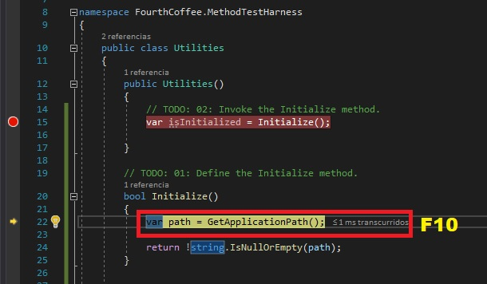
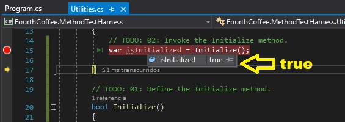

## MOC Módulo 2 - Creación de métodos, manejo de excepciones y aplicaciones de vigilancia

Fichero de Instrucciones: Instructions\20483C_MOD02_DEMO.md

Entregar el url de GitHub con la solución y un readme con las siguiente información:

1. **Nombres y apellidos:** José René Fuentes Cortez
2. **Fecha:** 14 de Octubre 2020.
3. **Resumen del Modulo 2:** Este MOC consta de una lección.
    -  En esta lección es para hacer uso de las herramientas de depuración en Visual Studio 2019.

4. **Dificultad o problemas presentados y como se resolvieron:** Ninguna.

**NOTA**: Si no hay descripcion de problemas o dificultades, y al yo descargar el código para realizar la comprobacion y el código no funcionar, el resultado de la califaciación del laboratorio será afectado.

---


## Lección 1: Crear e invocar métodos

### Demonstration: Crear, invocar y depurar métodos

1. Asegúrate de que has clonado el directorio 20483C de GitHub. Contiene los segmentos de código para los laboratorios y demostraciones de este curso. (**https://github.com/MicrosoftLearning/20483-Programming-in-C-Sharp/tree/master/Allfiles**
2. Prepare su base de datos:
   - Abre el **Explorador de Files** y navega a **[Repository Root]Allfiles/Mod02/Democode/Starter/FourthCoffee.MethodTestHarness**.
   - **FourthCoffee.MethodTestHarness.sln**.
      >**Nota:** Si aparece un diálogo de Windows protegido de tu PC, haz clic en **Más información** y luego en **Ejecutar de todos modos**.
   - Cierra **Explorador de Files**.


### Pasos de la demostración


1. En Visual Studio, en el menú **Ver**, haga clic en **Lista de tareas**.
2. En la ventana **Task List**, haga doble clic en la tarea **TODO: 01: Definir el método de inicialización.**
3. En el editor de códigos, haga clic en la línea en blanco debajo del comentario, y luego escriba el siguiente código:
    ```cs
    bool Inicializar()
    {
        var path = GetApplicationPath();

        return !string.IsNullOrEmpty(path);
    }
    ```
4. En la ventana **Task List**, haga doble clic en la tarea **TODO: 02: Invocar el método de Inicializar.**
5. En el editor de códigos, haga clic en la línea en blanco debajo del comentario, y luego escriba el siguiente código:
    ```cs
    var isInitialized = Initialize();
    ```
6. Haga clic con el botón derecho del ratón en el método **Iniciar**, apunte a **Punto de ruptura**, y luego haga clic en **Insertar punto de ruptura**.
7. En el menú **Construir**, haga clic en **Construir solución**.
8. En el menú **Debug**, haga clic en **Iniciar depuración**.
9. Para entrar en el método **Iniciar**, pulse F11.
10. Para pasar a la llamada del método **GetApplicationPath**, presione F10.
11. Para pasar a la llamada del método **GetApplicationPath**, presione F10.

El resultado visual se muestra en la siguiente imagen:

  

12. Para salir del método **Iniciar**, presione Shift+F11.
13. Para pasar por encima de la llamada al método **Initialize**, pulse F10.
14. Ponga el ratón sobre la variable **isInitialized** y compruebe que el valor devuelto es **verdadero**.

El resultado visual se muestra en la siguiente imagen:

  


15. En el menú **Debug**, pulse **Detener depuración**.
16. En el menú **Archivo**, haga clic en **Cerrar solución**.

