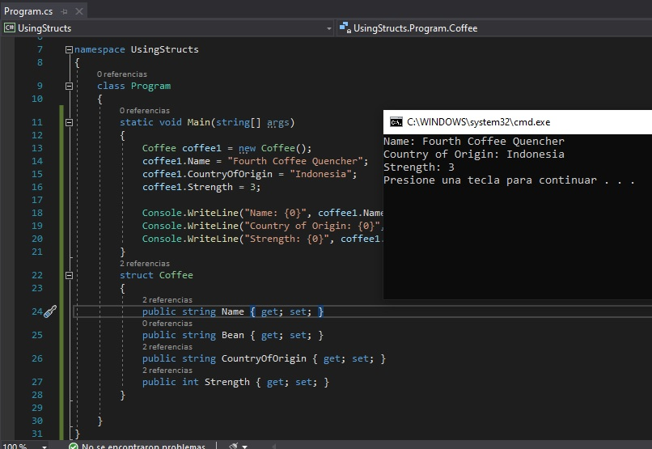

# Module 3:  Desarrollando el código para una aplicación gráficas


Fichero de Instrucciones: Instructions\20483C_MOD03_DEMO.md

Entregar el url de GitHub con la solución y un readme con las siguiente información:

1. **Nombres y apellidos:** José René Fuentes Cortez
2. **Fecha:** 15 de Octubre 2020.
3. **Resumen del Modulo 3:** Este MOC haremos dos lecciones:
    -  En la primera lección haremos uso de las Structs y su funcionamiento para ver como se muestran en la consola.
    - En la segunda lección no se muestra en el MOC_DEMO.

4. **Dificultad o problemas presentados y como se resolvieron:** Ninguna con la lección 1. Según la tarea tendríamos que hacer la lección 2 pero esta no aparece en el MOC_DEMO.

**NOTA**: Si no hay descripcion de problemas o dificultades, y al yo descargar el código para realizar la comprobacion y el código no funcionar, el resultado de la califaciación del laboratorio será afectado.

---
---

## Lección 1: Implementación de estructuras y enumeraciones

### Demostración: Creación y uso de una estructura

#### Pasos de preparación

Asegúrese de haber clonado el directorio 20483C de GitHub. Contiene los segmentos de código para los laboratorios y demostraciones de este curso. (** https://github.com/MicrosoftLearning/20483-Programming-in-C-Sharp/tree/master/Allfiles**)
Si aparece alguna advertencia de seguridad, haga clic en **Aceptar**.

#### Pasos de demostración

1. Abra **Visual Studio 2019**.
2. En Visual Studio, en el menú **Archivo**, seleccione **Nuevo** y luego haga clic en **Proyecto**.
3. En el cuadro de diálogo **Nuevo proyecto**, en la lista **Instalado**, haga clic en **Visual C\#**, y luego en la lista **Tipo de proyecto**, haga clic en **Aplicación de consola (.NET Framework)**.
4. En el cuadro de texto **Nombre**, escriba **UsingStructs**
5. En el cuadro de texto **Ubicación**, establezca la ubicación en **[Repository Root]\Allfiles\Mod03\Democode**, y luego haga clic en **Aceptar**.
   > **Nota:** Si aparece algún cuadro de diálogo de advertencia de seguridad, desactive la casilla de verificación **Preguntarme por cada proyecto en esta solución** y luego haga clic en **Aceptar**.
6. En el espacio de nombres **UsingStructs**, agregue el siguiente código:
    ```cs
    struct Coffee
    {
        public string Name { get; set; }
        public string Bean { get; set; }
        public string CountryOfOrigin { get; set; }
        public int Strength { get; set; }
    }
    ```
7. En la clase **Programa**, en el método **Principal**, agregue el siguiente código:
    ```cs
    Coffee coffee1 = new Coffee();
    coffee1.Name = "Fourth Coffee Quencher";
    coffee1.CountryOfOrigin = "Indonesia";
    coffee1.Strength = 3;

    Console.WriteLine("Name: {0}", coffee1.Name);
    Console.WriteLine("Country of Origin: {0}",coffee1.CountryOfOrigin);
    Console.WriteLine("Strength: {0}", coffee1.Strength);
    ```
8. Observe que puede usar la estructura **Coffee** de la misma manera que usaría un tipo de .NET Framework estándar.
9. En el menú **Crear**, haga clic en **Crear solución**.
10. En el menú **Depurar**, haga clic en **Iniciar sin depurar**.
11. Observe que la estructura **Coffee** funciona como un tipo estándar de .NET Framework en tiempo de ejecución.

- La representación visual del ejercicio anterior se muestra en la imagen siguiente:
 

12. Para cerrar la ventana de la consola, presione Entrar.
13. Cierre Visual Studio.

## Lección 3: Manejo de eventos

### Pasos de preparación

Asegúrese de haber clonado el directorio 20483C de GitHub. Contiene los segmentos de código para los laboratorios y demostraciones de este curso. (**https://github.com/MicrosoftLearning/20483-Programming-in-C-Sharp/tree/master/Allfiles**)

### Demostración: trabajar con eventos en XAML

1. Abra **Visual Studio 2019**.
2. En Visual Studio, en el menú **Archivo**, seleccione **Abrir** y luego haga clic en **Proyecto/Solución**.
3. En el cuadro de diálogo **Abrir proyecto**, vaya a la carpeta **[Repository Root]\Allfiles\Mod03\Democode\Starter**, haga clic en **EventsAndXAML.sln** y luego haga clic en **Abrir**.
   > **Nota: **Si aparece algún cuadro de diálogo de advertencia de seguridad, desactive la casilla de verificación **Preguntarme por cada proyecto en esta solución** y luego haga clic en **Aceptar**.
4. En **Explorador de soluciones**, expanda **EventsAndXAML** y, a continuación, haga doble clic en **MainWindow.xaml**.
5. Observe que la ventana incluye un botón llamado **btnGetTime** y una etiqueta llamada **lblShowTime**.
6. En la ventana **Diseño**, haga clic en el botón para seleccionarlo.
7. En la ventana **Propiedades**, asegúrese de que **btnGetTime **esté seleccionado y luego haga clic en **Eventos**. El botón **Eventos **está marcado con un icono de rayo.
8. Observe que la ventana **Propiedades **ahora muestra una lista de los eventos a los que puede suscribirse.
9. En la ventana **Propiedades**, haga doble clic dentro del cuadro de texto **Haga clic**. Si aparece algún cuadro de diálogo relacionado con finales de línea inconsistentes, haga clic en **Aceptar**.
10. Observe que Visual Studio crea un método de controlador de eventos para usted y cambia a la página de código subyacente.
11. En el método **btnGetTime_Click**, agregue el siguiente código:
    ```cs
    lblShowTime.Content = DateTime.Now.ToLongTimeString();
    ```
12. En **Explorador de soluciones**, expanda **MainWindow.xaml**, expanda **MainWindow.xaml.cs** y, a continuación, haga doble clic en **MainWindow**.
13. Vuelva a la ventana **MainWindow.xaml**.
14. En el elemento **Botón**, tenga en cuenta que el diseñador ha agregado el siguiente atributo:
    ```cs
    Click="btnGetTime_Click"
    ```
    Este atributo suscribe el método **btnGetTime_Click **al evento **Click**.
15. En el menú **Crear**, haga clic en **Crear solución**.
16. En **Solution Explorer**, expanda **obj**, expanda **Debug** y luego haga doble clic en **MainWindow.g.i.cs**.
17. Cerca de la parte inferior del archivo, observe que Visual Studio ha agregado la siguiente línea de código:
    ```cs
    this.btnGetTime.Click += new System.Windows.RoutedEventHandler(this.btnGetTime_Click);
    ```
18. Esto demuestra que Visual Studio analiza el XAML para crear el código que suscribe su método de controlador de eventos al evento **Click **del botón.
19. En el menú **Archivo**, haga clic en **Cerrar**.
20. En el menú **Depurar**, haga clic en **Iniciar sin depurar**.
21. Haga clic en el botón **¿Qué hora es? **varias veces.
22. Observe que la etiqueta muestra la hora actual.
23. Cierre la aplicación, cierre la solución y luego cierre Visual Studio.

### Demostración: escritura de código para el laboratorio de aplicación de prototipos de calificaciones

1. Desde la carpeta **[Repository Root]\Allfiles\Mod03\Labfiles\Solution\Exercise 3**, abra la solución **GradesPrototype.sln**.
   > **Nota: **Si aparece algún cuadro de diálogo de advertencia de seguridad, desactive la casilla de verificación **Preguntarme por cada proyecto en esta solución** y luego haga clic en **Aceptar**.
2. Ejecute la aplicación e inicie sesión como **vallee** y la password **password**.
3. Señale el mensaje de **Bienvenida** y el nombre de la clase a los estudiantes. Explique que cada uno de los nombres en la pantalla es un estudiante de la clase de Esther Valle.
4. Haga clic en **Kevin Liu** y explique a los estudiantes que esta página muestra las calificaciones de Kevin.
5. Haga clic en **Atrás** y, a continuación, haga clic en **Cerrar sesión**.
6. Inicie sesión como **liuk **con la password **password**.
7. Explique que como Kevin es un estudiante, solo puede ver sus propias calificaciones.
8. Haga clic en **Cerrar sesión**.
9. Inicie sesión como **parkerd **con la password **password**. Tenga en cuenta el mensaje de error.
10. Haga clic en **Aceptar** y luego cierre la aplicación.
11. En Visual Studio, en la carpeta **Datos**, abra **Grade.cs** y explique a los estudiantes que durante el Ejercicio 2 crearán estas estructuras.
12. En **DataSource.cs**, muéstreles la clase **DataSource**.
13. Abra **MainWindow.xaml** y desplácese hasta las definiciones de vista en el código XAML.
14. Explique a los estudiantes cómo los eventos están conectados con los métodos en cada una de las definiciones de página.
15. En la carpeta **Vistas**, abra **LogonPage.xaml.cs** y busque el controlador de eventos **Logon_Click**.
16. Explique a los alumnos que durante el Ejercicio 3 agregarán este código para validar al usuario, evaluar si es profesor o alumno, guardar sus datos y luego activar el método **LogonSuccess**.
17. Explique que si el usuario no es válido, el controlador de eventos genera **LogonFailed**.
18. Expanda **MainWindow.xaml** y luego abra **MainWindow.xaml.cs**, muestre a los estudiantes los controladores de eventos **Logon_Success** y **Logon_Failed**.
19. Expanda **MainWindow.xaml** y luego abra **MainWindow.xaml.cs**, ubique el evento Refresh y explique a los estudiantes que durante el Ejercicio 3 agregarán código a este método para mostrar el nombre de usuario en el Mensaje de bienvenida.
20. Expanda **MainWindow.xaml** y luego abra **StudentsPage.xaml.cs**, ubique el método Refresh y explique a los estudiantes que durante el Ejercicio 3 agregarán este código para encontrar todos los estudiantes para el profesor y vincularlos a una lista en la vista.
21. En **StudentsPage.xaml**, ubique el elemento **ItemsControl.ItemTemplate** y explique que el enlace de datos de los elementos **Button **muestra los nombres de los estudiantes en los botones de la vista.
22. Cierre Visual Studio.
