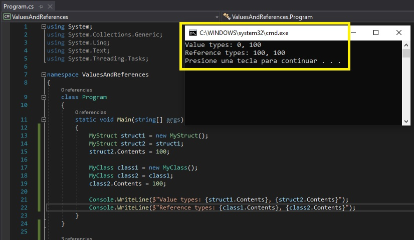

# Módulo 4: Crear clases e implementar colecciones de tipo seguro


Fichero de Instrucciones: Instructions\20483C_MOD04_DEMO.md

Entregar el url de GitHub con la solución y un readme con las siguiente información:

1. **Nombres y apellidos:** José René Fuentes Cortez
2. **Fecha:** 15 de Octubre 2020.
3. **Resumen del Modulo 4:** En este MOC_DEMO haremos una lección:
    -  En la única lección de este MOC haremos comparación de tipos de referencia y tipos de valores.


4. **Dificultad o problemas presentados y como se resolvieron:** Ninguna.

**NOTA**: Si no hay descripcion de problemas o dificultades, y al yo descargar el código para realizar la comprobacion y el código no funcionar, el resultado de la califaciación del laboratorio será afectado.

---
---


## Lección 1: Crear clases

### Demonstration: Comparación de los tipos de referencia y los tipos de valor

#### Pasos de preparación

Asegúrate de que has clonado el directorio 20483C de GitHub. Contiene los segmentos de código para los laboratorios y demostraciones de este curso. (**https://github.com/MicrosoftLearning/20483-Programming-in-C-Sharp/tree/master/Allfiles**)
     >**Nota:** Si aparece algún aviso de seguridad, haz clic en **OK**.

#### Pasos de demostración

1. Abrir **Visual Studio 2019**.
2. En Visual Studio, en el menú **Archivo**, apunta a **Nuevo**, y luego haz clic en **Proyecto**.
3. En el cuadro de diálogo **Nuevo Proyecto**, en la lista de **Plantillas**, haga clic en **Código Visual**, y luego en la lista de **Tipo de Proyecto**, haga clic en **Aplicación de la Consola (.NET Framework)**.
4. En el cuadro de texto de **Nombre**, escriba **Valores y referencias**
5. En el cuadro de texto **Localización**, establece la ubicación en **[Raíz del Repositorio]\N-Todos los archivos {Mod04\Democode**, y luego haz clic en **OK**.
6. Dentro del espacio de nombres **Valores y Referencias**, añade el siguiente código:
    ```cs
    struct MyStruct
    {
       public int Contents;
    }
    ```
7. Inmediatamente debajo del código que acabas de añadir, añade el siguiente código:
    ```cs
    class MyClass
    {
       public int Contents = 0;
    }
    ```
8. Dentro de la clase **Programa**, dentro del método **Main**, añada el siguiente código:
    ```cs
    MyStruct struct1 = new MyStruct();
    MyStruct struct2 = struct1;
    struct2.Contents = 100;

    MyClass class1 = new MyClass();
    MyClass class2 = class1;
    class2.Contents = 100;

    Console.WriteLine($"Value types: {struct1.Contents}, {struct2.Contents}");
    Console.WriteLine($"Reference types: {class1.Contents}, {class2.Contents}");
    ```
9. En el menú **Debug**, haga clic en **Iniciar sin depuración**. La ventana de la consola muestra la siguiente salida:
    ```cs
    Value types: 0, 100
    Reference types: 100, 100
    ```
- La representación visual para la respuesta del último ejercicio se muestra en la siguiente imagen a continuación: 

 

10. Para cerrar la ventana de la consola, pulse Intro.
11. Cierre Visual Studio 2017.

## Lección 3: Implementar colecciones seguras de tipos

### Demonstration: Añadir la validación de datos y la seguridad de tipo al laboratorio de aplicaciones

#### Pasos de preparación

1. Asegúrate de que has clonado el directorio 20483C de GitHub. Contiene los segmentos de código para los laboratorios y demostraciones de este curso. https://github.com/MicrosoftLearning/20483-Programming-in-C-Sharp/tree/master/Allfiles

#### Pasos de demostración

1. Desde la carpeta **[Repository Root]\Allfiles\Mod04\Labfiles\Solution\Exercise 4**, abre la solución **GradesPrototype.sln**.
     >**Nota :** Si aparece cualquier cuadro de diálogo de advertencia de seguridad, desactive la casilla de verificación **Pregúntame por cada proyecto de esta solución** y luego haga clic en **OK**.
2. En la carpeta **Datos**, abra **Grade.cs** y explique a los estudiantes que durante el Ejercicio 1 convertirán las estructuras que crearon en el laboratorio anterior en las clases de este archivo.
3. En la clase **Profesor**, localice el método **VerificarContraseña** y explique a los estudiantes que añadirán este método tanto a la clase **Profesor** como a la clase **Estudiante** para comparar la contraseña que el usuario introduce con la contraseña de ese usuario que está actualmente en la clase **Fuente de Datos.cs**.
4. En la carpeta **Data**, abre **DataSource.cs**, y expande la región **DataSample**.
5. Localice la definición de la lista de **Asuntos** y explique a los estudiantes que durante el Ejercicio 2 crearán esta lista de nombres de sujetos válidos.
6. En **Grade.cs,** localizar la propiedad **SubjectName** de la clase **Grade**, y luego explicar a los alumnos que aquí es donde se coteja la asignatura que un usuario introduce con la lista de nombres de asignaturas válidas antes de ser guardada.
7. Explique que añadirán un código de validación similar para asegurarse de que la **Fecha de Evaluación** no sea en el futuro, y que la calificación esté en el rango de A+ a E-.
8. En **Grade.cs**, localiza la definición de la clase **Estudiante**, y explica a los estudiantes que durante el Ejercicio 3 añadirán código para implementar la interfaz **Comparable**.
9. Localice el método **CompararPara** y explique a los estudiantes que añadirán este código para comparar los nombres de los estudiantes para mostrarlos en orden alfabético.
10. En **Grade.cs**, localiza la clase **Profesor**, y luego localiza el método **EnrollInClass**.
11. Explique a los estudiantes que durante el Ejercicio 4 añadirán este código para inscribir a un estudiante en la clase de un profesor en particular.
12. Localiza el método **RemoverFromClass** y explícale a los estudiantes que añadirán este código para eliminar a un estudiante de la clase del usuario.
13. En la carpeta **Controles**, abra **GradeDialog.xaml**, y luego explique a los estudiantes que este cuadro de diálogo se proporciona para ellos, pero ellos añadirán el código para tomar los datos introducidos por el usuario y añadirlos como una nueva calificación para el estudiante.
14. En la carpeta **Vistas**, expandir **Perfil del Estudiante.xaml** y luego abrir **Perfil del Estudiante.xaml.cs**, ubicar el método **AgregarCalificación_Clic*, y explicar a los estudiantes que agregarán este código para tomar los datos que el usuario ingrese en el cuadro de diálogo **CalificaciónDiálogo** y guardarlo en la lista de calificaciones del estudiante. Recuérdeles que el código de validación de datos que añadan en el ejercicio 2 validará la entrada del usuario aquí.
15. Ejecute la aplicación e inicie sesión como **vallee** con la contraseña **contraseña**.
16. Haga clic en **Nuevo estudiante** y añada un estudiante llamado **Darren Parker** con la contraseña **contraseña**.
17. Señala que el estudiante existe ahora en la fuente de datos, pero aún no es miembro de la clase 3C.
18. Haga clic en **Enroll Student**, haga clic en **Darren Parker**, y luego en el cuadro de mensaje **Confirmar**, haga clic en **Sí**, y luego haga clic en **Cerrar**.
19. Señale que el estudiante aparece ahora en la lista de la clase y es un miembro de la clase de este usuario.
20. Haz clic en **Darren Parker**, y luego en **Agregar grado**.
21. Introduzca un valor de evaluación que no sea válido, escriba un comentario y luego haga clic en **OK**.
22. Señala que el código de validación de datos capta el error, y luego pulsa **OK**.
23. En la casilla **Evaluación**, escriba **A+**, y luego haga clic en **OK**.
24. Señala que la nota ha sido añadida al estudiante.
25. Haga clic en **Quitar estudiante**, y luego en el cuadro de mensaje **Confirmar**, haga clic en **Sí**.
26. Señala que Darren Parker ya no aparece en la clase de este usuario.
27. Haga clic en **Enroll Student** y explique a los estudiantes que aunque Darren fue eliminado de la clase de este usuario, sigue existiendo como estudiante y puede ser añadido más tarde a una clase.
28. Haga clic en **Cerrar**, haga clic en **Desconectar**, y luego cierre la aplicación.
29. Cierre el Estudio Visual.
