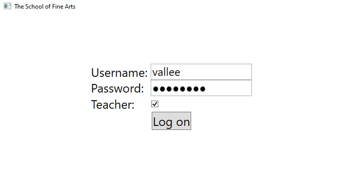
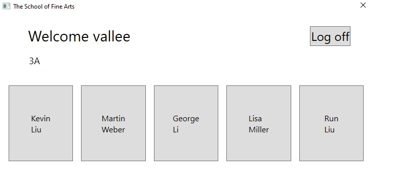
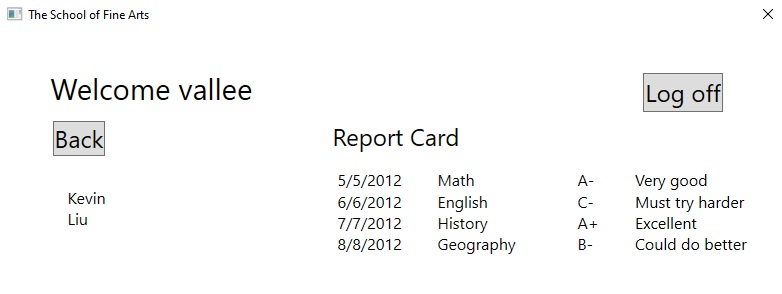
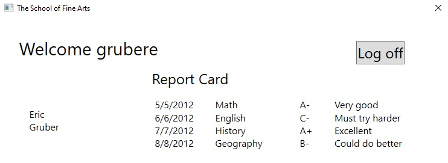
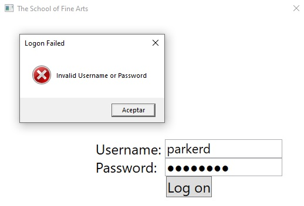
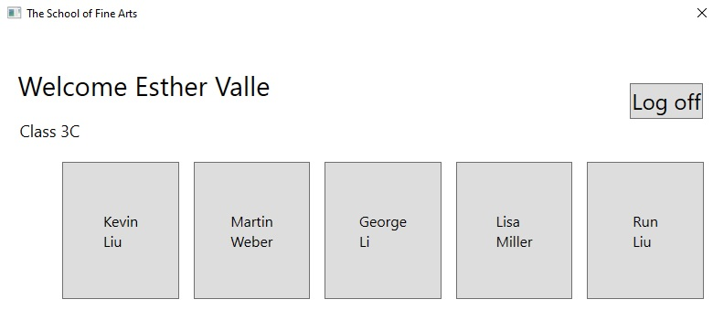
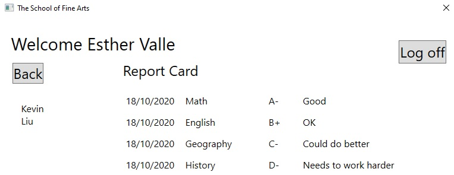
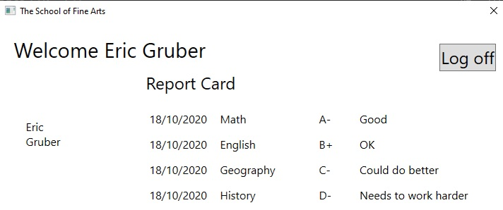

# Laboratorio Módulo 3 - Desarrollo del código para una aplicación gráfica

## Lab: Escribir el código para la aplicación del prototipo de grados

Tiempo estimado: **90 minutos**

Fichero de Instrucciones: Instructions\20483C_MOD03_LAK.md

Entregar el url de GitHub con la solución y un readme con las siguiente información:

1. **Nombres y apellidos:** José René Fuentes Cortez
2. **Fecha:** 15 de octubre de 2020
3. **Resumen del Modulo 2:** Este módulo consta de tres ejercicios:
    -  En el primer ejercio nos ayuda a actualizar la aplicación **Prototipo de Grades** para responder a los eventos del usuario y moverse entre las vistas de la aplicación de forma adecuada.
    - En el ejercicio 2 hacemos que la aplicación contenga las instrucciones para el profesor, el estudiante y los tipos de grado. 
    - En el ejercicio 3 hacemos que sólo los usuarios válidos pueda iniciar sesión en la aplicación y sólo verán los datos adecuados a su función..


4. **Dificultad o problemas presentados y como se resolvieron:** Ninguna.

**NOTA**: Si no hay descripcion de problemas o dificultades, y al yo descargar el código para realizar la comprobacion y el código no funcionar, el resultado de la califaciación del laboratorio será afectado.

---

### Configuración del Lab

Asegúrate de que has clonado el directorio 20483C de GitHub. Contiene los segmentos de código para los laboratorios y demostraciones de este curso. (**https://github.com/MicrosoftLearning/20483-Programming-in-C-Sharp/tree/master/Allfiles**)


## Ejercicio 1: Añadiendo la lógica de navegación a la aplicación del prototipo de grados

### Tarea 1: Examinar la ventana y las vistas en la aplicación

1. Haga clic en **Visual Studio 2019**.
2. En **Visual Studio**, en el menú **Archivo**, apunta a **Abrir**, y luego haz clic en **Proyecto/Solución**.
3. En el cuadro de diálogo **Abrir Proyecto**, apunta a **[Repository Root]\Allfiles\Mod03\Labfiles\Starter\Exercise 1**, haz clic en **GradesPrototype.sln**, y luego haz clic en **Abrir**.
   >**Nota :** Si aparece cualquier cuadro de diálogo de advertencia de seguridad, desactive la casilla **Ask me for each project in this solution** y luego haga clic en **OK**.
4. En el menú **Construir**, haga clic en **Construir la solución**.
5. En **Solution Explorer**, expandir **GradesPrototype**, y luego hacer doble clic en **MainWindow.xaml**.
6. Tenga en cuenta que esta es la ventana principal de la aplicación que albergará las siguientes vistas:
   - **LogonPage.xaml**
   - **StudentProfile.xaml**
   - **StudentsPage.xaml**
7. En **Solution Explorer**, expandir **Views**, y luego hacer doble clic en **LogonPage.xaml**.
8. Note que esta vista contiene cajas de texto para el nombre de usuario y la contraseña, una caja de verificación para identificar al usuario como profesor, y un botón para iniciar la sesión de la aplicación.
9. En **Solution Explorer**, haga doble clic en **StudentProfile.xaml**.
10. Observe que esta vista contiene un boletín de notas que actualmente muestra una lista de notas ficticias. La vista también contiene un botón **Atrás** y un espacio en blanco que mostrará el nombre del estudiante. Esta vista se muestra cuando un estudiante se conecta o cuando un profesor ve el perfil de un estudiante.
11. En **Explorador de soluciones**, haga doble clic en **StudentsPage.xaml**.
12. Note que esta vista contiene la lista de estudiantes de una clase en particular. Esta vista se muestra cuando un profesor se conecta. Un profesor puede hacer clic en el nombre de un estudiante y se mostrará la vista **Students Profile**, que contiene los datos del estudiante seleccionado.

### Tarea 2: Definir el evento LogonSuccess y añadir un código falso para el evento Logon_Click

1. En el menú **Ver**, haga clic en **Lista de tareas**.
2. En la ventana **Task List**, elija la opción **Entire Solution** de la lista de la izquierda.
3. Haga doble clic en el **TODO: Exercise 1: Task 2a: Define the LogonSuccess event handler**.
4. En el editor de códigos, haga clic en la línea en blanco debajo del comentario, y luego escriba el siguiente código:
    ```cs
    evento público EventHandler LogonSuccess;
    ```
5. En la ventana **Task List**, haga doble clic en el **TODO: Exercise 1: Task 2b: Implement the Logon_Click event handler for the Logon button**.
6. En el editor de códigos, haga clic en la línea en blanco debajo de los comentarios, y luego escriba el siguiente código:
    ```cs
    private void Logon_Click(object sender, RoutedEventArgs e)
    {
        // Save the username and role (type of user) specified on the form in the   global context
        SessionContext.UserName = username.Text;
        SessionContext.UserRole = (bool)userrole.IsChecked ? Role.Teacher : Role.Student;

        // If the role is Student, set the CurrentStudent property in the global    context to a dummy student; Eric Gruber
        if (SessionContext.UserRole == Role.Student)
        {
            SessionContext.CurrentStudent = "Eric Gruber";
        }

        // Raise the LogonSuccess event
        if (LogonSuccess != null)
        {
            LogonSuccess(this, null);
        }
    }
    ```
7. En **Solution Explorer**, haga doble clic en **LogonPage.xaml**.
8. En el editor XAML, localice la tarea **TODO: Exercise 1: Task 2c: Specify that the Logon button should raise the Logon_Click event handler in this view**.
9. En la línea debajo del comentario, modifique el marcado de XAML
    ```xml
    <Button Grid.Row="3" Grid.ColumnSpan="2" VerticalAlignment="Center" HorizontalAlignment="Center" Content="Log on" FontSize="24" \>
    ```
    to look like the following markup:
    ```xml
    <Button Grid.Row="3" Grid.ColumnSpan="2" VerticalAlignment="Center" HorizontalAlignment="Center" Content="Log on" FontSize="24" Click="Logon_Click" />
    ```


### Tarea 3: Añadir código para mostrar la vista de inicio de sesión

1. En la ventana **Lista de tareas**, haga doble clic en la tarea **TODO: Exercise 1: Task 3a: Display the logon view and hide the list of students and single student view**.
2. 2. En el editor de códigos, haga clic en la línea en blanco del método **GotoLogon**, y luego escriba el siguiente código:
    ```cs
    // Display the logon view and hide the list of students and single student view
    logonPage.Visibility = Visibility.Visible;
    studentsPage.Visibility = Visibility.Collapsed;
    studentProfile.Visibility = Visibility.Collapsed;
    ```
3. En la ventana **Task List**, haga doble clic en la tarea **TODO: Exercise 1: Task 3b: Handle successful logon**.
4. En el editor de códigos, haga clic en la línea en blanco debajo de los comentarios, y luego escriba el siguiente código:
    ```cs
    // Display the logon view and hide the list of students and single student view
    logonPage.Visibility = Visibility.Visible;
    studentsPage.Visibility = Visibility.Collapsed;
    studentProfile.Visibility = Visibility.Collapsed;
    ```
5. En **Solution Explorer**, haga doble clic en **MainWindow.xaml**.
6. En el editor XAML, localice la tarea **TODO: Exercise 1: Task 3c: Catch the LogonSuccess event and call the Logon_Success event handler (to be created)** tarea.
7. En la línea debajo del comentario, modifique la marca XAML
    ```xml
    <y:LogonPage x:Name="logonPage"  Visibility="Collapsed" />
    ```
    to look like the following markup:
    ```xml
    <y:LogonPage x:Name="logonPage" LogonSuccess="Logon_Success" Visibility="Collapsed" />
    ```

### Tarea 4: Añadir código para determinar el tipo de usuario

1. En la ventana **Task List**, haga doble clic en la tarea **TODO: Exercise 1: Task 4a: Update the display for the logged on user (student or teacher)**.
2. 2. En el editor de códigos, haga clic en la línea en blanco en el método **Refrescar**, y luego escriba el siguiente código:
    ```cs
    switch (SessionContext.UserRole)
    {
        case Role.Student:
            // Display the student name in the banner at the top of the page
            txtName.Text = string.Format("Welcome {0}", SessionContext.UserName);

            // Display the details for the current student
            GotoStudentProfile();
            break;

        case Role.Teacher:
            // Display the teacher name in the banner at the top of the page
            txtName.Text = string.Format("Welcome {0}", SessionContext.UserName);

            // Display the list of students for the teacher
            GotoStudentsPage();
            break;
    }
    ```
3. En la ventana **Task List**, haga doble clic en el **TODO: Exercise 1: Task 4b: Display the details for a single student**.
4. En el editor de códigos, haga clic en la línea en blanco del método **GotoStudentProfile**, y luego escriba el siguiente código:
    ```cs
    // Hide the list of students
    studentsPage.Visibility = Visibility.Collapsed;

    // Display the view for a single student
    studentProfile.Visibility = Visibility.Visible;
    studentProfile.Refresh();
    ```
5. En la ventana **Task List**, haga doble clic en la tarea **TODO: Exercise 1: Task 4c: Display the list of students**.
6. En el editor de códigos, haga clic en la línea en blanco del método **GotoStudentsPage**, y luego escriba el siguiente código:
    ```cs
    // Hide the view for a single student (if it is visible)
    studentProfile.Visibility = Visibility.Collapsed;

    // Display the list of students
    studentsPage.Visibility = Visibility.Visible;
    studentsPage.Refresh();
    ```
7. En la ventana **Task List**, haga doble clic en el **TODO: Exercise 1: Task 4d: Display the details for the current student including the grades for the student**.
8. En el editor de códigos, haga clic en la línea en blanco en el método **Refrescar**, y luego escriba el siguiente código:
    ```cs
    // Parse the student name into the first name and last name by using a regular expression
    // The firstname is the initial string up to the first space character.
    // The lastname is the string after the space character
    Match matchNames = Regex.Match(SessionContext.CurrentStudent, @"([^ ]+) ([^ ]+)");

    if (matchNames.Success)
    {
        string firstName = matchNames.Groups[1].Value; // Indexing in the Groups collection starts at 1, not 0
        string lastName = matchNames.Groups[2].Value;

        // Display the first name and last name in the TextBlock controls in the studentName StackPanel
        ((TextBlock)studentName.Children[0]).Text = firstName;
        ((TextBlock)studentName.Children[1]).Text = lastName;
    }

    // If the current user is a student, hide the Back button
    // (only applicable to teachers who can use the Back button to return to the list of students)
    if (SessionContext.UserRole == Role.Student)
    {
        btnBack.Visibility = Visibility.Hidden;
    }
    else
    {
        btnBack.Visibility = Visibility.Visible;
    }
    ```


### Tarea 5: Manejar el evento Student_Click

1. En la ventana **Task List**, haga doble clic en el **TODO: Exercise 1: Task 5a: Handle the click event for a student**.
2. En el editor de códigos, haga clic en la línea en blanco del método **Student_Click**, y luego escriba el siguiente código:
    ```cs
    Button itemClicked = sender as Button;
    if (itemClicked != null)
    {
        // Find out which student was clicked - the Tag property of the button  contains the name
        string studentName = (string)itemClicked.Tag;
        if (StudentSelected != null)
        {
            // Raise the StudentSelected event (handled by MainWindow) to display the   details for this student
            StudentSelected(sender, new StudentEventArgs(studentName));
        }
    }
    ```
3. En la ventana **Task List**, haga doble clic en el **TODO: Exercise 1: Task 5b: Handle the StudentSelected event when the user clicks a student on the Students page**.
4. En el editor de códigos, haga clic en la línea en blanco del método **studentsPage_StudentSelected**, y luego escriba el siguiente código:
    ```cs
    SessionContext.CurrentStudent = e.Child;
    GotoStudentProfile();
    ```
5. En **Solution Explorer**, haga doble clic en **MainWindow.xaml**.
6. En el editor XAML, localice la tarea **TODO: Exercise 1: Task 5c: Catch the StudentSelected event and call the studentsPage_StudentSelected event handler**.
7. En la línea debajo del comentario, modifica la marca XAML
    ```xml
    <y:StudentsPage x:Name="studentsPage" Visibility="Collapsed" />
    ```
    to look like the following markup:
    ```xml
    <y:StudentsPage x:Name="studentsPage" StudentSelected="studentsPage_StudentSelected" Visibility="Collapsed" />
    ```

### Tarea 6: Construir y probar la aplicación

1. En el menú **Construir**, haga clic en **Construir solución**.
2. En el menú **Debug**, haga clic en **Iniciar sin depuración**.
3. Cuando la aplicación se cargue, en el cuadro de texto **Nombre de usuario**, escriba **vallee**, y en el cuadro de texto **Password**, escriba **password**.

4. Selecciona la casilla **Profesor**, y luego haz clic en **Entrar en**.


- El resultado visual del ejercicio anterior se muestra en la siguiente imagen:

 

5. Verifique que la aplicación muestre la vista **StudentPage**.
   
- El resultado visual del ejercicio anterior se muestra en la siguiente imagen:

 


6. Haga clic en el estudiante **Kevin Liu** y verifique que la aplicación muestra la vista **Students Profile**.

   
- El resultado visual del ejercicio anterior se muestra en la siguiente imagen:

    


7. Haga clic en **Log off**.
8. En el cuadro de texto **Nombre de usuario**, borre el contenido existente, y luego escriba **grubere**.
9. Despeja la casilla de verificación **Profesor**, y luego haz clic en **Entrar en**.
10. Verifique que la aplicación muestra la página de perfil del estudiante para **Eric Gruber**.

   
- El resultado visual del ejercicio anterior se muestra en la siguiente imagen:

    

11. Cierre la aplicación.
12. En el menú **Archivo**, haga clic en **Cerrar solución**.

>**Resultado:** Después de completar este ejercicio, debería haber actualizado la aplicación **Prototipo de Grades** para responder a los eventos del usuario y moverse entre las vistas de la aplicación de forma adecuada.

## Ejercicio 2: Creación de tipos de datos para almacenar información de usuario y de grado

### Tarea 1: Definir las estructuras básicas para mantener la información del grado, del estudiante y del profesor.

1. En **Visual Studio**, en el menú **Archivo**, apunte a **Abrir**, y luego haga clic en **Proyecto/Solución**.
2. En el cuadro de diálogo **Abrir Proyecto**, apunta a **[Repository Root]\Allfiles\Mod03\Labfiles\Starter\Exercise 2**, apunta a **GradesPrototype.sln**, y luego haz clic en **Abrir**.
   >**Nota :** Si aparece cualquier cuadro de diálogo de advertencia de seguridad, desactive la casilla **Ask me for each project in this solution** y luego haga clic en **OK**.
3. En el menú **Ver**, haga clic en **Lista de tareas**.
4. En la ventana **Task List**, haga doble clic en el **TODO: Exercise 2: Task 1a: Create the Grade struct**.
5. En el editor de códigos, haga clic en la línea en blanco debajo del comentario, y luego escriba el siguiente código:
    ```cs
    public struct Grade
    {
        public int StudentID { get; set; }
        public string AssessmentDate { get; set; }
        public string SubjectName { get; set; }
        public string Assessment { get; set; }
        public string Comments { get; set; }
    }
    ```
6. En la ventana **Task List**, haga doble clic en el **TODO: Exercise 2: Task 1b: Create the Student struct**.
7. En el editor de códigos, haga clic en la línea en blanco debajo del comentario, y luego escriba el siguiente código:
    ```cs
    public struct Student
    {
        public int StudentID { get; set; }
        public string UserName { get; set; }
        public string Password { get; set; }
        public int TeacherID { get; set; }
        public string FirstName { get; set; }
        public string LastName { get; set; }
    }
    ```
8. En la ventana **Task List**, haga doble clic en el **TODO: Exercise 2: Task 1c: Create the Teacher struct**.
9. En el editor de códigos, haga clic al final de la línea de comentarios, presione Enter, y luego escriba el siguiente código:
    ```cs
    public struct Teacher
    {
        public int TeacherID { get; set; }
        public string UserName { get; set; }
        public string Password { get; set; }
        public string FirstName { get; set; }
        public string LastName { get; set; }
        public string Class { get; set; }
    }
    ```


#### Tarea 2: Examinar la fuente de datos ficticia utilizada para poblar las colecciones

1. En **Solution Explorer**, expandir **GradesPrototype**, expandir **Data**, y luego hacer doble clic en **DataSource.cs**.
2. En el editor de código, expande la región **Datos de Muestra**, y luego localiza el método **CrearDatos**.
3. Note cómo la **Teachers ArrayList** está poblada con datos **Teacher**, cada uno de los cuales contiene los campos **TeacherID**, **UserName**, **Password**, **FirstName**, **LastName**, y **Class**.
4. Observe cómo la **Students ArrayList** se llena con datos de **Student**, cada uno de los cuales contiene los campos **StudentID**, **UserName**, **Password**, **TeacherID**, **FirstName**, y **LastName**.
5. Observe cómo la **Grades ArrayList** se completa con datos de **Grade**, cada uno de los cuales contiene los campos **StudentID**, **AssessmentDate**, **SubjectName**, **Assessment**, y **Comments**.
6. En el **Menú Archivo**, haga clic en **Cerrar Solución**.

>**Resultado:** Después de completar este ejercicio, la aplicación contendrá las instrucciones para el profesor, el estudiante y los tipos de grado.


## Ejercicio 3: Mostrando información de usuario y grado

### Tarea 1: Añadir el evento LogonFailed

1. En **Visual Studio**, en el menú **Archivo**, apunte a **Abrir**, y luego haga clic en **Proyecto/Solución**.
2. En el cuadro de diálogo **Abrir Proyecto**, apunta a **[Repository Root]\Allfiles\Mod03\Labfiles\Starter\Exercise 3**, apunta a **GradesPrototype.sln**, y luego haz clic en **Abrir**.
   >**Nota :** Si aparece cualquier cuadro de diálogo de advertencia de seguridad, desactive la casilla **Ask me for each project in this solution** y luego haga clic en **OK**.
3. En la ventana **Task List**, haga doble clic en el **TODO: Exercise 3: Task 1a: Define LogonFailed event**.
4. En el editor de códigos, haga clic en la línea en blanco debajo del comentario, y luego escriba el siguiente código:
    ```cs
    public event EventHandler LogonFailed;
    ```
5. En la ventana **Task List**, haga doble clic en la tarea **TODO: Exercise 3: Task 1b: Validate the username and password against the Users collection in the MainWindow window**.
6. En el editor de códigos, en el método **Logon_Click**, haga clic en la línea en blanco, y luego escriba el siguiente código:
    ```cs
    // Find the user in the list of possible users - first check whether the user is a  teacher
    var teacher = (from Teacher t in DataSource.Teachers
                   where String.Compare(t.UserName, username.Text) == 0 &&
                         String.Compare(t.Password, password.Password) == 0
                   select t).FirstOrDefault();

    // If the UserName of the user retrieved by using LINQ is non-empty then the user is a teacher
    if (!String.IsNullOrEmpty(teacher.UserName))
    {
        // Save the UserID and Role (teacher or student) and UserName in the global context
        SessionContext.UserID = teacher.TeacherID;
        SessionContext.UserRole = Role.Teacher;
        SessionContext.UserName = teacher.UserName;
        SessionContext.CurrentTeacher = teacher;

        // Raise the LogonSuccess event and finish
        LogonSuccess(this, null);
        return;
    }
    // If the user is not a teacher, check whether the username and password match those of a student
    else
    {
        var student = (from Student s in DataSource.Students
                       where String.Compare(s.UserName, username.Text) == 0 &&
                             String.Compare(s.Password, password.Password) == 0
                       select s).FirstOrDefault();

        // If the UserName of the user retrieved by using LINQ is non-empty then the user is a student
        if (!String.IsNullOrEmpty(student.UserName))
        {
            // Save the details of the student in the global context
            SessionContext.UserID = student.StudentID;
            SessionContext.UserRole = Role.Student;
            SessionContext.UserName = student.UserName;
            SessionContext.CurrentStudent = student;

            // Raise the LogonSuccess event and finish
            LogonSuccess(this, null);
            return;
        }
    }

    // If the credentials do not match those for a Teacher or for a Student then they must be invalid
    // Raise the LogonFailed event
    LogonFailed(this, null);
    ```

### Tarea 2: Añadir el manejador de eventos Logon_Failed

1. En la ventana **Task List**, haga doble clic en la tarea **TODO: Exercise 3: Task 2a: Handle logon failure**.
2. En el editor de códigos, haga clic en la línea en blanco debajo de los comentarios, y luego escriba el siguiente código:
    ```cs
    private void Logon_Failed(object sender, EventArgs e)
    {
        // Display an error message. The user must try again
        MessageBox.Show("Invalid Username or Password", "Logon Failed", MessageBoxButton.OK, MessageBoxImage.Error);
    }
    ```
3. En **Solution Explorer**, haga doble clic en **MainWindow.xaml**.
4. En el editor XAML, localice la tarea **TODO: Exercise 3: Task 2b: Connect the LogonFailed event of the logonPage view to the Logon_Failed method in MainWindow.xaml.cs**.
5. En la línea debajo del comentario, modifique la marca XAML
    ```xml
    <y:LogonPage x:Name="logonPage" LogonSuccess="Logon_Success" Visibility="Collapsed" />
    ```
    to look like the following markup:
    ```xml
    <y:LogonPage x:Name="logonPage" LogonSuccess="Logon_Success" LogonFailed="Logon_Failed" Visibility="Collapsed" />
    ```
6. En la ventana **Task List**, haga doble clic en la tarea **TODO: Exercise 3: Task 2c: Display the student name in the banner at the top of the page**.
7. En el editor de códigos, haga clic en la línea en blanco debajo del comentario, y luego escriba el siguiente código:
    ```cs
    // Display the student name in the banner at the top of the page
    txtName.Text = string.Format("Welcome {0} {1}", SessionContext.CurrentStudent.FirstName, SessionContext.CurrentStudent.LastName);
    ```
8. En la ventana **Task List**, haga doble clic en la tarea **TODO: Exercise 3: Task 2d: Display the teacher name in the banner at the top of the page**.
9. En el editor de códigos, haga clic en la línea en blanco debajo del comentario, y luego escriba el siguiente código:
    ```cs
    // Display the teacher name in the banner at the top of the page
    txtName.Text = string.Format("Welcome {0} {1}", SessionContext.CurrentTeacher.FirstName, SessionContext.CurrentTeacher.LastName);
    ```

### Tarea 3: Mostrar los estudiantes para el profesor actual

1. En **Solution Explorer**, expandir **Views**, y luego hacer doble clic en **StudentsPage.xaml**.
2. En el editor XAML, localiza el **ItemsControl** llamado **lista** y observa cómo se utiliza la vinculación de datos para mostrar el nombre de cada estudiante.
   >**Nota:** La vinculación de datos también se utiliza para recuperar el StudentID de un estudiante. Esta vinculación se utiliza cuando un usuario hace clic en un estudiante de la lista **Página del estudiante** para identificar al estudiante cuyos datos se van a mostrar en la página **Students Profile**.
3. En la ventana **Task List**, haga doble clic en la tarea **TODO: Exercise 3: Task 3a: Display students for the current teacher (held in SessionContext.CurrentTeacher)**.
4. En el editor de códigos, en el método **Refrescar**, haga clic en la línea en blanco, y luego escriba el siguiente código:
    ```cs
    // Find students for the current teacher
    ArrayList students = new ArrayList();

    foreach (Student student in DataSource.Students)
    {
        if (student.TeacherID == SessionContext.CurrentTeacher.TeacherID)
        {
            students.Add(student);
        }
    }

    // Bind the collection to the list item template
    list.ItemsSource = students;

    // Display the class name
    txtClass.Text = String.Format("Class {0}", SessionContext.CurrentTeacher.Class);
    ```
5. En la ventana **Task List**, haga doble clic en el **TODO: Exercise 3: Task 3b: If the user clicks on a student, display the details for that student**.
6. En el editor de códigos, en el método **Student_Click**, haga clic en la línea en blanco, y luego escriba el siguiente código:
    ```cs
    Button itemClicked = sender as Button;

    if (itemClicked != null)
    {
        // Find out which student was clicked
        int studentID = (int)itemClicked.Tag;

        if (StudentSelected !=null)
        {
            // Find the details of the student by examining the DataContext of the Button
            Student student = (Student)itemClicked.DataContext;

            // Raise the StudentSelected event (handled by MainWindow to display the details for this student
            StudentSelected(sender, new StudentEventArgs(student));
        }
    }
    ```
7. En la ventana **Task List**, haga doble clic en el **TODO: Exercise 3: Task 3c: Set the current student in the global context to the student specified in the StudentEventArgs parameter**.
8. En el editor de códigos, haga clic en la línea en blanco debajo del comentario, y luego escriba el siguiente código:
    ```cs
    SessionContext.CurrentStudent = e.Child;
    ```

### Tarea 4: Establecer el DataContext para la página

1. En la ventana **Task List**, haga doble clic en el **TODO: Exercise 3: Task 4a: Display the details for the current student (held in SessionContext.CurrentStudent)**.
2. En el editor de códigos, haga clic en la línea en blanco debajo del comentario, y luego escriba el siguiente código:
    ```cs
    // Bind the studentName StackPanel to display the details of the student in the TextBlocks in this panel
    studentName.DataContext = SessionContext.CurrentStudent;

    // If the current user is a student, hide the Back button
    // (only applicable to teachers who can use the Back button to return to the list of students)
    if (SessionContext.UserRole == Role.Student)
    {
        btnBack.Visibility = Visibility.Hidden;
    }
    else
    {
        btnBack.Visibility = Visibility.Visible;
    }
    ```
3. En **Solution Explorer**, expandir **Views** y luego hacer doble clic en **StudentProfile.xaml**.
4. En el editor XAML, localice la tarea **TODO: Exercise 3: Task 4b: Bind the firstName TextBlock to the FirstName property of the DataContext for this control**.
5. En la línea debajo del comentario, modifique la marca XAML
    ```xml
    <TextBlock x:Name="firstName" FontSize="16" />
    ```
    to look like the following markup:
    ```xml
    <TextBlock x:Name="firstName" Text="{Binding FirstName}" FontSize="16" />
    ```
6. En el editor de XAML, localice la tarea **TODO: Exercise 3: Task 4c: Bind the lastName TextBlock to the LastName property of the DataContext for this control**.
7. En la línea debajo del comentario, modifique la marca XAML
    ```xml
    <TextBlock x:Name="lastName" FontSize="16"/>
    ```
    to look like the following markup:
    ```xml
    <TextBlock x:Name="lastName" Text="{Binding LastName}" FontSize="16"  />
    ```
8. En la ventana **Task List**, haga doble clic en la tarea **TODO: Exercise 3: Task 4d: Create a list of the grades for the student and display this list on the page**.
9. En el editor de códigos, haga clic al final de la línea de comentarios, presione Enter, y luego escriba el siguiente código:
    ```cs
    // Find all the grades for the student
    ArrayList grades = new ArrayList();

    foreach (Grade grade in DataSource.Grades)
    {
        if (grade.StudentID == SessionContext.CurrentStudent.StudentID)
        {
            grades.Add(grade);
        }
    }

    // Display the grades in the studentGrades ItemsControl by using databinding
    studentGrades.ItemsSource = grades;
    ```


### Tarea 5: Construir y probar la aplicación

1. En el menú **Construir**, haga clic en **Construir solución**.
2. En el menú **Debug**, haga clic en **Iniciar sin depuración**.
3. Cuando la aplicación se cargue, en el cuadro de texto **Nombre de usuario**, escriba **parkerd**, en el cuadro de texto **Password**, escriba **password**, y luego haga clic en **Entrar en**.
4. Verifique que aparezca el cuadro de diálogo **Logon Failed**, y luego haga clic en **OK**.

- El resultado visual del ejercicio anterior se muestra en la siguiente imagen:

    


5. En el cuadro de texto **Nombre de usuario**, borre el contenido existente, escriba **vallee**, y luego haga clic en **Entrar en**.

- El resultado visual del ejercicio anterior se muestra en la siguiente imagen:

    

6. Verifique que aparezca la página **Students**, mostrando una lista de estudiantes.
7. Haga clic en el estudiante **Kevin Liu** y verifique que aparece la página **Students Profile**.

- El resultado visual del ejercicio anterior se muestra en la siguiente imagen:

    

8. Haga clic en **Log off**.
9. En el cuadro de texto **Nombre de usuario**, borre el contenido existente, escriba **grubere**, y luego haga clic en **Log on**.

10. Verifique que se muestre la página **Students Profile** para **Eric Gruber**.


- El resultado visual del ejercicio anterior se muestra en la siguiente imagen:

    

    
11. Cierre la aplicación.
12. En el menú **Archivo**, haga clic en **Cerrar solución**.

>**Resultado:** Después de completar este ejercicio, sólo los usuarios válidos podrán iniciar sesión en la aplicación y sólo verán los datos adecuados a su función.


