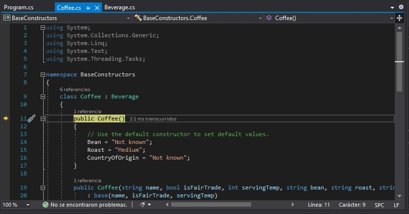
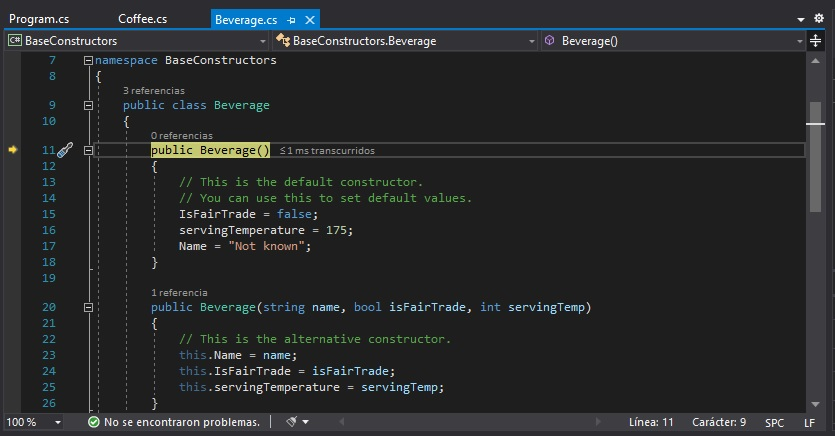
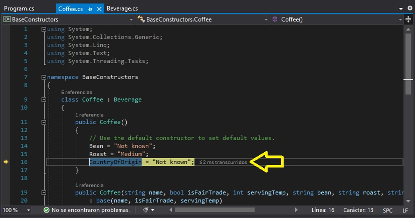
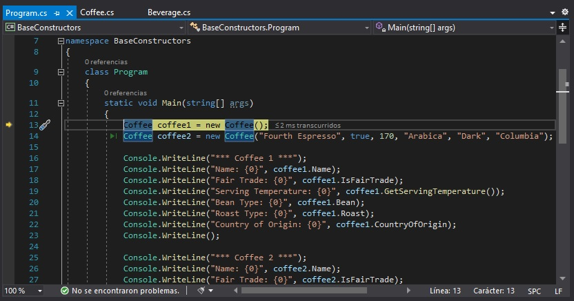
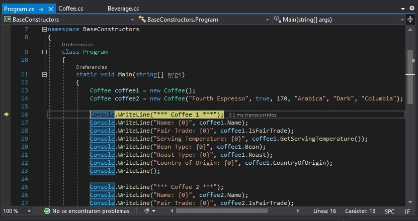
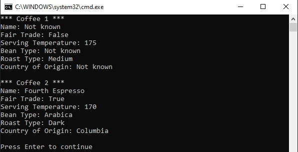

# Módulo 5: Creación de una jerarquía de clases mediante el uso de la herencia

Fichero de Instrucciones: Instructions\20483C_MOD05_DEMO.md

Entregar el url de GitHub con la solución y un readme con las siguiente información:

1. **Nombres y apellidos:** José René Fuentes Cortez
2. **Fecha:** 16 de Octubre 2020.
3. **Resumen del Modulo 5:** Este MOC consta de dos lecciones de las cuales solo haremos una:
    -  En el primer ejercio nos ayuda a actualizar la aplicación para refactorizar el código duplicado en métodos reutilizables.

4. **Dificultad o problemas presentados y como se resolvieron:** Ninguna.

**NOTA**: Si no hay descripcion de problemas o dificultades, y al yo descargar el código para realizar la comprobacion y el código no funcionar, el resultado de la califaciación del laboratorio será afectado.

---

## Lección 1: Crear jerarquías de clase

### Demonstration: Llamando a los constructores de la base

#### Pasos de preparación

1. Asegúrate de que has clonado el directorio 20483C de GitHub. Contiene los segmentos de código para los laboratorios y demostraciones de este curso. (**https://github.com/MicrosoftLearning/20483-Programming-in-C-Sharp/tree/master/Allfiles**)
2. Navega a **[Repository Root]\Allfiles\Mod05\Democode**, y luego abre el archivo **BaseConstructors.sln**.
3. Si aparece alguna ventana de advertencia de seguridad, haga clic en **OK**.

#### Pasos de demostración

1. En **Solution Explorer**, haga doble clic en **Beverage.cs** y revise el contenido de la clase.
2. Observe que la clase **Beverage** contiene un constructor por defecto y un constructor alternativo.
3. En **Solution Explorer**, haga doble clic en **Coffee.cs** y revise el contenido de la clase.
4. Tengan en cuenta que la clase de **Coffee** hereda de la clase de **Beverage**.
5. Observe que la clase **Coffee** contiene un constructor por defecto y un constructor alternativo.
6. Obsérvese que el constructor alternativo llama explícitamente al constructor alternativo de la clase base.
7. En **Solution Explorer**, haga doble clic en **Program.cs** y revise el contenido de la clase.
8. Observe que la clase **Programa** crea dos instancias del tipo **Coffee**: una usando el constructor por defecto, y otra usando el constructor alternativo.
9. En el menú de **Construir**, haga clic en **Construir la solución**.

10. Presiona F11 dos veces para que la primera línea del código ejecutable de la clase **Programa** se resalte.

- La representación visual a la respuesta del último ejercicio se muestra en la siguiente imagen:

 

11. Presione F11. Observe que el depurador pasa al constructor por defecto para la clase **Coffee**.

- La representación visual a la respuesta del último ejercicio se muestra en la siguiente imagen:

 

12. Presiona F11. Observe que el depurador entra en el constructor por defecto para la clase **Beverage**.

- La representación visual a la respuesta del último ejercicio se muestra en la siguiente imagen:

 

13. Observe que los constructores de clases derivadas llaman implícitamente al constructor de la clase base por defecto, a menos que especifique un constructor de clase base alternativo.
14. Presiona F11 seis veces, hasta que el depurador vuelva al constructor por defecto de la clase **Coffee**.
     >**Nota:** Si aparece la ventana de **Microsoft Visual Studio**, presione **No** y continúe con F11.

- La representación visual a la respuesta del último ejercicio se muestra en la siguiente imagen:

 

15. Observe que la lógica del constructor de la clase base se ejecuta antes que la lógica del constructor de la clase derivada.
16. Presiona F11 seis veces, hasta que el depurador vuelva a la clase **Programa**.
17. Presiona F11. La segunda línea de código ejecutable de la clase **Programa** está resaltada.
18. Presiona F11. Observe que el depurador entra en el constructor alternativo para la clase **Coffee**.
19. Presiona F11. Observe que el depurador entra en el constructor alternativo para la clase **Beverage**.

- La representación visual a la respuesta del último ejercicio se muestra en la siguiente imagen:

 

20. Coloca el ratón sobre los parámetros del constructor **Beverage** y señala que el constructor **Coffee** ha pasado valores de argumento a este constructor.
21. Presiona F11 seis veces, hasta que el depurador vuelva al constructor alternativo para la clase **Coffee**.
22. Presiona F11 seis veces, hasta que el depurador vuelva a la clase **Programa**.

- La representación visual a la respuesta del último ejercicio se muestra en la siguiente imagen:

 

23. Presione F5 para ejecutar el resto de la aplicación.
24. Cuando aparezca la ventana de la consola, señale que para los consumidores de la clase no importa si las variables fueron fijadas por el constructor de la clase derivada o por el constructor de la clase base.

- La representación visual a la respuesta del último ejercicio se muestra en la siguiente imagen:

 

25. Para cerrar la ventana de la consola, pulse Intro.
26. Cierre el Estudio Visual.

## Lección 2: Extendiendo las clases del .NET Framework

### Demonstration: Refactorización de la funcionalidad común en el laboratorio de la clase de usuario

#### Pasos de preparación

Asegúrate de que has clonado el directorio 20483C de GitHub. Contiene los segmentos de código para los laboratorios y demostraciones de este curso. (**https://github.com/MicrosoftLearning/20483-Programming-in-C-Sharp/tree/master/Allfiles**)

#### Pasos de demostración

1. Abre la solución **GradesPrototype.sln** de la carpeta **[Repository Root]\Allfiles\Mod05\Labfiles\Solution\Exercise 3**.
     >**Nota :** Si aparece cualquier cuadro de diálogo de advertencia de seguridad, desactive la casilla de verificación **Pregúntame por cada proyecto de esta solución** y luego haga clic en **OK**.
2. En la carpeta **Datos**, abre **Grade.cs**, y localiza la clase **Usuario**.
3. Explique a los estudiantes que durante el ejercicio 1 añadirán esta clase y añadirán las propiedades **UserName** y **Password** y el método **VerifyPassword**.
4. Localizar la clase **Estudiante** y explicar a los estudiantes que durante el Ejercicio 1 modificarán esta clase para heredar de la nueva clase **Usuario** y utilizar las implementaciones de miembros que proporciona.
5. Localizar la clase de **Usuario** de nuevo y explicar a los estudiantes que durante el ejercicio 2 añadirán el método abstracto **SetPassword** y lo usarán desde el acceso establecido de la propiedad **Contraseña**.
6. En la clase **Estudiante**, localiza la propiedad **SetPassword** y explica a los estudiantes que añadirán código aquí para anular la propiedad abstracta en la clase **Usuario** para asegurar que las contraseñas de los estudiantes tengan al menos seis caracteres de longitud.
7. En la clase **Profesor**, localice la propiedad **Contraseña** y explique a los estudiantes que añadirán código aquí para anular la propiedad abstracta en la clase **Usuario** para asegurarse de que las contraseñas de los profesores contienen al menos dos caracteres numéricos y son de al menos ocho caracteres de largo.
8. En la carpeta **Controles**, expanda **Cambio de ContraseñaDialog.xaml**, abra **Cambio de ContraseñaDialog.xaml.cs** y localice el método **ok_Click**.
9. Explique a los estudiantes que durante el Ejercicio 2 añadirán este código para llamar a la implementación apropiada del método **SetPassword** de acuerdo con el rol del usuario actual.
10. En la carpeta **Servicios**, abre **ClaseFullException.cs**.
11. Explique a los estudiantes que durante el ejercicio 3 añadirán a esta clase propiedades y constructores personalizados de **ClassName**.
12. En **Grade.cs**, localice la clase **Profesor** y explique a los estudiantes que usarán la constante **MAX_CLASS_SIZE** para definir el número máximo de estudiantes que pueden estar inscritos en una clase.
13. Localiza el método **EnrollInClass** y explica a los estudiantes que durante el ejercicio 3 añadirán el código aquí para lanzar la **ClassFullException** si el usuario intenta añadir demasiados estudiantes a una clase.
14. Ejecute la aplicación e inicie sesión como **vallee** con la contraseña **contraseña99**.
15. Señala que la aplicación muestra correctamente a los estudiantes de la clase de Esther Valle.
16. Intente cambiar la contraseña a **contraseña1** (una contraseña que no es válida) y señale el mensaje de error que se muestra.
17. Cambie la contraseña a **password101** (una contraseña válida) y señale que la contraseña ha sido cambiada con éxito.
18. Crear cuatro nuevos estudiantes.
19. Intenta inscribir a los cuatro estudiantes en la clase. Cuando inscriba al cuarto estudiante, señale el mensaje de error que aparece.
20. Desconecta, y luego entra como **liuk** con la contraseña **contraseña**.
21. Señala que la aplicación muestra correctamente el informe de calificaciones del estudiante.
22. Intente cambiar la contraseña a **pass** (una contraseña que no es válida) y señale el mensaje de error que se muestra.
23. Cambie la contraseña a **passwd** (una contraseña válida) y señale que la contraseña se ha cambiado con éxito.
24. Cierra la aplicación, y luego cierra Visual Studio.
