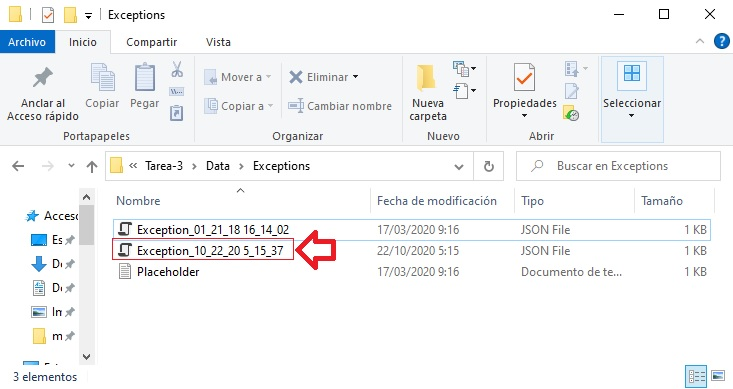

# Módulo 6: Lectura y escritura de datos locales


Fichero de Instrucciones: Instructions\20483C_MOD06
_DEMO.md

Entregar el url de GitHub con la solución y un readme con las siguiente información:

1. **Nombres y apellidos:** José René Fuentes Cortez
2. **Fecha:** 16 de Octubre 2020.
3. **Resumen del Modulo 6:** Este módulo consta de tres leccions de la cuales solo haremos dos:
    -  En la primera lección cargamos y manipulamos archivos desde nuestra aplicación.
    - En la lección 2 hacemos serialziación y deserialización de objetos JSON, así como manipulación de archivos para mostrar archivos con objetos JSON y logs.


4. **Dificultad o problemas presentados y como se resolvieron:** Ninguna.

**NOTA**: Si no hay descripcion de problemas o dificultades, y al yo descargar el código para realizar la comprobacion y el código no funcionar, el resultado de la califaciación del laboratorio será afectado.

---

## Lección 1: Lectura y escritura de archivos

### Demonstration: Manipulación de archivos, directorios y rutas

#### Pasos de preparación

Asegúrate de que has clonado el directorio 20483C de GitHub. Contiene los segmentos de código para los laboratorios y demostraciones de este curso. (**https://github.com/MicrosoftLearning/20483-Programming-in-C-Sharp/tree/master/Allfiles**)

#### Pasos de demostración

1. Abrir **Visual Studio 2019**.
2. Navega a **[Repository Root]\Allfiles\Mod06\Democode\Starter\FourthCoffee.LogProcessor** y luego abre el archivo **FourthCoffee.LogProcessor.sln**.
     >**Nota :** Si aparece cualquier cuadro de diálogo de advertencia de seguridad, desactive la casilla de verificación **Pregúntame por cada proyecto de esta solución** y luego haga clic en **OK**.
3. En **Visual Studio**, en el menú **Ver**, haga clic en **Lista de tareas**.
4. En la ventana **Task List**, haga doble clic en el **TODO: 01: Asegure que el directorio de archivos de registro existe.** tarea.
5. En el editor de códigos, haga clic en la línea en blanco debajo del comentario, y luego escriba el siguiente código:
    ```cs
    if (!Directory.Exists(logDirectoryRoot))
        throw new DirectoryNotFoundException();
    ```
6. En la ventana **Task List**, haga doble clic en el **TODO: 02: Get all log file paths.** task.
7. En el editor de códigos, haga clic en la línea en blanco debajo del comentario, y luego escriba el siguiente código:
    ```cs
    return Directory.GetFiles(this._logDirectoryPath, "*.txt");
    ```
8. En la ventana **Task List**, haga doble clic en el **TODO: 03: Check for existing combined log file and delete if it already exists.** task.
9. En el editor de códigos, haga clic en la línea en blanco debajo del comentario, y luego escriba el siguiente código:
    ```cs
    if (File.Exists(combinedLogPath))
        File.Delete(combinedLogPath);
    ```
10. En la ventana **Task List**, haga doble clic en la tarea **TODO: 04: Write the heading to the combined log file.**.
11. En el editor de códigos, haga clic en la línea en blanco debajo del comentario, y luego escriba el siguiente código:
    ```cs
    File.AppendAllLines(combinedLogPath, heading);
    ```
12. En la ventana **Task List**, haga doble clic en la tarea **TODO: 05: Get the log file name without the file extension.**.
13. En el editor de códigos, haga clic en la línea en blanco debajo del comentario, y luego escriba el siguiente código:
    ```cs
    var logName = Path.GetFileNameWithoutExtension(logPath);
    ```
14. En la ventana **Task List**, haga doble clic en la tarea **TODO: Task 06: Read the contents of the existing log file.**.
15. En el editor de códigos, haga clic en la línea en blanco debajo del comentario, y luego escriba el siguiente código:
    ```cs
    var logText = File.ReadAllText(logPath);
    ```
16. En la ventana **Task List**, haga doble clic en la tarea **TODO: Task 07: Write the log file contents to the combined log file.**.
17. En el editor de códigos, haga clic en la línea en blanco debajo del comentario, y luego escriba el siguiente código:
    ```cs
    File.AppendAllLines(combinedLogPath, logContent);
    ```
18. En la ventana **Lista de tareas**, haga doble clic en la tarea **//TODO 09: Replace [Repository Root] with your folder path.**.
19. Reemplaza **[Raíz del repositorio]** con la ruta de tu carpeta.
20. En el menú **Construir**, haga clic en **Construir solución**.
21. En el menú **Debug**, haga clic en **Iniciar sin depuración**.
22. En la ventana **Command Prompt**, cuando se le pida que pulse cualquier tecla para continuar, pulse Intro.

- La representación visual a la respuesta del último ejercicio se muestra en la siguiente imagen:

 

23. Abre el **Explorador de Archivos** y navega a la carpeta **[Repository Root]\Allfiles\Mod06\Democode\Data\Logs**.

- La representación visual a la respuesta del último ejercicio se muestra en la siguiente imagen:

 

24. Haga doble clic en **CombinedLog.txt**, verifique que el archivo contiene un encabezamiento, y luego verifique el contenido de cada archivo de registro.

- La representación visual a la respuesta del último ejercicio se muestra en la siguiente imagen:

 


25. Cerrar **Notepad**, cerrar **Explorador de archivos**, y luego cerrar **Visual Studio**.

## Lección 2: Serializar y deserializar los datos

### Demonstration: Serializar objetos como JSON usando JSON.Net

#### Pasos de preparación

Asegúrate de que has clonado el directorio 20483C de GitHub. Contiene los segmentos de código para los laboratorios y demostraciones de este curso. (**https://github.com/MicrosoftLearning/20483-Programming-in-C-Sharp/tree/master/Allfiles**)

#### Pasos de demostración

1. Navega a **[Repository Root]\Allfiles\Mod06\Democode\Starter\FourthCoffee.ExceptionLogger**, y luego abre el archivo **FourthCoffee.ExceptionLogger.sln**.
     >**Nota :** Si aparece cualquier cuadro de diálogo de advertencia de seguridad, desactive la casilla de verificación **Pregúntame por cada proyecto de esta solución** y luego haga clic en **OK**.
2. Haga clic con el botón derecho del ratón en el proyecto **FourthCoffee.ExceptionLogger**, y luego seleccione **Manage NuGet Packages**.
3. En **NuGet: Cuarto Café. Registro de Excepciones, haga clic en "Examinar".
4. Haga clic en el cuadro de texto **Búsqueda** y escriba **Newtonsoft.Json**
5. Selecciona el resultado de **Newtonsoft.Json** y pulsa en el lado izquierdo de la ventana de **Instalación**.
6. Cierra la ventana de **Instalación**.
7. En **Visual Studio**, en el menú **Ver**, haga clic en **Lista de tareas**.
8. En la ventana **Task List**, haga doble clic en la tarea **TODO: 01: Add Using for Newtonsoft.Json.**.
9. En el editor de códigos, haga clic en la línea en blanco debajo del comentario, y luego escriba el siguiente código:
    ```cs
    using Newtonsoft.Json;
    ```
10. En la ventana **Task List**, haga doble clic en la tarea **TODO: 02: Convertir objeto en cadena JSON.**
11. En el editor de códigos, al final del comentario presione **Enter**, y luego escriba el siguiente código:
    ```cs
    var jsonAsString = JsonConvert.SerializeObject(entry);
    File.WriteAllText(path,jsonAsString);
    ```
12. En la ventana **Task List**, haga doble clic en el **TODO: 03: Convertir cadena JSON en un objeto.** tarea.
13. En el editor de códigos, haga clic en la línea en blanco debajo del comentario, y luego escriba el siguiente código:
    ```cs
    entry = JsonConvert.DeserializeObject<ExceptionEntry>(jsonAsStriong);
    ```
14. Expande el proyecto **FourthCoffee.ExceptionLogger** y haz doble clic en el archivo **App.config**.
15. Reemplaza **[Raíz del repositorio]** con la ruta de tu carpeta.
16. En el menú **Construir**, haga clic en **Construir solución**.
17. En el menú **Debug**, haga clic en **Iniciar sin depuración**.
18. En la ventana **Exception Logger**, cree una nueva entrada de excepción usando la siguiente información, y luego haga clic en **Save**:
     - Título: **Error crítico de la base de datos**
     - Detalles: **No pude encontrar el servidor de la base de datos**
19. En el cuadro de mensajes **Save Successful**, haga clic en **OK**. La entrada de excepción ha sido ahora serializada.

- La representación visual a la respuesta del último ejercicio se muestra en la siguiente imagen:

 

20. Cierra la aplicación **Exception Logger**.
21. Abre el **Explorador de Archivos** y navega a la carpeta **[Repository Root]\Allfiles\Mod06\Democode\Data\Exceptions**.

- La representación visual a la respuesta del último ejercicio se muestra en la siguiente imagen:

 

22. En la carpeta **[Repository Root]\Allfiles\Mod06\Democode\Data\Exceptions**, haga doble clic en el archivo **Excepciones_\N- fecha y hora\N-.json**, Si el archivo JSON no se estaba abriendo, entonces haga clic con el botón derecho en el archivo y luego abra con el Bloc de notas.
23. En **Notepad**, encuentra los elementos **Título** y **Detalles** de JSON.

- La representación visual a la respuesta del último ejercicio se muestra en la siguiente imagen:

 

24. Cambia a **Visual Studio**, y en el menú **Debug**, pulsa **Iniciar sin depuración**.
25. En la ventana **Exception Logger**, en la lista de **Archivos**, pulsa **[Repository Root]\Allfiles\Mod06\Democode\Data\Exceptions\Exception_\<date and time\>.json**, y luego pulsa **Cargar**. 

- La representación visual a la respuesta del último ejercicio se muestra en la siguiente imagen:

 

El objeto **ExceptionEntry** ha sido ahora deserializado.

- La representación visual a la respuesta del último ejercicio se muestra en la siguiente imagen:

 

26. Cierra la aplicación, cierra **Visual Studio**, y luego cierra **File Explorer**.

## Lección 3: Realizar E/S usando corrientes

### Demonstration: Generando el laboratorio de informes de calificaciones

#### Pasos de preparación

Asegúrate de que has clonado el directorio 20483C de GitHub. Contiene los segmentos de código para los laboratorios y demostraciones de este curso. (**https://github.com/MicrosoftLearning/20483-Programming-in-C-Sharp/tree/master/Allfiles**)

#### Pasos de demostración

1. Abre la solución **GradesPrototype.sln** de la carpeta **[Repository Root]\Allfiles\Mod06\Labfiles\Solution\Exercise 2**.
     >**Nota :** Si aparece cualquier cuadro de diálogo de advertencia de seguridad, desactive la casilla de verificación **Pregúntame por cada proyecto de esta solución** y luego haga clic en **OK**.
2. En la carpeta **Views**, abra **StudentProfile.xaml** y verifique que la interfaz de usuario ha sido actualizada para incluir el botón **Save Report** y el botón **Load Report**.
3. En la carpeta **Vistas**, abre **Perfil del Estudiante.xaml.cs**, y localiza el método **SalvarInforme_Click**.
4. Explique a los estudiantes que durante el laboratorio añadirán el código en este método para pedir al usuario un nombre de archivo para guardar el informe como, y para llamar a los métodos para generar, previsualizar y guardar el informe.
5. En la carpeta **Views**, abre **StudentProfile.xaml.cs**, y localiza el método **LoadReport_Click**.
6. Explique a los estudiantes que durante el laboratorio añadirán el código en este método para pedir al usuario un nombre de archivo para cargar el informe, y para llamar a los métodos para mostrar el informe al usuario.
7. Explique a los estudiantes que durante el laboratorio añadirán el código que genera un documento JSON y lo cargarán desde el disco.
8. Ejecuta la aplicación, y entra como **vallee** con **contraseña99** como contraseña.
9. Ver **Kevin Liu's** tarjeta de informe y luego haga clic en **Save Report** para generar el documento JSON.
10. Especifique para guardar el archivo en la carpeta **Documentos** utilizando el nombre predeterminado.
11. Revise los datos de JSON que aparecen en el cuadro de mensajes, y luego confirme que quiere guardar el archivo.
12. Ve al archivo y cambia algunas propiedades dentro del informe.
13. Ver **Kevin Liu's** tarjeta de informe y luego haga clic en **Cargar Informe** para cargar el documento JSON y mostrarlo en la vista **Tarjeta de informe**.
14. Cierra la aplicación, y luego cierra **Visual Studio**.
