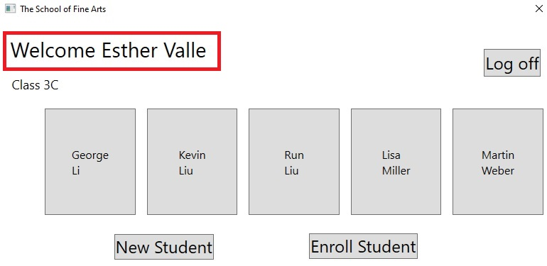
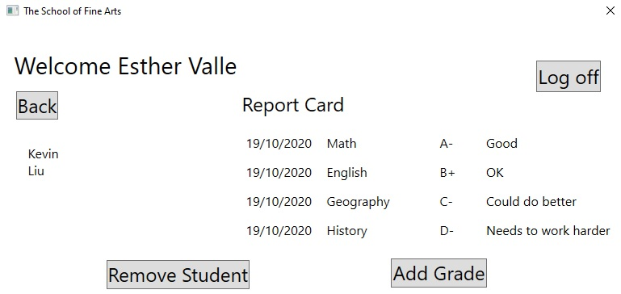
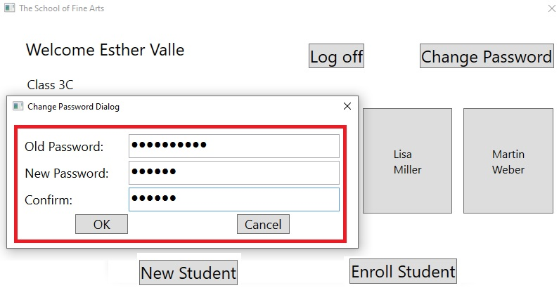
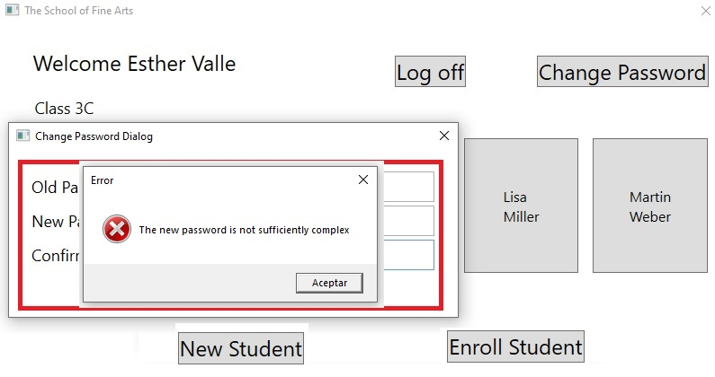
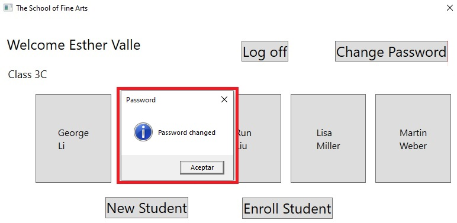
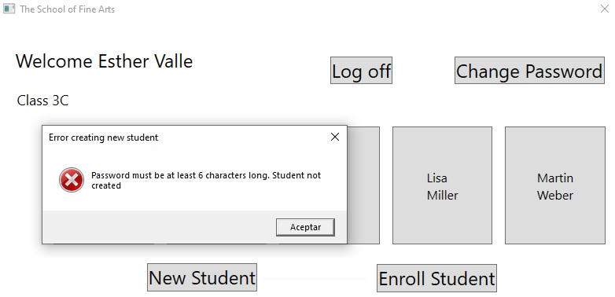
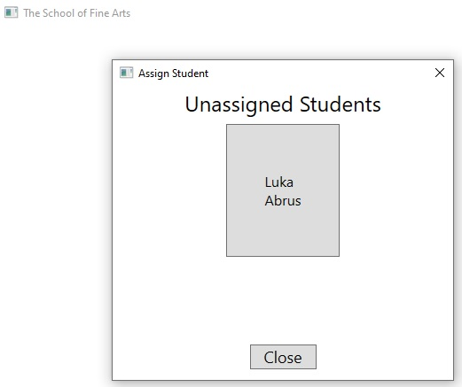
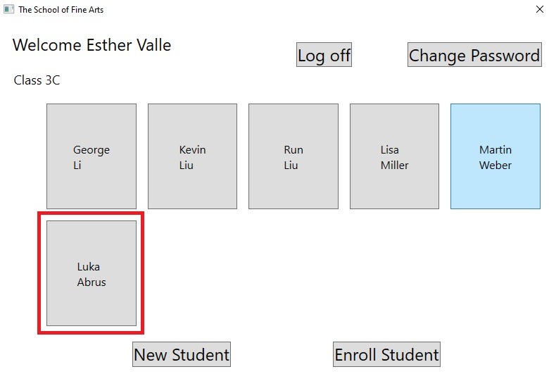

# Módulo 5: Creación de una jerarquía de clases mediante el uso de herencia

# Laboratorio: Refactorización de la funcionalidad común en la clase de usuario

Tiempo estimado:**60 minutos**

Fichero de Instrucciones: Instructions\20483C_MOD05_LAK.md

Entregar el url de GitHub con la solución y un readme con las siguiente información:

1. **Nombres y apellidos:** José René Fuentes Cortez
2. **Fecha:** 16 de Octubre 2020.
3. **Resumen del Modulo 5:** Este módulo consta de tres ejercicios:
    -  En el primer ejercio nos ayuda a eliminar el código duplicado de las clases **Student** y **Teacher**, y movido el código a una clase base abstracta llamada **User**.
    - En el ejercicio 2 implementamos un método polimórfico llamado **SetPassword** que cambia el comportamiento en función de si el usuario es un estudiante o un profesor. También habrá modificado la aplicación para que los usuarios puedan cambiar sus passwords.
    - En el ejercicio 3 hacemos que la aplicación pueda manipular los datos modificados del estudiante para que se  guarden en la base de datos.

4. **Dificultad o problemas presentados y como se resolvieron:** Ninguna.

**NOTA**: Si no hay descripcion de problemas o dificultades, y al yo descargar el código para realizar la comprobacion y el código no funcionar, el resultado de la califaciación del laboratorio será afectado.

---
---

## Configuración del laboratorio

Asegúrate de que has clonado el directorio 20483C de GitHub. Contiene los segmentos de código para los laboratorios y demostraciones de este curso. (**https://github.com/MicrosoftLearning/20483-Programming-in-C-Sharp/tree/master/Allfiles**)


## Pasos de preparación


## Ejercicio 1: Creación y herencia de la clase User Base

### Tarea 1: Crear la clase base abstracta de usuario

1. Haga clic en **Visual Studio 2019**.
2. En **Visual Studio**, en el menú **Archivo**, seleccione **Abrir** y luego haga clic en **Proyecto/Solución**.
3. En el cuadro de diálogo **Abrir proyecto**, vaya a **[Repository Root]\allfiles\Mod05\Labfiles\Starter\Exercise 1**, haga clic en **GradesPrototype.sln** y luego haga clic en **Abrir**.
   > **Nota:** Si aparece algún cuadro de diálogo de advertencia de seguridad, desactive la casilla de verificación **Preguntarme por cada proyecto en esta solución** y luego haga clic en **Aceptar**.
4. En **Visual Studio**, en el menú **Ver**, haga clic en **Lista de tareas**.
5. En la ventana **Lista de tareas**, haga doble clic en la tarea **TODO: Exercise 1: Task 1a: Create the User abstract class with the common functionality for Teachers and Students**.
6. En el editor de código, haga clic al final del comentario, presione Entrar y luego escriba el siguiente código:
    ```cs
    public abstract class User
    {
    ```
7. Haga clic al final del último comentario en el bloque (antes de la declaración de clase **Calificación **), presione Intro y luego escriba el siguiente código:
    ```cs
    }
    ```
8. En la ventana **Lista de tareas**, haga doble clic en **TODO: Exercise 1: Task 1b: Add the UserName property to the User class**.
9. En el editor de código, haga clic al final del comentario, presione Entrar y luego escriba el siguiente código:
    ```cs
    public string UserName { get; set; }
    ```
10. En la ventana **Lista de tareas**, haga doble clic en **TODO: Exercise 1: Task 1c: Add the Password property to the User class**.
11. En el editor de código, haga clic al final del comentario, presione Entrar y luego escriba el siguiente código:
    ```cs
    private string _password = Guid.NewGuid().ToString(); // Generate a random password by default

    public string Password
    {
       set
       {
          _password = value;
       }
    }
    ```
12. En la ventana **Lista de tareas**, haga doble clic en **TODO: Exercise 1: Task 1d: Add the VerifyPassword method to the User class**.
13. En el editor de código, haga clic al final del comentario, presione Entrar y luego escriba el siguiente código:
    ```cs
    public bool VerifyPassword(string pass)
    {
       return (String.Compare(pass, _password) == 0);
    }
    ```

### Tarea 2: Modificar las clases de estudiantes y profesores para heredarlas de la clase de usuario

1. En la ventana **Lista de tareas**, haga doble clic en la tarea **TODO: Exercise 1: Task 2a: Inherit from the User class**.
2. En el editor de código, modifique la declaración debajo de este comentario como se muestra a continuación en negrita:
    ```cs
    public class Student: User, IComparable<Student>
    ```
3. En la ventana **Lista de tareas**, haga doble clic en la tarea **TODO: Exercise 1: Task 2b: Remove the UserName property (now inherited from User)**.
4. En el editor de código, elimine la siguiente declaración debajo del comentario:
    ```cs
    public string UserName { get; set; }
    ```
5. En la ventana **Lista de tareas**, haga doble clic en la tarea **TODO: Exercise 1: Task 2c: Remove the Password property (now inherited from User)**.
6. En el editor de código, elimine el siguiente bloque de código debajo del comentario:
    ```cs
    private string _password = Guid.NewGuid().ToString(); // Generate a random password by default

    public string Password
    {
        set
        {
            _password = value;
        }
    }
    ```
7. En la ventana **Lista de tareas**, haga doble clic en la tarea **TODO: Exercise 1: Task 2d Remove the VerifyPassword method (now inherited from User)** .
8. En el editor de código, elimine el siguiente método de debajo del comentario:
    ```cs
    public bool VerifyPassword(string pass)
    {
        return (String.Compare(pass, _password) == 0);
    }
    ```
9. En la ventana **Lista de tareas**, haga doble clic en la tarea **TODO: Exercise 1: Task 2e: Inherit from the User class**
10. En el editor de código, modifique la declaración debajo de este comentario como se muestra a continuación en negrita:
    ```cs
    public class Teacher: User
    ```
11. En la ventana **Lista de tareas**, haga doble clic en la tarea **TODO: Exercise 1: Task 2f: Remove the UserName property (now inherited from User)**.
12. En el editor de código, elimine la siguiente declaración debajo del comentario:
    ```cs
    public string UserName { get; set; }
    ```
13. En la ventana **Lista de tareas**, haga doble clic en la tarea **TODO: Exercise 1: Task 2g: Remove the Password property (now inherited from User)**.
14. En el editor de código, elimine el siguiente bloque de código debajo del comentario:
    ```cs
    private string _password = Guid.NewGuid().ToString(); // Generate a random password by default

    public string Password
    {
        set
        {
            _password = value;
        }
    }
    ```
15. En la ventana **Lista de tareas**, haga doble clic en la tarea **TODO: Exercise 1: Task 2h Remove the VerifyPassword method (now inherited from User)**.
16. En el editor de código, elimine el siguiente método de debajo del comentario:
    ```cs
    public bool VerifyPassword(string pass)
    {
        return (String.Compare(pass, _password) == 0);
    }
    ```

### Tarea 3: Ejecuta la aplicación y prueba la funcionalidad de inicio de sesión

1. En el menú **Crear**, haga clic en **Crear solución**.
2. En el menú **Depurar**, haga clic en **Iniciar sin depurar**.
3. Cuando se inicie la aplicación, en el cuadro de texto **Nombre de usuario**, escriba **vallee**, en el cuadro de texto **Password**, escriba **password** y luego haga clic en **Iniciar sesión **.

- La representación visual a la respuesta del último ejercicio se muestra en la siguiente imagen:
 

4. Verifique que se muestre la lista de alumnos de la profesora **Esther Valle**.
5. Haga clic en **Kevin Liu** y verifique que se muestre la boleta de calificaciones con las calificaciones de **Kevin Liu**.

- La representación visual a la respuesta del último ejercicio se muestra en la siguiente imagen:
 

6. Haga clic en **Cerrar sesión**.
7. En el cuadro de texto **Nombre de usuario**, escriba **liuk**, en el cuadro de texto **Password**, escriba **password** y luego haga clic en **Iniciar sesión**.
8. Verifique que la boleta de calificaciones que muestra las calificaciones de **Kevin Liu **se muestre nuevamente.
9. Haga clic en **Cerrar sesión**.
10. Cierre la aplicación.
11. En **Visual Studio**, en el menú **Archivo**, haga clic en **Cerrar solución**.

> **Resultado:** Después de completar este ejercicio, debería haber eliminado el código duplicado de las clases **Student** y **Teacher**, y movido el código a una clase base abstracta llamada **Usuario**.

## Ejercicio 2: implementación de la complejidad de la password mediante un método abstracto

### Tarea 1: Definir el método abstracto SetPassword

1. En **Visual Studio**, en el menú **Archivo**, seleccione **Abrir** y luego haga clic en **Proyecto/Solución**.
2. En el cuadro de diálogo **Abrir proyecto**, vaya a **[Repository Root]\Allfiles\Mod05\Labfiles\Starter\Exercise 2**, haga clic en **GradesPrototype.sln** y luego haga clic en **Abrir**.
    > **Nota:** Si aparece algún cuadro de diálogo de advertencia de seguridad, desactive la casilla de verificación **Preguntarme por cada proyecto en esta solución** y luego haga clic en **Aceptar**.
3. En **Visual Studio**, en el menú **Ver**, haga clic en **Lista de tareas**.
4. En la ventana **Lista de tareas**, haga doble clic en la tarea **TODO: Exercise 2: Task 1a: Define an abstract method for setting the password**.
5. En el editor de código, revise el comentario debajo de esta línea, haga clic al final del comentario, presione Entrar y luego escriba el siguiente código:
    ```cs
    public abstract bool SetPassword(string pwd);
    ```
6. En la ventana **Lista de tareas**, haga doble clic en la tarea **TODO: Ejercicio 2: Tarea 1b: Utilice el método SetPassword para establecer la password**.
7. En el editor de código, elimine la siguiente declaración:
    ```cs
    _password = value;
    ```
8. Agregue el siguiente bloque de código en lugar de la declaración que acaba de eliminar:
    ```cs
    if (!SetPassword(value))
    {
        throw new ArgumentException("Password not complex enough", "Password");
    }
    ```

### Tarea 2: Implementar el método SetPassword en las clases de estudiantes y profesores

1. En la ventana **Lista de tareas**, haga doble clic en **TODO: Exercise 2: Task 2a: Make _password a protected field rather than private**.
2. En el editor de código, modifique la declaración debajo del comentario como se muestra a continuación en negrita:
    ```cs
    protected string _password = Guid.NewGuid().ToString(); // Generate a random password by default
    ```
3. En la ventana **Lista de tareas**, haga doble clic en **TODO: Exercise 2: Task 2b: Implement SetPassword to set the password for the student** del estudiante.
4. En el editor de código, revise el comentario debajo de esta línea, haga clic al final del comentario, presione Entrar y luego escriba el siguiente código:
    ```cs
    public override bool SetPassword(string pwd)
    {
        // If the password provided as the parameter is at least 6 characters long then save it and return true
        if (pwd.Length >= 6)
        {
            _password = pwd;
            return true;
        }
        // If the password is not long enough, then do not save it and return false
        return false;
    }
    ```
5. En la ventana **Lista de tareas**, haga doble clic en **TODO: Exercise 2: Task 2c: Implement SetPassword to set the password for the teacher** del profesor.
6. En el editor de código, revise el comentario debajo de esta línea, haga clic al final del comentario, presione Entrar y luego escriba el siguiente código:
    ```cs
    public override bool SetPassword(string pwd)
    {
        // Use a regular expression to check that the password contains at least two numeric characters
        Match numericMatch = Regex.Match(pwd, @".*[0-9]+.*[0-9]+.*");

        // If the password provided as the parameter is at least 8 characters long and contains at least two numeric characters then save it and return true
        if (pwd.Length >= 8 && numericMatch.Success)
        {
            _password = pwd;
            return true;
        }
        // If the password is not complex enough, then do not save it and return false
        return false;
    }
    ```

### Tarea 3: Establecer la password para un nuevo alumno

1. En la ventana **Lista de tareas**, haga doble clic en la tarea **TODO: Exercise 2: Task 3a: Use the SetPassword method to set the password.**.
2. En el editor de código, elimine la declaración debajo de este comentario y reemplácela con el siguiente bloque de código:
    ```cs
    if (!newStudent.SetPassword(sd.password.Text))
    {
        throw new Exception("Password must be at least 6 characters long. Student not created");
    }
    ```

### Tarea 4: Cambiar la password de un usuario existente

1. En el menú **Crear**, haga clic en **Crear solución**.
2. En **Explorador de soluciones**, expanda el proyecto **GradesPrototype** y luego haga doble clic en **MainWindow.xaml**.
3. En el editor XAML, desplácese hasta la línea 27 y revise el siguiente bloque de código XAML:
    ```xml
    <Button Grid.Column="2" Margin="5" HorizontalAlignment="Right" Click="ChangePassword_Click">
        <TextBlock Text="Change Password" FontSize="24"/>
    </Button>
    ```
4. En **Explorador de soluciones**, expanda **MainWindow.xaml** y luego haga doble clic en **MainWindow.xaml.cs**.
5. En el editor de código, expanda la región **Event Handlers** y busque el método **ChangePassword_Click**.
6. Revise el código en este método:
    ```cs
    private void ChangePassword_Click(object sender, EventArgs e)
    {
        // Use the ChangePasswordDialog to change the user's password
        ChangePasswordDialog cpd = new ChangePasswordDialog();

        // Display the dialog
        if (cpd.ShowDialog().Value)
        {
            // When the user closes the dialog by using the OK button, the password should have been changed
            // Display a message to confirm
            MessageBox.Show("Password changed", "Password", MessageBoxButton.OK, MessageBoxImage.Information);
        }
    }
    ```
7. En **Explorador de soluciones**, expanda **Controles **y, a continuación, haga doble clic en **ChangePasswordDialog.xaml**.
8. En **Explorador de soluciones**, expanda **ChangePasswordDialog.xaml** y luego haga doble clic en **ChangePasswordDialog.xaml.cs**.
9. Revise el código en el método **ok_Click **:
    ```cs
    // If the user clicks OK to change the password, validate the information that the user has provided
    private void ok_Click(object sender, RoutedEventArgs e)
    {
        // TODO: Exercise 2: Task 4a: Get the details of the current user

        // TODO: Exercise 2: Task 4b: Check that the old password is correct for the current user

        // TODO: Exercise 2: Task 4c: Check that the new password and confirm password fields are the same

        // TODO: Exercise 2: Task 4d: Attempt to change the password
        // If the password is not sufficiently complex, display an error message

        // Indicate that the data is valid
        this.DialogResult = true;
    }
    ```
10. En la ventana **Lista de tareas**, haga doble clic en la tarea **TODO: Exercise 2: Task 4a: Get the details of the current user**.
11. En el editor de código, en la línea en blanco debajo de este comentario, escriba el siguiente código:
    ```cs
    User currentUser;

    if (SessionContext.UserRole == Role.Teacher)
    {
        currentUser = SessionContext.CurrentTeacher;
    }
    else
    {
        currentUser = SessionContext.CurrentStudent;
    }
    ```
12. En la ventana **Lista de tareas**, haga doble clic en **TODO: Exercise 2: Task 4b: Check that the old password is correct for the current user** del usuario actual.
13. En el editor de código, en la línea en blanco debajo de este comentario, escriba el siguiente código:
    ```cs
    string oldPwd = oldPassword.Password;

    if (!currentUser.VerifyPassword(oldPwd))
    {
        MessageBox.Show("Old password is incorrect", "Error", MessageBoxButton.OK, MessageBoxImage.Error);
        return;
    }
    ```
14. En la ventana **Lista de tareas**, haga doble clic en tarea **TODO: Exercise 2: Task 4c: Check that the new password and confirm password fields are the same**.
15. En el editor de código, en la línea en blanco debajo de este comentario, escriba el siguiente código:
    ```cs
    string newPwd = newPassword.Password;
    string confirmPwd = confirm.Password;

    if (String.Compare(newPwd, confirmPwd) != 0)
    {
        MessageBox.Show("The new password and confirm password fields are different", "Error", MessageBoxButton.OK, MessageBoxImage.Error);
        return;
    }
    ```
16. En la ventana **Lista de tareas**, haga doble clic en la tarea **TODO: Exercise 2: Task 4d: Attempt to change the password**.
17. En el editor de código, revise el comentario debajo de esta línea, haga clic al final del comentario, presione Entrar y luego escriba el siguiente código:
    ```cs
    if (!currentUser.SetPassword(newPwd))
    {
        MessageBox.Show("The new password is not sufficiently complex", "Error", MessageBoxButton.OK, MessageBoxImage.Error);
        return;
    }
    ```

### Tarea 5: Ejecute la aplicación y pruebe la funcionalidad de cambio de password

1. En el menú **Crear**, haga clic en **Crear solución**.
2. En el menú **Depurar**, haga clic en **Iniciar sin depurar**.
3. Cuando se inicie la aplicación, en el cuadro de texto **Nombre de usuario**, escriba **vallee**, en el cuadro de texto **Password**, escriba **password99** y luego haga clic en **Iniciar sesión**.

- La representación visual a la respuesta del último ejercicio se muestra en la siguiente imagen:

 

4. En la ventana **The School of Fine Arts** haga clic en **Cambiar password**.
5. En la ventana **Cambiar password**, en el cuadro de texto **password anterior**, escriba **password99**, en el cuadro de texto **New Password**, escriba **pwd101**, en el cuadro de texto **Confirmar**, escriba **pwd101** y luego haga clic en **Aceptar**.

- La representación visual a la respuesta del último ejercicio se muestra en la siguiente imagen:

 

6. Verifique que aparezca el mensaje **La nueva password no es lo suficientemente compleja** y luego haga clic en **Aceptar**.

- La representación visual a la respuesta del último ejercicio se muestra en la siguiente imagen:

 

7. En el cuadro de texto **New Password**, escriba **password101**, en el cuadro de texto **Confirmar**, escriba **password101** y luego haga clic en **Aceptar**.
8. Verifique que se muestre el mensaje **password cambiada** y luego haga clic en **Aceptar**.

- La representación visual a la respuesta del último ejercicio se muestra en la siguiente imagen:

 

9. Haga clic en **Cerrar sesión**.
10. En el cuadro de texto **Nombre de usuario**, escriba **vallee**, en el cuadro de texto **Password**, escriba **password101** y luego haga clic en **Iniciar sesión**.
11. Haga clic en **Nuevo estudiante**.
12. En la ventana **Detalles del estudiante nuevo**, en el cuadro de texto **Nombre**, escriba **Luka**, en el cuadro de texto **Apellido**, escriba **Abrus**, en el cuadro de texto **Password**, escriba **1234** y luego haga clic en **Aceptar**.
13. Verifique que el mensaje **password debe tener al menos 6 caracteres. Aparece el alumno no creado **y, a continuación, haga clic en **Aceptar**.

- La representación visual a la respuesta del último ejercicio se muestra en la siguiente imagen:

 

14. Haga clic en **Nuevo estudiante**.
15. En la ventana **Detalles del estudiante nuevo**, en el cuadro de texto **Nombre**, escriba **Luka**, en el cuadro de texto **Apellido**, escriba **Abrus**, en en el cuadro de texto **Password**, escriba **abcdef** y luego haga clic en **Aceptar**.

- La representación visual a la respuesta del último ejercicio se muestra en la siguiente imagen:

 

16. Haga clic en **Inscribir estudiante**.
17. En la ventana **Asignar estudiante**, verifique que aparezca el estudiante **Luka Abrus**.

- La representación visual a la respuesta del último ejercicio se muestra en la siguiente imagen:

 

18. Haga clic en **Cerrar**.
19. Haga clic en **Cerrar sesión**.
20. Cierre la aplicación.
21. En **Visual Studio**, en el menú **Archivo**, haga clic en **Cerrar solución**.

> **Resultado:** Después de completar este ejercicio, debería haber implementado un método polimórfico llamado **SetPassword **que cambia el comportamiento en función de si el usuario es un estudiante o un profesor. También habrá modificado la aplicación para que los usuarios puedan cambiar sus passwords.

## Ejercicio 3: Creación de la excepción personalizada ClassFullException

### Tarea 1: Implementar la clase ClassFullException

1. En **Visual Studio**, en el menú **Archivo**, seleccione **Abrir** y luego haga clic en **Proyecto/Solución**.
2. En el cuadro de diálogo **Abrir proyecto**, vaya a **[Repository Root]\Allfiles\Mod05\Labfiles\Starter\Exercise 3**, haga clic en **GradesPrototype.sln** y luego haga clic en **Abrir**.
    > **Nota:** Si aparece algún cuadro de diálogo de advertencia de seguridad, desactive la casilla de verificación **Preguntarme por cada proyecto en esta solución** y luego haga clic en **Aceptar**.
3. En **Visual Studio**, en el menú **Ver**, haga clic en **Lista de tareas**.
4. En la ventana **Lista de tareas**, haga doble clic en la tarea **TODO: Exercise 3: Task 1a: Add custom data: the name of the class that is full**.
5. En el editor de código, revise el comentario debajo de esta tarea, haga clic en al final del comentario, presione Entrar y luego escriba el siguiente código:
    ```cs
    private string _className;
    public virtual string ClassName
    {
        get
        {
            return _className;
        }
    }
    ```
6. En la ventana **Lista de tareas**, haga doble clic en **TODO: Exercise 3: Task 1b: Delegate functionality for the common constructors directly to the Exception class**.
7. En el editor de código, haga clic en al final del comentario, presione Entrar y luego escriba el siguiente código:
    ```cs
    public ClassFullException()
    {
    }

    public ClassFullException(string message)
        : base(message)
    {
    }

    public ClassFullException(string message, Exception inner)
        : base(message, inner)
    {
    }
    ```
8. En la ventana **Lista de tareas**, haga doble clic en la tarea **TODO: Exercise 3: Task 1c: Add custom constructors that populate the _className field.**.
9. En el editor de código, revise el comentario debajo de esta tarea, haga clic al final del comentario, presione Entrar y luego escriba el siguiente código:
    ```cs
    public ClassFullException(string message, string cls)
        : base(message)
    {
        _className = cls;
    }

    public ClassFullException(string message, string cls, Exception inner)
        : base(message, inner)
    {
        _className = cls;
    }
    ```

### Tarea 2: Lanzar y capturar la ClassFullException

1. En la ventana **Lista de tareas**, haga doble clic en **TODO: Exercise 3: Task 2a: Set the maximum class size for any teacher**.
2. En el editor de código, haga clic al final del comentario, presione Entrar y luego escriba el siguiente código:
    ```cs
    private const int MAX_CLASS_SIZE = 8;
    ```
3. En la ventana **Lista de tareas**, haga doble clic en la tarea **TODO: Exercise 3: Task 2b: If the class is already full, then another student cannot be enrolled**.
4. En el editor de código, revise el comentario debajo de esta tarea, haga clic al final del comentario, presione Entrar y luego escriba el siguiente código:
    ```cs
    if (numStudents == MAX_CLASS_SIZE)
    {
        // Throw a ClassFullException and specify the class that is full
        throw new ClassFullException("Class full: Unable to enroll student", Class);
    }
    ```
5. En la ventana **Lista de tareas**, haga doble clic en **TODO: Exercise 3: Task 2c: Catch and handle the ClassFullException***.
6. En el editor de código, haga clic al final del comentario, presione Entrar y luego escriba el siguiente código:
    ```cs
    catch (ClassFullException cfe)
    {
        MessageBox.Show(String.Format("{0}. Class: {1}", cfe.Message, cfe.ClassName), "Error enrolling student", MessageBoxButton.OK, MessageBoxImage.Error);
    }
    ```

### Tarea 3: Construye y prueba la solución

1. En el menú **Crear**, haga clic en **Crear solución**.
2. En el menú **Depurar**, haga clic en **Iniciar sin depurar**.
3. Cuando se inicie la aplicación, en el cuadro de texto **Nombre de usuario**, escriba **vallee**, en el cuadro de texto **Password**, escriba **password99** y luego haga clic en **Iniciar sesión **.
4. En la ventana **The School of Fine Arts**, haga clic en **Nuevo estudiante**.
5. En la ventana **Detalles del estudiante nuevo**, ingrese los siguientes detalles y luego haga clic en **Aceptar**.
    
    | **Field**    | **Value**  |
    | -------------|:----------:|
    | First Name   | **Walter** |
    | Last Name    |  **Harp**  |
    | Password     | **abcdef** |

    > **Nota:** Los nuevos estudiantes no aparecerán en la ventana principal de la aplicación porque esto muestra a los estudiantes en la clase **Usuarios** y los nuevos estudiantes aún no se han asignado a una clase.
6. En la ventana **The School of Fine Arts** haga clic en **Nuevo estudiante**.
7. En la ventana **Detalles del estudiante nuevo**, ingrese los siguientes detalles y luego haga clic en **Aceptar**.
    

    | **Field**    | **Value**  |
    | -------------|:----------:|
    | First Name   | **Andrew** |
    | Last Name    | **Harris** |
    | Password     | **abcdef** |

8. En la ventana **The School of Fine Arts** haga clic en **Nuevo estudiante**.
9. En la ventana **Detalles del estudiante nuevo**, ingrese los siguientes detalles y luego haga clic en **Aceptar**.
    
    | **Field**    | **Value**  |
    | -------------|:----------:|
    | First Name   | **Toni**   |
    | Last Name    | **Poe**    |
    | Password     | **abcdef** |
	
10. En la ventana **The School of Fine Arts** haga clic en **Nuevo estudiante**.
11. En la ventana **Detalles del nuevo estudiante**, ingrese los siguientes detalles y luego haga clic en **Aceptar**.
    
    | **Field**    | **Value**   |
    | -------------|:-----------:|
    | First Name   | **Ben**     |
    | Last Name    | **Andrews** |
    | Password     | **abcdef**  |
	
12. En la ventana **The School of Fine Arts** haga clic en **Inscribir estudiante**.
13. En la ventana **Asignar estudiante**, haga clic en **Walter Harp**.
14. En el cuadro de mensaje **Confirmar**, haga clic en **Sí**.
15. En la ventana **Asignar estudiante**, haga clic en **Andrew Harris**.
16. En el cuadro de mensaje **Confirmar**, haga clic en **Sí**.
17. En la ventana **Asignar estudiante**, haga clic en **Toni Poe**.
18. En el cuadro de mensaje **Confirmar**, haga clic en **Sí**.
19. En la ventana **Asignar estudiante**, haga clic en **Ben Andrews**.
20. En el cuadro de mensaje **Confirmar**, haga clic en **Sí**.
21. Verifique que aparezca el mensaje **Clase llena: No se puede inscribir al alumno: Clase: 3C** y luego haga clic en **Aceptar**.
22. En la ventana **Asignar estudiante**, haga clic en **Cerrar**.
23. Haga clic en **Cerrar sesión**.
24. Cierre la aplicación.
25. En **Visual Studio**, en el menú **Archivo**, haga clic en **Cerrar solución**.

> **Resultado:** Después de completar este ejercicio, debería haber creado una nueva clase de excepción personalizada y usarla para informar cuando hay demasiados estudiantes inscritos en una clase.