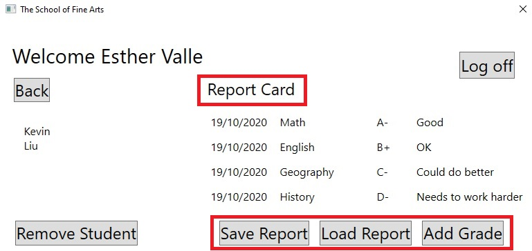
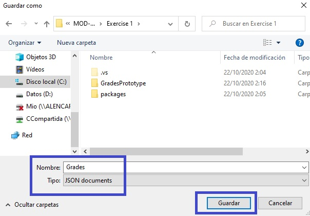
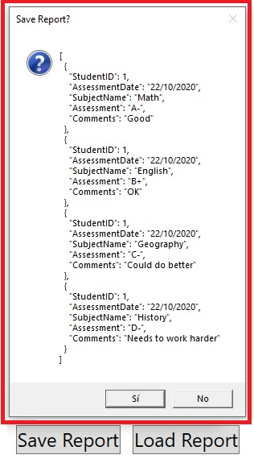
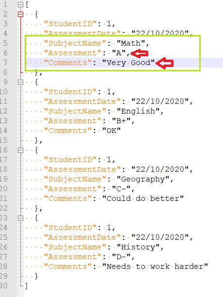
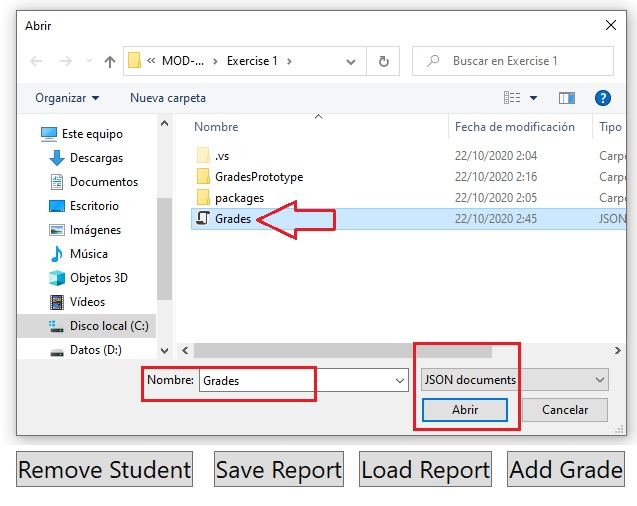
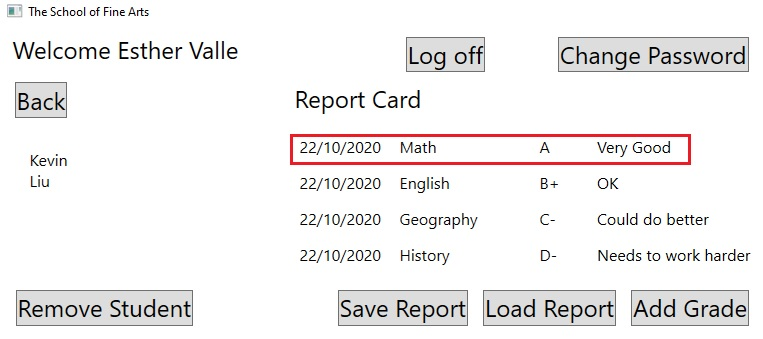

# Módulo 6: Lectura y escritura de datos locales

# Laboratorio: Generación y carga del informe de calificaciones

Tiempo estimado:**60 minutos**

Fichero de Instrucciones: Instructions\20483C_MOD06_LAK.md

Entregar el url de GitHub con la solución y un readme con las siguiente información:

1. **Nombres y apellidos:** José René Fuentes Cortez
2. **Fecha:** 16 de Octubre 2020.
3. **Resumen del Modulo 6:** Este módulo consta de dos ejercicios:
    -  En el primer ejercio hacemos que los usuarios podrán guardar los informes de los estudiantes en el disco duro local en formato JSON.
    - En el ejercicio 2 agregamos código para que los usuarios puedan cargar los informes de los estudiantes desde el disco duro local.

4. **Dificultad o problemas presentados y como se resolvieron:** Ninguna.

**NOTA**: Si no hay descripcion de problemas o dificultades, y al yo descargar el código para realizar la comprobacion y el código no funcionar, el resultado de la califaciación del laboratorio será afectado.

---

## Configuración del Lab

Asegúrate de que has clonado el directorio 20483C de GitHub. Contiene los segmentos de código para los laboratorios y demostraciones de este curso. (**https://github.com/MicrosoftLearning/20483-Programming-in-C-Sharp/tree/master/Allfiles**)


## Pasos de preparación

## Ejercicio 1: serializar datos para el informe de calificaciones como JSON

### Tarea 1: Solicitar al usuario un nombre de archivo y recuperar los datos de calificación

1. Abra **Visual Studio 2019**.
2. En **Visual Studio**, en el menú **Archivo**, seleccione **Abrir** y luego haga clic en **Proyecto/Solución**.
3. En el cuadro de diálogo **Abrir proyecto**, busque **[Repository Root]\Allfiles\Mod06\Labfiles\Starter\Exercise 1**, haga clic en **GradesPrototype.sln** y luego haga clic en **Abrir**.
    > **Nota:** Si aparece algún cuadro de diálogo de advertencia de seguridad, desactive la casilla de verificación **Preguntarme por cada proyecto en esta solución** y luego haga clic en **Aceptar**.
4. Haga clic con el botón derecho en el proyecto **GradesPrototype** y seleccione **Administrar paquetes NuGet**.
5. En **NeGet: GradesPrototype**, haga clic en **Examinar**.
6. Haga clic en el cuadro de texto **Buscar** y escriba **Newtonsoft.Json**.
7. Seleccione el resultado para **Newtonsoft.Json** y haga clic en en el lado izquierdo de la ventana **Instalar**.
8. Cierre la ventana **Instalar**.
9. En **Explorador de soluciones**, expanda **GradesPrototype**, expanda **Vistas** y luego haga doble clic en **StudentProfile.xaml**.
10. Tenga en cuenta que esta vista muestra y permite a los usuarios agregar calificaciones para un estudiante. La solución se ha actualizado para incluir un botón **Guardar informe **en el que los usuarios harán clic para generar y guardar el informe de calificaciones.
11. En el menú **Ver**, haga clic en **Lista de tareas**.
12. En la ventana **Lista de tareas**, haga doble clic en la tarea **TODO: 01: Task 1a: Add Using for Newtonsoft.Json.**.
13. En el editor de código, haga clic en la línea en blanco debajo del comentario y luego escriba el siguiente código:
    ```cs
    using Newtonsoft.Json;
    ```
14. Haga doble clic en **TODO: Exercise 1: Task 1b: Store the return value from the SaveFileDialog in a nullable Boolean variable.**.
15. En el editor de código, haga clic en la línea en blanco debajo del comentario y luego escriba el siguiente código:
    ```cs
    bool? result = dialog.ShowDialog();
    if (result.HasValue && result.Value)
    {
    ```
16. Haga clic en al final del último comentario en este método, presione Entrar y luego escriba el siguiente código:
    ```cs
    }
    ```
17. En la ventana **Lista de tareas**, haga doble clic en la tarea **TODO: Exercise 1: Task 1c: Get the grades for the currently selected student.**.
18. En el editor de código, haga clic en la línea en blanco debajo del comentario y luego escriba el siguiente código:
    ```cs
    List<Grade> grades = (from g in DataSource.Grades
                          where g.StudentID == SessionContext.CurrentStudent.StudentID
                          select g).ToList();
    ```

### Tarea 2: serializar los datos de calificación en un flujo de archivos

1. En la ventana **Lista de tareas**, haga doble clic en la tarea **TODO: Exercise 1: Task 2: Serialize the grades to a JSON.**.
2. En el editor de código, haga clic al final del comentario, presione Entrar y luego escriba el siguiente código:
    ```cs
    var gradesAsJson = JsonConvert.SerializeObject(grades, Newtonsoft.Json.Formatting.Indented);
    ```

### Tarea 3: Guarde el documento JSON en el disco usando FileStream

1. En la ventana **Lista de tareas**, haga doble clic en **TODO: Exercise 1: Task 3a: Modify the message box and ask the user whether they wish to save the report**.
2. En el editor de código, elimine la línea de código debajo del comentario y luego escriba el siguiente código:
    ```cs
    MessageBoxResult reply = MessageBox.Show(gradesAsJson, "Save Report?", MessageBoxButton.YesNo, MessageBoxImage.Question);
    ```
3. En la ventana **Lista de tareas**, haga doble clic en la tarea **TODO: Exercise 1: Task 3b: Check if the user what to save the report or not**.
4. En el editor de código, haga clic al final del comentario, presione Entrar y luego escriba el siguiente código:
    ```cs
    if (reply == MessageBoxResult.Yes)
    {
    ```
5. Haga clic al final del último comentario en este método, presione Entrar y luego escriba el siguiente código:
    ```cs
    }
    ```
6. En la ventana **Lista de tareas**, haga doble clic en **TODO: Exercise 1: Task 3c: Save the data to the file by using FileStream**.
7. En el editor de código, haga clic en al final del comentario, presione Entrar y luego escriba el siguiente código:
    ```cs
     FileStream file = new FileStream(dialog.FileName, FileMode.Create, FileAccess.Write);
     StreamWriter streamWriter = new StreamWriter(file);
     streamWriter.Write(gradesAsJson);
     file.Position = 0;
    ```
8. En la ventana **Lista de tareas**, haga doble clic en la tarea **TODO: Exercise 1: Task 3d: Release all the stream resources**.
9. En el editor de código, haga clic al final del comentario, presione Entrar y luego escriba el siguiente código:
    ```cs
      streamWriter.Close();
      streamWriter.Dispose();

      file.Close();
      file.Dispose();
    ```

### Tarea 4: Ejecuta la aplicación y verifica la funcionalidad de guardar

1. En el menú **Crear**, haga clic en **Crear solución**.
2. En el menú **Depurar**, haga clic en **Iniciar sin depurar**.
3. En el cuadro de texto **Nombre de usuario**, escriba **vallee**.
4. En el cuadro de texto **Password**, escriba **password99** y luego haga clic en **Iniciar sesión**.

- La representación visual a la respuesta del último ejercicio se muestra en la siguiente imagen:

 

5. En la ventana principal de la aplicación, haga clic en **Kevin Liu**.
6. En la vista **Boleta de calificaciones**, haga clic en **Guardar informe**.

- La representación visual a la respuesta del último ejercicio se muestra en la siguiente imagen:

 

7. En el cuadro de diálogo **Guardar como**, haga clic en **Guardar**.

- La representación visual a la respuesta del último ejercicio se muestra en la siguiente imagen:

 

8. Revise los datos JSON que se muestran en el cuadro de mensaje y luego haga clic en **Sí**.

- La representación visual a la respuesta del último ejercicio se muestra en la siguiente imagen:

 

9. Cierre la aplicación.
10. En **Visual Studio**, en el menú **Archivo**, haga clic en **Cerrar solución**.
11. Cierre **Visual Studio**.
12. Busque la carpeta de destino en la que acaba de guardar el archivo y abra el archivo **Grades.Json**.
    > **Nota:** Si el archivo JSON no se abre, haga clic con el botón derecho en el archivo guardado y seleccione abrir con y luego haga clic en **más aplicaciones** y seleccione **Selector de versiones de Microsoft Visual Studio** y haga clic en **Aceptar**.
13. Busque el elemento **SubjectName** con el valor **Math** dentro de la matriz JSON.
14. Cambie **\'Math\'Assessment** por **A** y **Comments** por **Very Good**.
15. Guarde y cierre el archivo.

- La representación visual a la respuesta del último ejercicio se muestra en la siguiente imagen:

 


> **Resultado:** Después de completar este ejercicio, los usuarios podrán guardar los informes de los estudiantes en el disco duro local en formato JSON.

## Ejercicio 2: deserializar datos del informe JSON al objeto de calificaciones

### Tarea 1: Definir la configuración del diálogo de archivo para cargar el archivo de informe

1. Abra **Visual Studio 2019**.
2. En **Visual Studio**, en el menú **Archivo**, seleccione **Abrir** y luego haga clic en **Proyecto/Solución**.
3. En el cuadro de diálogo **Abrir proyecto**, vaya a **[Repository Root]\Allfiles\Mod06\Labfiles\Starter\Exercise 2**, haga clic en **GradesPrototype.sln** y luego haga clic en **Abrir**.
    > **Nota:** Si aparece algún cuadro de diálogo de advertencia de seguridad, desactive la casilla de verificación **Preguntarme por cada proyecto en esta solución** y luego haga clic en **Aceptar**.
4. En el menú **Ver**, haga clic en **Lista de tareas**.
5. En la ventana **Lista de tareas**, haga doble clic en la tarea **TODO: 02: Task 1: Define the File Dialog settings to load the report file**.
6. En el editor de código, haga clic al final del comentario, presione Entrar y luego escriba el siguiente código:
    ```cs
    OpenFileDialog dialog = new OpenFileDialog();
    dialog.Filter = "JSON documents|*.json";

    // Display the dialog and get a filename from the user
    bool? result = dialog.ShowDialog();
    ```

### Tarea 2: Cargar el informe y mostrarlo al usuario

1. En la ventana **Lista de tareas**, haga doble clic en la tarea **TODO: 02: Task 2a: Check the user file selection**.
2. En el editor de código, haga clic al final del comentario, presione Entrar y luego escriba el siguiente código:
    ```cs
    if (result.HasValue && result.Value)
    {
    ```
3. Haga clic en al final del último comentario en este método, presione Entrar y luego escriba el siguiente código:
   ```cs
    }
    ```
4. En la ventana **Lista de tareas**, haga doble clic en la tarea **TODO: 02: Task 2b: Read the report data from Disk**.
5. En el editor de código, haga clic en al final del comentario, presione Entrar y luego escriba el siguiente código:
    ```cs
    string gradesAsJson = File.ReadAllText(dialog.FileName);
    ```
6. En la ventana **Lista de tareas**, haga doble clic en la tarea **TODO: 02: Tarea 2c: deserializar los datos JSON en la lista de calificaciones**.
7. En el editor de código, haga clic en al final del comentario, presione Entrar y luego escriba el siguiente código:
    ```cs
    var gradeList =  JsonConvert.DeserializeObject<List<Grade>>(gradesAsJson);
    ```
8. En la ventana **Lista de tareas**, haga doble clic en la tarea **TODO: 02: Task 2d: Display the saved report to the user**.
9. En el editor de código, haga clic al final del comentario, presione Entrar y luego escriba el siguiente código:
    ```cs
    studentGrades.ItemsSource = gradeList;
    ```

### Tarea 3: Ejecuta la aplicación y verifica la funcionalidad de carga

1. En el menú **Crear**, haga clic en **Crear solución**.
2. En el menú **Depurar**, haga clic en **Iniciar sin depurar**.
3. En el cuadro de texto **Nombre de usuario**, escriba **vallee**.
4. En el cuadro de texto **Password**, escriba **password99** y luego haga clic en **Iniciar sesión**.
- La representación visual a la respuesta del último ejercicio se muestra en la siguiente imagen:

 
5. En la ventana principal de la aplicación, haga clic en **Kevin Liu**.
6. En la vista **Boleta de calificaciones**, haga clic en **Cargar informe**.

- La representación visual a la respuesta del último ejercicio se muestra en la siguiente imagen:

 

7. En el cuadro de diálogo **Abrir**, vaya a la carpeta de destino donde se guardó el informe en la tarea anterior y localice el informe guardado.

8. Seleccione el archivo de informe y luego haga clic en **Abrir**.
9. Revise los datos que se muestran en la vista **Tarjeta de calificaciones** y verifique que los cambios que se realizaron en el archivo del informe se reflejen ahora.

- La representación visual a la respuesta del último ejercicio se muestra en la siguiente imagen:

 

10. Cierre la aplicación.
11. En **Visual Studio**, en el menú **Archivo**, haga clic en **Cerrar solución**.
12. Cierre **Visual Studio**.

> **Resultado:** Después de completar este ejercicio, los usuarios podrán cargar los informes de los estudiantes desde el disco duro local.