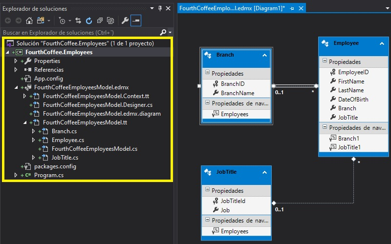
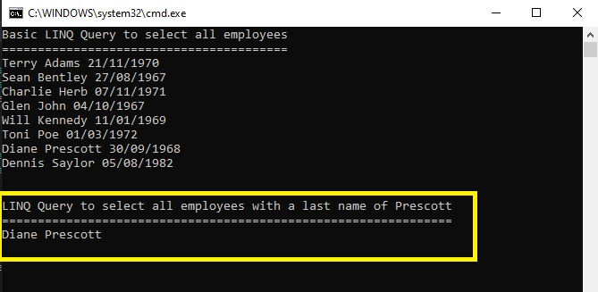

# Módulo 7: Acceso a una base de datos

Fichero de Instrucciones: Instructions\20483C_MOD07_DEMO.md

Entregar el url de GitHub con la solución y un readme con las siguiente información:

1. **Nombres y apellidos:** José René Fuentes Cortez
2. **Fecha:** 14 de Octubre 2020.
3. **Resumen del Modulo 2:** Este módulo consta de tres ejercicios:
    -  En el primer ejercio nos ayuda a actualizar la aplicación para refactorizar el código duplicado en métodos reutilizables.
    - En el ejercicio 2 los datos del estudiante serán validados antes de ser guardados por la aplicación.
    - En el ejercicio 3 hacemos que la aplicación pueda manipular los datos modificados del estudiante para que se  guarden en la base de datos.

4. **Dificultad o problemas presentados y como se resolvieron:** Ninguna.

**NOTA**: Si no hay descripcion de problemas o dificultades, y al yo descargar el código para realizar la comprobacion y el código no funcionar, el resultado de la califaciación del laboratorio será afectado.

---

## Lección 1: Crear y usar modelos de datos de entidades

### Demonstration: Creación de un modelo de datos de la entidad

#### Pasos de preparación

1. Asegúrate de que has clonado el directorio 20483C de GitHub. Contiene los segmentos de código para los laboratorios y demostraciones de este curso. (**https://github.com/MicrosoftLearning/20483-Programming-in-C-Sharp/tree/master/Allfiles**)

#### Pasos de demostración

1. Navega a la carpeta **[Raíz del Repositorio]\N-Todos los Archivos {Mod07\Democode\N-Bases de Datos**, y luego haz doble clic en **SetupFourthCoffeeDB.cmd**.
     >**Nota:** Si aparece un diálogo de Windows protegido de su PC, haga clic en **Más información** y luego en **Ejecutar de todos modos**.
2. Localiza la carpeta **[Raíz del Repositorio]\N-Todos los archivos\N-Mod07\N-Democode\N-Bases de Datos** de nuevo, haz clic con el botón derecho en **FourthCoffee.sql**, apunta a **Abrir con**, haz clic en **Selector de Versión de Microsoft Visual Studio**, luego haz clic en **Abrir**.

- La representación visual a la respuesta del último ejercicio se muestra en la siguiente imagen:

 

3. Revise la consulta SQL.
4. En el menú **Archivo**, haga clic en **Cerrar**.
5. En el menú **Archivo**, apunta a **Nuevo**, y luego haz clic en **Proyecto**.
6. En el cuadro de diálogo **Nuevo Proyecto**, expanda **Plantillas**, haga clic en **Corporación Visual**, y luego en la lista **Plantilla**, haga clic en **Consola App(.NET Framework)**.
7. En el cuadro de texto **Nombre**, escriba **FourthCoffee.Employees**, en el cuadro de texto **Ubicación**, escriba  **[Repository Root]\Allfiles\Mod07\Democode\Demo1\Starter**, y luego haga clic en **OK**.
8. En **Solution Explorer**, haga clic con el botón derecho en **FourthCoffee.Employees**, apunte a **Add**, y luego haga clic en **New Item**.
9. En el cuadro de diálogo **Agregar nuevo elemento - FourthCoffee.Employees**, haga clic en **Modelo de Datos de la Entidad-ADO.NET**, en el cuadro de texto **Nombre**, escriba **FourthCoffeeModelo de Employees**, y luego haga clic en **Agregar**.

- La representación visual a la respuesta del último ejercicio se muestra en la siguiente imagen:

 

10. En **Entity Data Model Wizard**, en la página **Choose Model Contents**, haga clic en **EF Designer from database**, y luego haga clic en **Next**.

- La representación visual a la respuesta del último ejercicio se muestra en la siguiente imagen:

 

11. En la página de **Elija su conexión de datos**, haga clic en **Nueva conexión**.

- La representación visual a la respuesta del último ejercicio se muestra en la siguiente imagen:

 

12. En la página **Seleccione la fuente de datos**, seleccione **Microsoft SQL Server** y luego haga clic en **OK**.

13. En el cuadro de texto **Nombre del servidor**, escriba **(localdb)\MSSQLLocalDB**, en la lista **Seleccione o introduzca un nombre de base de datos**, haga clic en **FourthCoffee**, y luego haga clic en **OK**.

- La representación visual a la respuesta del último ejercicio se muestra en la siguiente imagen:

 

14. En **Entity Data Model Wizard**, en la página **Seleccione su conexión de datos**, haga clic en **Siguiente**.
15. En la página **Elige tu versión**, elige **Entity Framework 6.x** y luego haz clic en **Siguiente**.

- La representación visual a la respuesta del último ejercicio se muestra en la siguiente imagen:

 

16. En la página **Seleccione sus objetos de base de datos y ajustes**, expanda **Tablas**, expanda **dbo**, seleccione **Sucursales**, **Employees**, y **Títulos de trabajo**, y luego haga clic en **Finalizar**.

- La representación visual a la respuesta del último ejercicio se muestra en la siguiente imagen:

 

17. Si aparece un cuadro de diálogo de **Advertencia de Seguridad**, seleccione **No mostrar este mensaje de nuevo**, y luego pulse **OK**.

- La representación visual a la respuesta del último ejercicio se muestra en la siguiente imagen:

 

18. En el menú **Construir**, haga clic en **Construir solución**.
19. Examine las tres entidades que se han generado y las asociaciones entre ellas.
20. Haga clic con el botón derecho del ratón en la superficie del diseñador, y luego haga clic en **Detalles del mapa**.
21. En el panel de **Diseñador**, haga clic en **Empleado**.
22. En el panel **Detalles del mapa**, revise los mapeos entre la entidad y la fuente de datos.
23. En **Solution Explorer**, amplíe **FourthCoffeeEmployeesModel.edmx**, amplíe **FourthCoffeeEmployeesModel.Context.tt**, y luego haga doble clic en **FourthCoffeeEmployeesModel.Context.cs**.
24. En el editor de códigos, revisa el código en la clase parcial de **FourthCoffeeEntities**.

- La representación visual a la respuesta del último ejercicio se muestra en la siguiente imagen:

 

25. En **Solution Explorer**, expande **FourthCoffeeEmployeesModel.tt**, y luego haz doble clic en **Employee.cs**.
26. Revise la clase parcial de **Empleado** y las propiedades que se han generado.

- La representación visual a la respuesta del último ejercicio se muestra en la siguiente imagen:

 

27. Deje la solución abierta para que pueda referirse a ella en los siguientes temas.

### Demonstration: Lectura y modificación de datos en un EDM

#### Pasos de preparación

Asegúrate de que has clonado el directorio 20483C de GitHub. Contiene los segmentos de código para los laboratorios y demostraciones de este curso. (**https://github.com/MicrosoftLearning/20483-Programming-in-C-Sharp/tree/master/Allfiles**)

#### Pasos de demostración

1. Abrir **Estudio Visual 2019**.
2. En Visual Studio, en el menú **Archivo**, apunta a **Abrir**, y luego haz clic en **Proyecto/Solución**.
3. En el cuadro de diálogo **[RepositoryRoot]\Allfiles\Mod07\Democode\Demo2\FourthCoffee.Employees**, y luego abrir el archivo **Cuarto Café.Employees.sln**.
     >**Nota :** Si aparece cualquier cuadro de diálogo de advertencia de seguridad, desactive la casilla de verificación **Pregúntame por cada proyecto de esta solución** y luego haga clic en **OK**.
4. En **Solution Explorer**, expande **FourthCoffee.Employees**, y luego haz doble clic en **Program.cs**.
5. Revisar la definición de la variable **DBContext**.
6. Revise el código en el método **PrintEmployeesList** que utiliza la variable **DBContext** para acceder a los datos en el EDM.

- La representación visual a la respuesta del último ejercicio se muestra en la siguiente imagen:

 

Fig-11-DBContext
7. Revise el código en el método **Main** que utiliza el método de extensión **First** para recuperar a un empleado y luego modifica la propiedad **Apellido** de ese empleado.
8. En el menú **Construir**, haga clic en **Construir solución**.
9. En el menú **Debug**, haga clic en **Iniciar sin depuración**.
10. Verifique que se muestre la lista de Employees y luego pulse Intro.
11. Verifique que la empleada llamada **Diane Prescott** se llama ahora **Diane Forsyth** y luego presione Enter.
12. Para cerrar la aplicación, pulse Intro.

- La representación visual a la respuesta del último ejercicio se muestra en la siguiente imagen:

 

## Lección 2: Consulta de datos mediante el uso de LINQ

### Demonstration: Consulta de datos

#### Pasos de preparación

Asegúrate de que has clonado el directorio 20483C de GitHub. Contiene los segmentos de código para los laboratorios y demostraciones de este curso. (**https://github.com/MicrosoftLearning/20483-Programming-in-C-Sharp/tree/master/Allfiles**)

#### Pasos de demostración

1. Abrir **Estudio Visual 2017**.
2. En Visual Studio, en el menú **Archivo**, apunta a **Abrir**, y luego haz clic en **Proyecto/Solución**.
3. En el cuadro de diálogo **Proyecto Abierto**, busque la carpeta **[RepositoryRoot]\Allfiles\Mod07\Democode\Demo2\FourthCoffee.Employees**, haga clic en **FourthCoffee.Employees.sln**, y luego haga clic en **Abrir**.
     >**Nota :** Si aparece cualquier cuadro de diálogo de advertencia de seguridad, desactive la casilla de verificación **Pregúntame por cada proyecto de esta solución** y luego haga clic en **OK**.
4. En **Solution Explorer**, expande **FourthCoffee.Employees**, y luego haz doble clic en **Program.cs**.
5. Revise el código LINQ en cada uno de los métodos.
6. En el menú **Construir**, haga clic en **Construir solución**.
7. En el menú **Debug**, haga clic en **Iniciar sin depuración**.
8. En la ventana de la consola, revise la salida del método **QueryingData**, y luego presione Enter.

- La representación visual a la respuesta del último ejercicio se muestra en la siguiente imagen:

 

9. Repita el paso 8 para cada uno de los siguientes métodos:
    - **Filtrando datos por fila**
    - **Filtrando los datos por columna**

- La representación visual a la respuesta del último ejercicio se muestra en la siguiente imagen:

 

- La representación visual a la respuesta del último ejercicio se muestra en la siguiente imagen:

 

10. Para cerrar la aplicación, pulse Intro.
11. En Visual Studio, en el menú **Archivo**, haga clic en **Cerrar solución**.

### Demonstration: Consulta de datos mediante el uso de tipos anónimos

#### Pasos de preparación

Asegúrate de que has clonado el directorio 20483C de GitHub. Contiene los segmentos de código para los laboratorios y demostraciones de este curso. (**https://github.com/MicrosoftLearning/20483-Programming-in-C-Sharp/tree/master/Allfiles**)

#### Pasos de demostración

1. Abrir **Estudio Visual 2019**.
2. En Visual Studio, en el menú **Archivo**, apunta a **Abrir**, y luego haz clic en **Proyecto/Solución**.
3. En el cuadro de diálogo **Proyecto Abierto**, vaya a la carpeta **[RepositoryRoot]\Allfiles\Mod07\Democode\Demo4\FourthCoffee.Employees****, haga clic en **FourthCoffee.Employees.sln**, y luego haga clic en **Abrir**.
     >**Nota :** Si aparece cualquier cuadro de diálogo de advertencia de seguridad, desactive la casilla de verificación **Pregúntame por cada proyecto de esta solución** y luego haga clic en **OK**.
4. En **Solution Explorer**, expande **FourthCoffee.Employees**, y luego haz doble clic en **Program.cs**.
5. Revise el código LINQ en cada uno de los métodos.
6. En el menú **Construir**, haga clic en **Construir solución**.
7. En el menú **Debug**, haga clic en **Iniciar sin depuración**.
8. En la ventana de la consola, revise la salida del método **Utilizando tipos anónimos** y luego presione Enter.
9. Repita el paso 8 para cada uno de los siguientes métodos:
    - **GroupingData**
    - **Agregando datos**
    - **NavigatingData**
10. Para cerrar la aplicación, pulse Intro.
11. En Visual Studio, en el menú **Archivo**, haga clic en **Cerrar solución**.

### Demonstration: Recuperación y modificación del laboratorio de datos de grado

#### Pasos de preparación

1. Asegúrate de que has clonado el directorio 20483C de GitHub. Contiene los segmentos de código para los laboratorios y demostraciones de este curso. (**https://github.com/MicrosoftLearning/20483-Programming-in-C-Sharp/tree/master/Allfiles**)
2. Iniciar la base de datos:
     - En la lista de **Aplicaciones**, haz clic en **Explorador de archivos**.
     - En **Explorador de Archivos**, navega a la carpeta **[Raíz del Repositorio]\N-Todos los Archivos {Mod07\\N-Labfiles\N-Bases de Datos**, y luego haz doble clic en **SetupSchoolGradesDB.cmd**.
         >**Nota:** Si aparece un diálogo de Windows protegido de su PC, haga clic en **Más información** y luego en **Ejecutar de todos modos**.
     - Cerrar **File Explorer**.

#### Pasos de demostración

1. Abrir **Estudio Visual 2017**.
2. En Visual Studio, en el menú **Archivo**, apunta a **Abrir**, y luego haz clic en **Proyecto/Solución**.
3. En el cuadro de diálogo **Abrir Proyecto**, navega a la carpeta **[Raíz del Repositorio]}Todos los Archivos {Mod07}Labfiles\Solución\Ejercicio 3**, haz clic en **GradesPrototype.sln**, y luego haz clic en **Abrir**.
     >**Nota :** Si aparece cualquier cuadro de diálogo de advertencia de seguridad, desactive la casilla de verificación **Pregúntame por cada proyecto de esta solución** y luego haga clic en **OK**.
4. En **Server Explorer**, expandir **Conexión de datos**, gastar **{SuNombre} {Sqlexpress.SchoolGradesDB.dbo** conexión de datos y luego expandir **Tablas**.
     >**Nota :** Si **SchoolGradesDB** no aparecía en el Explorador del Servidor, puedes añadirlo manualmente haciendo clic en el botón **Add New Database**.
5. Explique a los estudiantes que usarán esta base de datos para los laboratorios a partir de este momento y muéstreles los datos en las siguientes tablas:
     - **Estudiantes**
     - **Profesores**
     - **Grades**
     - **Sujetos**
     - **Usuarios**
6. Establecer el proyecto **GradesPrototype** como proyecto de inicio.
7. En el proyecto **Grades.DataModel**, abre **GradesModel.edmx**.
8. Explique a los estudiantes que durante el ejercicio 1, generarán este modelo a partir de una base de datos existente.
9. 9. Describa brevemente las entidades y relaciones que se muestran en el diagrama.
10. En el proyecto **GradesPrototype**, en la carpeta **Views**, Expandir **StudentProfile.xaml** y luego abrir **StudentProfile.xaml.cs**, y localizar el método **Refrescar**.
11. Explique a los estudiantes que durante el ejercicio 2, añadirán un código para encontrar todas las notas del estudiante actual y las mostrarán en el control **studentGrades ItemsControl**.
12. Localizar el método **Convertir** en la clase **Convertidor de sujetos**.
13. Explique a los estudiantes que durante el Ejercicio 2, añadirán este código para convertir la identificación de la asignatura que está almacenada en el grado asignado a un estudiante en la base de datos en un nombre de la asignatura.
14. Localiza el método **AddGrade_Click** en la clase **StudentProfile.xaml.cs**.
15. Explique a los estudiantes que también añadirán un código para pedir al usuario los datos de las calificaciones y luego guardarán la información en la base de datos y la mostrarán en la UI.
16. En el proyecto **Grades.DataModel**, abre **customTeacher.cs**.
17. Explique a los estudiantes que durante el ejercicio 3, crearán esta clase parcial y añadirán el código de validación al método **EnrollInClass** para comprobar que hay espacio en la clase antes de inscribir a un estudiante.
18. En el proyecto **Grades.DataModel**, abre **customGrade.cs**.
19. Explique a los estudiantes que también crearán la clase parcial de grado y añadirán un código de validación para comprobar la fecha y el grado de evaluación que un usuario introduce antes de almacenarlo en la base de datos.
20. Ejecute la aplicación, y luego inicie sesión como **vallee** con la contraseña **contraseña99**.
21. Intente inscribir a un nuevo estudiante en la clase, y luego verifique que aparezca un mensaje de error explicando que la clase ya está llena.
22. Haga clic en **Kevin Liu**, y luego agregue una nueva calificación para él usando la siguiente información:
     - Cita: *Fecha de mañana*
     - Sujeto: **Matemáticas**
     - Evaluación: **F+**
     - Comentarios: **Bien hecho!**
23. Señale que aparece un mensaje de error que explica que la fecha de evaluación debe ser en o antes de la fecha actual.
24. Modifique la fecha de la nueva calificación usando la siguiente información:
     - Cita: **8/19/2012**
     - Sujeto: **Matemáticas**
     - Evaluación: **F+**
     - Comentarios: **Bien hecho!**
25. Señala que aparece un mensaje de error explicando que la calificación de la evaluación debe estar en el rango de A+ a E-.
26. Modifique la nueva fecha de calificación utilizando la siguiente información:
     - Cita: **8/19/2012**
     - Sujeto: **Matemáticas**
     - Evaluación: **A+**
     - Comentarios: **Bien hecho!**
27. Señala que el nuevo grado se añade a la lista, y luego cierra la aplicación.
28. Cierre el Estudio Visual.
