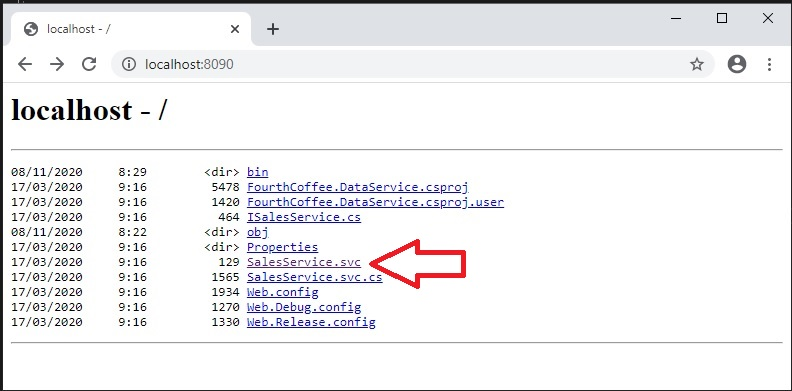
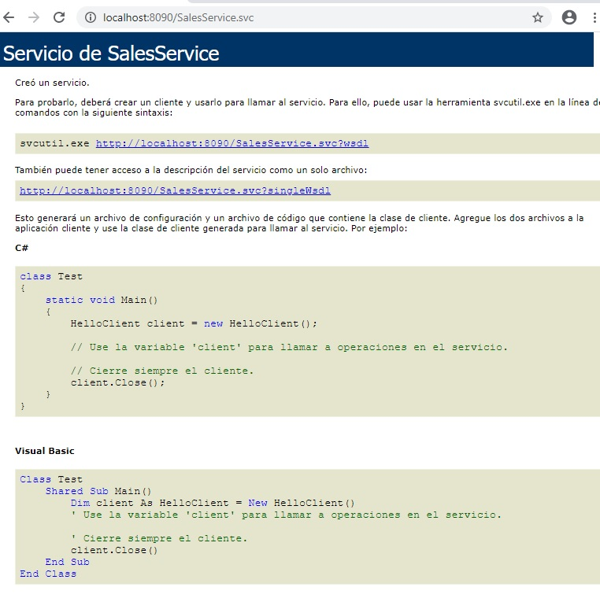
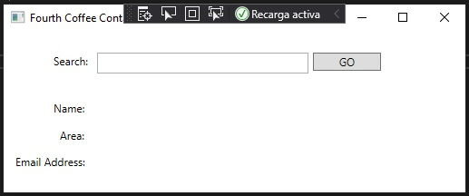

# Módulo 8: Acceder a datos remotos


Fichero de Instrucciones: Instructions\20483C_MOD08_DEMO.md

Entregar el url de GitHub con la solución y un readme con las siguiente información:

1. **Nombres y apellidos:** José René Fuentes Cortez
2. **Fecha:** 14 de Octubre 2020.
3. **Resumen del Modulo 2:** Este módulo consta de tres ejercicios:
    -  En el primer ejercio nos ayuda a actualizar la aplicación para refactorizar el código duplicado en métodos reutilizables.
    - En el ejercicio 2 los datos del estudiante serán validados antes de ser guardados por la aplicación.
    - En el ejercicio 3 hacemos que la aplicación pueda manipular los datos modificados del estudiante para que se  guarden en la base de datos.


4. **Dificultad o problemas presentados y como se resolvieron:** Ninguna.

**NOTA**: Si no hay descripcion de problemas o dificultades, y al yo descargar el código para realizar la comprobacion y el código no funcionar, el resultado de la califaciación del laboratorio será afectado.

---

## Lección 1: Acceder a los datos a través de la web

### Demonstration: Consumir un servicio web

#### Pasos de preparación

1. Asegúrate de que has clonado el directorio 20483C de GitHub. Contiene los segmentos de código para los laboratorios y demostraciones de este curso. (**https://github.com/MicrosoftLearning/20483-Programming-in-C-Sharp/tree/master/Allfiles**)
2. Navega a **[Raíz del Repositorio]\Ntodos los archivos\NMod08\N-Democodificar el Buscador de Contactos del Cuarto Café**, y luego abre el archivo **Buscador de Contactos del Cuarto Café.sln**.
 >**Nota:** Si aparece cualquier cuadro de diálogo de advertencia de seguridad, desactive la casilla de verificación **Pregúntame por cada proyecto de esta solución** y luego haga clic en **OK**.

#### Pasos de demostración

1. En la ventana del **Explorador de soluciones**, amplíe el proyecto **FourthCoffee.DataService**, y luego haga doble clic en **ISalesService.cs**.
2. En el editor de códigos, revise la firma de la operación **GetSalesPerson**, que acepta una dirección de correo electrónico en forma de una cadena JSON y devuelve un objeto **SalesPerson**.
3. En la ventana del **Explorador de Soluciones**, expandir el proyecto **Cuarta Infraestructura del Café**, expandir la carpeta **Modelos**, y luego hacer doble clic en **VentasPersona.cs**.
4. En el editor de códigos, revisa los atributos **DataContract** y **DataMember** que decoran el tipo y los miembros del tipo.
5. En Microsoft Visual Studio, en el menú **Ver**, haga clic en **Lista de tareas**.
6. En la ventana **Task List**, haga doble clic en la tarea **TODO: 01: Bring the System.Net namespace into scope.**.
7. En el editor de códigos, haga clic en la línea en blanco debajo del comentario, y luego escriba el siguiente código:
     "C
     usando System.Net;
     ```
8. En la ventana **Task List**, haga doble clic en la tarea **TODO: 02: Declarar un objeto global para encapsular una tarea de solicitud HTTP**.
9. En el editor de códigos, haga clic en la línea en blanco debajo del comentario, y luego escriba el siguiente código:
     "C
     HttpWebRequest _request;
     ```
10. En la ventana **Task List**, haga doble clic en la tarea **TODO: 03: Instanciar el objeto de la solicitud**.
11. En el editor de códigos, haga clic en la línea en blanco debajo del comentario, y luego escriba el siguiente código:
     "C
     this._request = WebRequest.Create(this._serviceUri.AbsoluteUri) as HttpWebRequest;
     ```
12. En la ventana **Task List**, haga doble clic en el **TODO: 04: Configurar la solicitud de envío de datos JSON** tarea.
13. En el editor de códigos, haga clic en la línea en blanco debajo del comentario, y luego escriba el siguiente código:
     "C
     Esta... solicitud. Método = "POST";
     this._request.ContentType = "application/json";
     esta._solicitud.longitud.de.contenido = longitud.de.datos.en.bruto;
     ```
14. En la ventana **Task List**, haga doble clic en la tarea **TODO: 05: Escribir datos en el flujo de solicitudes**.
15. En el editor de códigos, haga clic en la línea en blanco debajo del comentario, y luego escriba el siguiente código:
     "C
     var dataStream = this._request.GetRequestStream();
     dataStream.Write(data, 0, data.Length);
     dataStream.Close();
     ```
16. En la ventana **Task List**, haga doble clic en la tarea **TODO: 06: Create an HttpWebResponse object**.
17. En el editor de códigos, haga clic en la línea en blanco debajo del comentario, y luego escriba el siguiente código:
      "C
     var response = this._request.GetResponse() as HttpWebResponse;
     ```
18. En la ventana **Task List**, haga doble clic en el **TODO: 07: Check to see if the response contains any data.** task.
19. En el editor de códigos, haga clic en la línea en blanco debajo del comentario, y luego escriba el siguiente código:
     "C
     si (response.ContentLength == 0)
         ...y no hay vuelta atrás;
     ```
20. En la ventana **Task List**, haga doble clic en la tarea **TODO: 08: Leer y procesar los datos de respuesta**.
21. En el editor de códigos, haga clic en la línea en blanco debajo del comentario, y luego escriba el siguiente código:
     "C
     var stream = new StreamReader(response.GetResponseStream());
     var resultado = SalesPerson.FromJson(stream.BaseStream);
     stream.Close();
     ```
22. En el menú **Construir**, haga clic en **Construir solución**.
23. Haga clic con el botón derecho del ratón en el proyecto **FourthCoffee.DataService**, apunte a **Debug** y luego haga clic en **Iniciar nueva instancia**.

- La representación visual a la respuesta del último ejercicio se muestra en la siguiente imagen:

 

24. Localiza la barra de direcciones en el navegador, añade **\SalesService.svc** al final de la dirección y luego pulsa Intro.

- La representación visual a la respuesta del último ejercicio se muestra en la siguiente imagen:

 

25. En el Explorador de Soluciones, haga clic con el botón derecho en **Fourth Coffee Contact Finder**, apunte a **Debug** y luego haga clic en **Start new instance**.

- La representación visual a la respuesta del último ejercicio se muestra en la siguiente imagen:

 

26. En la aplicación **Fourth Coffee Contract Finder**, en la casilla **Search**, escriba **jesper@fourthcoffee.com**, y luego haga clic en **GO**.

27. En el cuadro de diálogo **Búsqueda exitosa**, haga clic en **OK**.

- La representación visual a la respuesta del último ejercicio se muestra en la siguiente imagen:

 

28. Verifique que se muestren los detalles de Jesper Herp.
29. En el menú **Debug**, haga clic en **Detener depuración**.
30. Cierre el Estudio Visual.

## Lección 2: Acceder a los datos mediante el uso de los servicios conectados de OData

### Demonstration: Recuperar y modificar datos de grado de forma remota

#### Pasos de preparación

1. Asegúrate de que has clonado el directorio 20483C de GitHub. Contiene los segmentos de código para los laboratorios y demostraciones de este curso. (**https://github.com/MicrosoftLearning/20483-Programming-in-C-Sharp/tree/master/Allfiles**)
2. Iniciar la base de datos:
    - En la lista de **Aplicaciones**, haz clic en **Explorador de archivos**.
    - En **Explorador de Archivos**, navega a la carpeta **[Repository Root]\Allfiles\Mod08\Labfiles\Databases**, y luego haz doble clic en **SetupSchoolGradesDB.cmd**.
     >**Nota:** Si aparece un diálogo de Windows protegido de su PC, haga clic en **Más información** y luego en **Ejecutar de todos modos**.
    - Cerrar **File Explorer**.
3. Asegúrese de haber completado los siguientes pasos antes de empezar a trabajar en este módulo:
    - Instalar **Microsoft.OData.ConnectedService.vsix** desde **[Raíz del Repositorio]\Ntodos los archivos**. 
      También puede descargar la última versión del Visual Studio Marketplace: https://marketplace.visualstudio.com/items?itemName=laylaliu.ODataConnectedService
    - Instalar **WcfDataServices.exe** desde **[Repository Root]\AllFiles\Assets**.
    - Ejecuta el archivo **WCF.reg** desde **[Raíz del repositorio]\N-Todos los archivos**.

#### Pasos de demostración

1. Abre la solución **GradesPrototype.sln** de la carpeta **[Raíz del Repositorio]} Allfiles {\a6}Mod08\\N-Labfiles\N-Solution\N-Ejercicio 3**.
     >**Nota:** Si aparece cualquier cuadro de diálogo de advertencia de seguridad, desactive la casilla de verificación **Pregúntame por cada proyecto de esta solución** y luego haga clic en **OK**.
2. En **Solution Explorer**, haz clic con el botón derecho del ratón en **Solution 'GradesPrototype'**, y luego haz clic en **Properties**.
3. En la página de **Proyecto de inicio**, haga clic en **Múltiples proyectos de inicio**. Ponga **Grades.Web** y **GradesPrototype** en **Inicio**, y luego haga clic en **OK**.
4. Reconstruir la solución.
5. Ver las propiedades del proyecto **Grades.Web** y mostrar la pestaña **Web**. 6. Explique a los estudiantes que durante el ejercicio 1, añadirán este proyecto a la solución y lo configurarán como un servicio de datos.
6. En el proyecto **Grades.Web**, en la carpeta **Servicios**, abra **GradesWebDataService.svc**, y luego explique a los estudiantes que durante el Ejercicio 1, establecerán reglas para indicar qué conjuntos de entidades y operaciones de servicio son visibles y añadirán una nueva operación de servicio a la clase.
7. En **Solution Explorer**, en el proyecto **Grades.Web**, vea la carpeta **Servicios conectados**.
8. Explique a los estudiantes que en el Ejercicio 2, añadirán un **Servicio conectado a los datos** al servicio de datos para que los datos sean recuperados del servicio de datos, no directamente de la fuente de datos.
9. En **Solution Explorer**, en el proyecto **GradesPrototype**, ver la carpeta **DataModel**.
10. Explique a los estudiantes que en el Ejercicio 2, copiarán las clases parciales del Gestor de Datos de la Entidad original (EDM) en la aplicación cliente porque los tipos parciales que contienen no son propagados por el **Servicio Conectado de Datos**.
11. En el proyecto **GradesPrototype**, en la carpeta **Services**, en **SessionContext.cs**, localice la declaración **DBContext**.
12. Explique a los estudiantes que en el ejercicio 2, especificarán la URL del servicio de datos **GradesWebDataService** aquí.
13. En la carpeta **Vistas**, expanda **StudentsPage.xaml** y luego abra **StudentsPage.xaml.cs**, localice el método **Refrescar**, y luego explique a los estudiantes que en el **Ejercicio 2**, utilizarán la carga ansiosa para cargar los datos relacionados.
14. En la carpeta **Controles**, expanda **AssignStudentDialog.xaml** y luego abra **AssignStudentDialog.xaml.cs**, localice el método **Student_Click**, y luego explique a los estudiantes que en **Ejercicio 2**, añadirán código a la aplicación para detectar cuando los datos de los estudiantes han sido cambiados.
15. En **StudentsPage.xaml.cs**, localiza la clase **ImageNameConverter**, y luego explica a los estudiantes que en el ejercicio 3, crearán esta clase e implementarán la interfaz **IValueConverter**.
16. En **StudentsPage.xaml**, señala el elemento **UserControl.Resources** y el elemento **Image**, y luego explica a los estudiantes que en el Ejercicio 3, ligarán los controles de **Image** a las imágenes de los estudiantes para mostrarlas en la UI.
17. Ejecute la aplicación, inicie sesión como **vallee** con una contraseña de **contraseña99**, y luego señale a los estudiantes que la lista de estudiantes ahora incluye imágenes.
18. Vea el perfil de un estudiante y señale que esto también incluye una imagen.
19. Quitar un estudiante de la clase y luego inscribirlo de nuevo para mostrar imágenes en el cuadro de diálogo **Asignar estudiante** y para los nuevos estudiantes que se añadan a una clase.
20. Haga clic en **Log off**, y luego cierre la aplicación.
21. En el menú **Debug**, haga clic en **Detener depuración** y luego cierre Visual Studio.

