# Módulo 7: Acceder a una base de datos

# Laboratorio: Recuperar y modificar datos de notas

Tiempo estimado:** 60 minutos **

Fichero de Instrucciones: Instructions\20483C_MOD07_LAK.md

Entregar el url de GitHub con la solución y un readme con las siguiente información:

1. **Nombres y apellidos:** José René Fuentes Cortez
2. **Fecha:** 14 de Octubre 2020.
3. **Resumen del Modulo 2:** Este módulo consta de tres ejercicios:
    -  En el primer ejercio nos ayuda a actualizar la aplicación para incluir un Manejador de Manejador de Datos (EDM) para acceder a la base de datos de La Escuela de Finos Artes.
    - En el ejercicio 2 los datos del estudiante serán validados antes de ser guardados por la aplicación.
    - En el ejercicio 3 hacemos que la aplicación pueda manipular los datos modificados del estudiante para que se  guarden en la base de datos.


4. **Dificultad o problemas presentados y como se resolvieron:** Ninguna.

**NOTA**: Si no hay descripcion de problemas o dificultades, y al yo descargar el código para realizar la comprobacion y el código no funcionar, el resultado de la califaciación del laboratorio será afectado.

---

## Configuración del Lab

Asegúrate de que has clonado el directorio 20483C de GitHub. Contiene los segmentos de código para los laboratorios y demostraciones de este curso. (**https://github.com/MicrosoftLearning/20483-Programming-in-C-Sharp/tree/master/Allfiles**)


## Pasos de preparación


## Ejercicio 1: Creación de un modelo de datos de entidad a partir de la base de datos de la Escuela de Bellas Artes

### Tarea 1: Construye y genera un EDM usando una tabla de la base de datos SchoolGradesDB

1. Navegue a la carpeta **[Repository Root]\Allfiles\Mod07\Labfiles\Databases**, luego haga doble clic en **SetupSchoolGradesDB.cmd**.
2. Cierre **Explorador de archivos**, si aparece un cuadro de diálogo de Windows que protegió su PC, haga clic en **Más información** y luego en **Ejecutar de todos modos**.
3. Abra **Visual Studio 2019**.
4. En **Visual Studio**, en el menú **Archivo**, seleccione **Abrir** y luego haga clic en **Proyecto/Solución**.
5. En el cuadro de diálogo **Abrir proyecto**, navegue hasta **[Repository Root]\Allfiles\Mod07\Labfiles\Starter\Exercise 1**, haga clic en **GradesPrototype.sln** y luego haga clic en **Abrir**.
   > **Nota:** Si aparece un cuadro de diálogo de advertencia de seguridad, desmarque la casilla de verificación **Preguntarme por cada proyecto en esta solución** y luego haga clic en **Aceptar**.
6. En el menú **Archivo**, seleccione **Nuevo** y luego haga clic en **Proyecto**.
7. En el cuadro de diálogo **Nuevo proyecto**, en la lista **Instalado**, haga clic en **Visual C\#** y luego haga clic en **Biblioteca de clases (.NET Framework)**.
8. En el cuadro de texto **Nombre**, escriba **Grades.DataModel** y luego haga clic en **Aceptar**.
9. Haga clic con el botón derecho en el proyecto **Grades.DataModel**, seleccione **Agregar** y luego haga clic en **Nuevo elemento **
10. En el cuadro de diálogo **Agregar nuevo elemento - Grades.DataModel**, en la lista de modelos, haga clic en **ADO.NET Entity Data Model**.

- La representación visual a la respuesta del último ejercicio se muestra en la siguiente imagen:

 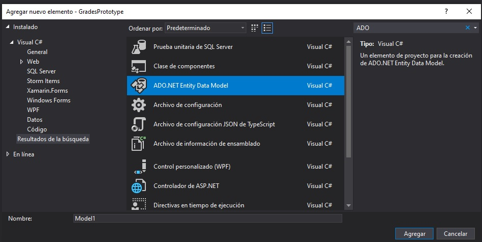

11. En el cuadro de texto **Nombre**, escriba **GradesModel** y luego haga clic en **Agregar**.
12. En el **Entity Data Model Wizard**, en la página **Choose Model Contents**, haga clic en **EF Designer from database**, luego haga clic en **Next **ץ

- La representación visual a la respuesta del último ejercicio se muestra en la siguiente imagen:

 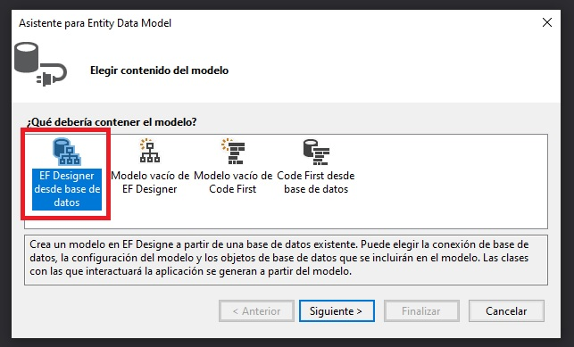

13. En la página **Elija su conexión de datos**, haga clic en **Nueva conexión**.
14. Si aparece el cuadro de diálogo **Elegir fuente de datos**, en la lista **Fuente de datos**, haga clic en **Microsoft SQL Server** y luego haga clic en **Continuar**.

- La representación visual a la respuesta del último ejercicio se muestra en la siguiente imagen:

 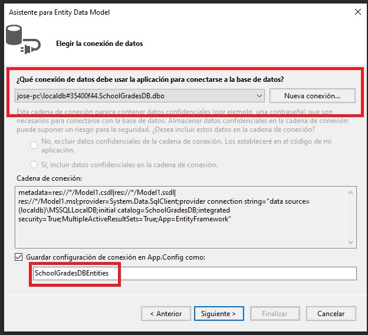

15. En el cuadro de diálogo **Propiedades de conexión**, en el cuadro de texto **Nombre del servidor**, escriba **(localdb)\MSSQLLocalDB**.
16. En la lista **Seleccione o ingrese un nombre de base de datos**, haga clic en **SchoolGradesDB** y luego haga clic en **Aceptar**.
17. En **Entity Data Model Wizard**, en la página **Elija su conexión de datos**, haga clic en **Siguiente**.
18. En la página **Elija su versión**, elija **Entity Framework 6.x** y luego haga clic en **Siguiente**.

- La representación visual a la respuesta del último ejercicio se muestra en la siguiente imagen:

 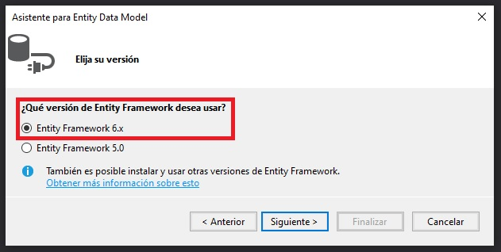

19. En la página **Elija los objetos y parámetros de su base de datos**, expanda **Tables**, expanda **dbo**, seleccione las siguientes tablas y luego haga clic en **Finalizar **:
    - **Grades**
    - **Students**
    - **Subjects**
    - **Teachers**
    - **Users**

- La representación visual a la respuesta del último ejercicio se muestra en la siguiente imagen:

 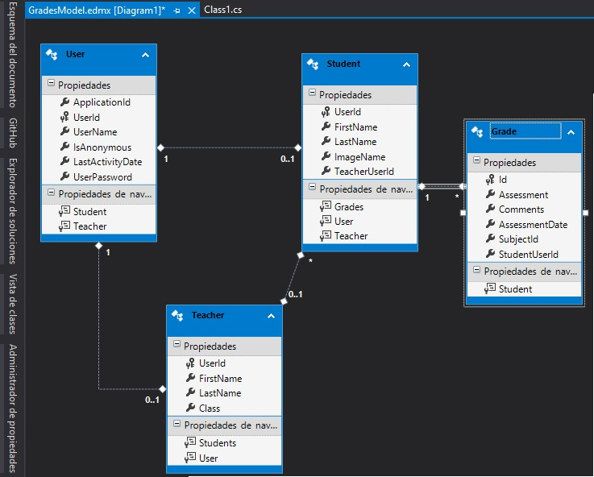

20. Si aparece el cuadro de diálogo **Advertencia de seguridad**, haga clic en **No volver a mostrar este mensaje** y luego haga clic en **Aceptar**.
21. En el menú **Crear**, haga clic en **Crear solución**.

### Tarea 2: Revisar el código generado

1. En la ventana **Diseñador**, examine las entidades que se han generado.
2. Revise las propiedades y las propiedades de navegación de la entidad **Grade**.
- La representación visual a la respuesta del último ejercicio se muestra en la siguiente imagen:

 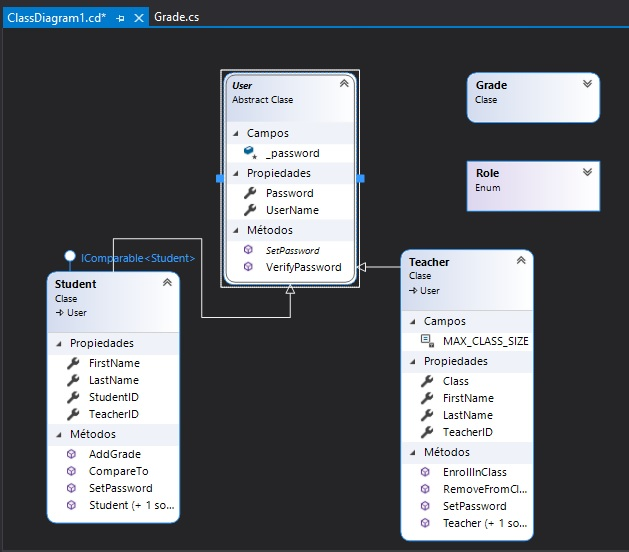

3. Haga clic con el botón derecho en el encabezado de la entidad **Calificaciones** y luego haga clic en **Asignación de tablas**.
4. En el panel **Detalles de asignación - Notas**, examine las asignaciones entre las columnas de la tabla de la base de datos y las propiedades de la entidad.

- La representación visual a la respuesta del último ejercicio se muestra en la siguiente imagen:

 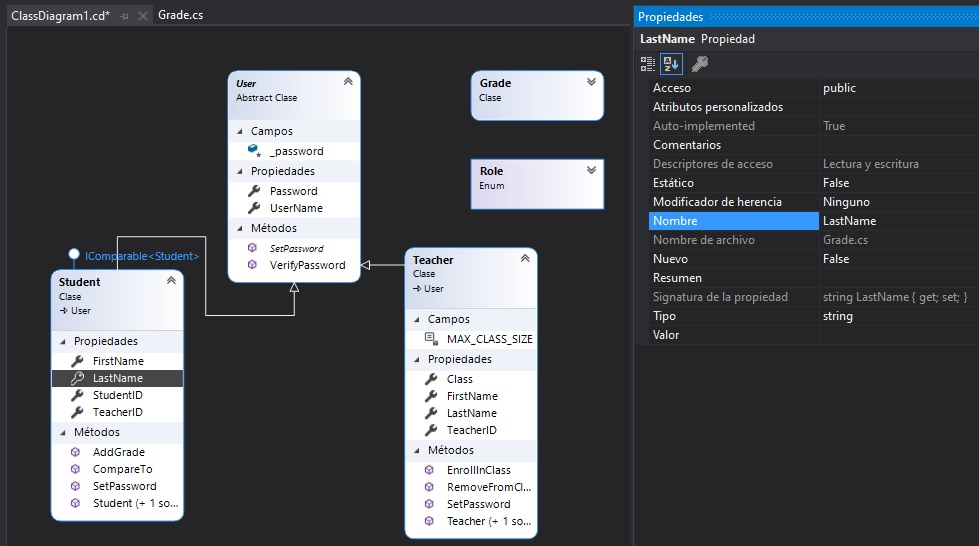

5. En **Explorador de soluciones**, expanda **GradesModel.edmx**, expanda **GradesModel.Context.tt** y luego haga doble clic en **GradesModel.Context.cs**.
6. En la ventana **Código**, observe que el asistente ha creado un objeto **DbContext **llamado **SchoolGradesDBEntities**.

- La representación visual a la respuesta del último ejercicio se muestra en la siguiente imagen:

 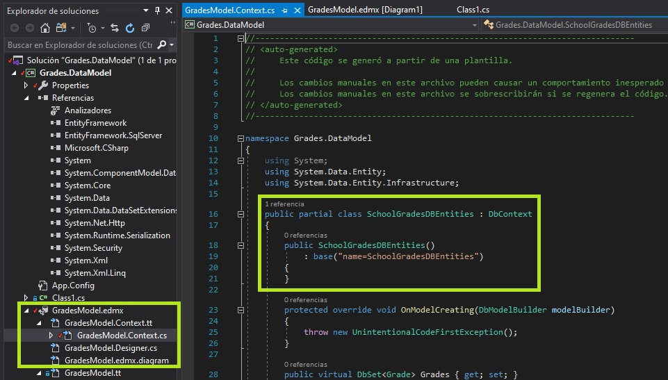

7. En **Explorador de soluciones**, expanda **GradesModel.tt** y luego haga doble clic en **Grades.cs**.
8. Tenga en cuenta que el asistente ha creado una propiedad para cada columna de la tabla de base de datos **Calificaciones**.

- La representación visual a la respuesta del último ejercicio se muestra en la siguiente imagen:

 

9. En el menú **Archivo**, haga clic en **Guardar todo**.
10. En el menú **Archivo**, haga clic en **Cerrar solución**.

> **Resultado:** Después de completar este ejercicio, la aplicación prototipo debe incluir un Entity Data Manager (EDM) que puede usar para acceder a la base de datos de **The School of Fine Arts**.

## Ejercicio 2: actualice los datos de los estudiantes y las calificaciones con Entity Framework

### Tarea 1: Ver las calificaciones del estudiante actual

1. Abra **Visual Studio 2019**.
2. En **Visual Studio**, en el menú **Archivo**, seleccione **Abrir** y luego haga clic en **Proyecto/Solución**.
3. En el cuadro de diálogo **Abrir proyecto**, vaya a **[Repository Root]\Allfiles\Mod07\Labfiles\Starter\Exercise 2**, haga clic en **GradesPrototype.sln** y luego haga clic en **Abrir**.
    > **Nota:** Si aparece un cuadro de diálogo de advertencia de seguridad, desmarque la casilla de verificación **Preguntarme por cada proyecto en esta solución** y luego haga clic en **Aceptar**.
4. En **Explorador de soluciones**, haga clic con el botón derecho en **GradesPrototype **y, a continuación, haga clic en **Establecer como proyecto inicial**.
5. En el menú **Ver**, haga clic en **Lista de tareas**.
6. En la ventana **Lista de tareas**, en la lista desplegable **Categorías**, elija **Solución completa**.
7. Haga doble clic en la tarea **TODO: Exercise 2: Task 1a: Find all the grades for the student.**.
8. En el Editor de código, haga clic en la línea vacía debajo del comentario, luego escriba el siguiente código:
    ```cs
    List<Grades.DataModel.Grade> grades = new List<Grades.DataModel.Grade>();

    foreach (Grades.DataModel.Grade grade in SessionContext.DBContext.Grades)
    {
       if (grade.StudentUserId == SessionContext.CurrentStudent.UserId)
       {
          grades.Add(grade);
       }
    }
    ```
9. En la ventana **Lista de tareas**, haga doble clic en la tarea **TODO: Exercise 2: Task 1b: Display the grades in the studentGrades ItemsControl by using databinding.**.
10. En el Editor de código, haga clic en la línea vacía debajo del comentario, luego escriba el siguiente código:
    ```cs
    studentGrades.ItemsSource = grades;
    ```
11. En el menú **Crear**, haga clic en **Crear solución**.
12. En el menú **Depurar**, haga clic en **Iniciar sin depurar**.
13. Cuando se cargue la aplicación, en el cuadro de texto **Nombre de usuario**, escriba **vallee** y en el cuadro de texto **Password**, escriba **password99 **, luego haga clic en **Iniciar sesión * *.

- La representación visual a la respuesta del último ejercicio se muestra en la siguiente imagen:

 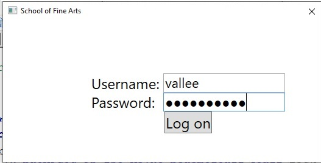

14. En la vista **Class 3C**, haga clic en **Kevin Liu**.

- La representación visual a la respuesta del último ejercicio se muestra en la siguiente imagen:

 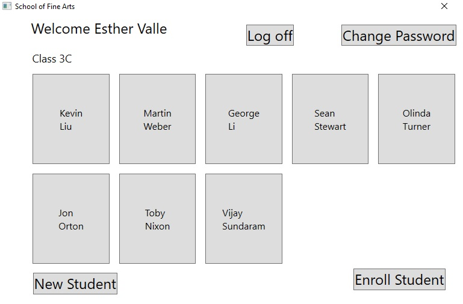

15. Verifique que aparezcan las notas de Kevin Liu.
16. Tenga en cuenta que la columna **asunto** utiliza el ID del asunto en lugar del nombre del asunto, luego cierre la aplicación.

- La representación visual a la respuesta del último ejercicio se muestra en la siguiente imagen:

 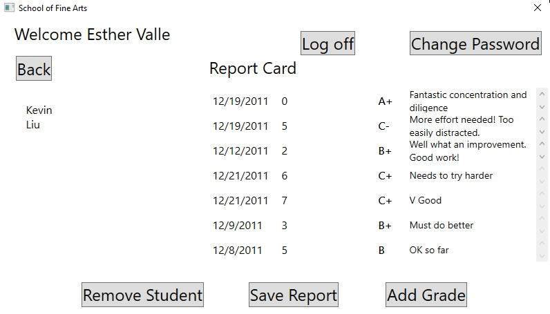


### Tarea 2: Mostrar el nombre del tema en la interfaz de usuario

1. En **Visual Studio**, en la ventana **Lista de tareas**, haga doble clic en **TODO: Exercise 2: Task 2a: Convert the subject ID provided in the value parameter**.
2. En el editor de código, haga clic en la línea vacía debajo del comentario, luego escriba el siguiente código:
    ```cs
    int subjectId = (int)value;
    var subject = SessionContext.DBContext.Subjects.FirstOrDefault(s => s.Id == subjectId);
    ```
3. En la ventana **Lista de tareas**, haga doble clic en la tarea **TODO: Exercise 2: Task 2b: Return the subject name or the string “N/A”**.
4. En el Editor de código, elimine la siguiente línea de código:
    ```cs
    return value;
    ```
5. En el Editor de código, haga clic en la línea vacía debajo del comentario y luego escriba el siguiente código:
    ```cs
    return subject.Name != string.Empty ? subject.Name : "N/A";
    ```
6. Guarde el archivo.

### Tarea 3: Mostrar la vista GradeDialog y usar la entrada para agregar una nueva calificación

1. En la ventana **Lista de tareas**, haga doble clic en **TODO: Exercise 2: Task 3a: Use the GradeDialog to get the details of the new grade**.
2. En el editor de código, haga clic en la línea vacía debajo del comentario, luego escriba el siguiente código:
    ```cs
    GradeDialog gd = new GradeDialog();
    ```
3. En la ventana **Lista de tareas**, haga doble clic en **TODO: Exercise 2: Task 3b: Display the form and get the details of the new grade**.
4. En el editor de código, haga clic en la línea vacía debajo del comentario, luego escriba el siguiente código:
    ```cs
    if (gd.ShowDialog().Value)
    {
    ```
5. Haga clic en la línea vacía debajo del último comentario TODO en este bloque **try**, luego escriba el siguiente código:
    ```cs
    }
    ```
6. En la ventana **Lista de tareas**, haga doble clic en **TODO: Exercise 2: Task 3c: When the user closes the form, retrieve the details of the assessment grade from the form and use them to create a new Grade object**.
7. En el Editor de código, haga clic en la línea vacía debajo del comentario, luego escriba el siguiente código:
    ```cs
    Grades.DataModel.Grade newGrade = new Grades.DataModel.Grade();
    newGrade.AssessmentDate = gd.assessmentDate.SelectedDate.Value;
    newGrade.SubjectId = gd.subject.SelectedIndex;
    newGrade.Assessment = gd.assessmentGrade.Text;
    newGrade.Comments = gd.comments.Text;
    newGrade.StudentUserId = SessionContext.CurrentStudent.UserId;
    ```
8. En la ventana **Lista de tareas**, haga doble clic en la tarea **TODO: Exercise 2: Task 3d: Save the grade**.
9. En el Editor de código, haga clic en la línea vacía debajo del comentario, luego escriba el siguiente código:
    ```cs
    SessionContext.DBContext.Grades.Add(newGrade);
    SessionContext.Save();
    ```
10. En la ventana **Lista de tareas**, haga doble clic en la tarea **TODO: Exercise 2: Task 3e: Refresh the display so that the new grade appears**.
11. En el Editor de código, haga clic al final del comentario, presione Entrar y luego escriba el siguiente código:
    ```cs
    Refresh();
    ```

### Tarea 4: Ejecuta la aplicación y prueba la funcionalidad Agregar notas

1. En el menú **Crear**, haga clic en **Crear solución**.
2. En el menú **Depurar**, haga clic en **Iniciar sin depurar**.
3. Cuando se cargue la aplicación, en el cuadro de texto **Nombre de usuario**, escriba **vallee** y en el cuadro de texto **Password**, escriba **password99**, luego haga clic en **Iniciar sesión * *.
4. En la vista **Class 3C**, haga clic en **Kevin Liu**.
5. Verifique que la lista de Notas ahora muestre el nombre del tema, no el ID del tema.
6. En la vista **Boleta de calificaciones**, haga clic en **Agregar nota**.
7. En el cuadro de diálogo **Detalles de calificación nueva**, en la lista **Asignatura**, haga clic en **Geografía**, en el cuadro de texto **Evaluación**, escriba **A+**, en el cuadro de texto **Comentarios**, escriba **¡Bien hecho!**, luego haz clic en **Aceptar**.
8. Verifique que la nueva nota esté agregada a la lista y luego cierre la aplicación.
9. En **Visual Studio**, en el menú **Archivo**, haga clic en **Cerrar solución**.

> **Resultado:** Después de completar este ejercicio, los usuarios verán las calificaciones del estudiante actual y agregarán nuevas calificaciones.

## Ejercicio 3: Ampliación del modelo de datos de la entidad para validar los datos

### Tarea 1: Lanzar ClassFullException

1. Abra **Visual Studio 2019**.
2. En **Visual Studio**, en el menú **Archivo**, seleccione **Abrir** y luego haga clic en **Proyecto/Solución**.
3. En el cuadro de diálogo **Abrir proyecto**, navegue hasta **[Repository Root]\Allfiles\Mod07\Labfiles\Starter\Exercise 3**, haga clic en **GradesPrototype.sln** y luego haga clic en **Abrir**.
   > **Nota:** Si aparece un cuadro de diálogo de advertencia de seguridad, desmarque la casilla de verificación **Preguntarme por cada proyecto en esta solución** y luego haga clic en **Aceptar**.
4. En **Explorador de soluciones**, haga clic con el botón derecho en **GradesPrototype **y, a continuación, haga clic en **Establecer como proyecto inicial**.
5. En **Explorador de soluciones**, haga clic con el botón derecho en el proyecto **Grades.DataModel**, seleccione **Agregar **y, a continuación, haga clic en **Clase**.
6. En el cuadro de diálogo **Agregar nuevo elemento - Grades.DataModel**, en el cuadro de texto **Nombre**, escriba **customTeacher.cs** y luego haga clic en **Agregar**.
7. En el Editor de código, modifique la declaración de clase como se muestra en el siguiente código:
    ```cs
    public partial class Teacher
    ```
8. En el editor de código, en la clase **Teacher**, escriba el siguiente código:
    ```cs
    private const int MAX_CLASS_SIZE = 8;
    ```
9. En el editor de código, en la clase **Teacher**, escriba el siguiente código:
    ```cs
    public void EnrollInClass(Student student)
    {
        // Verify that this teacher's class is not already full.
        // Determine how many students are currently in the class.
        int numStudents = (from s in Students
                           where s.TeacherUserId == UserId
                           select s).Count();

        // If the class is already full, another student cannot be enrolled.
        if (numStudents >= MAX_CLASS_SIZE)
        {
            // So throw a ClassFullException and specify the class that is full.
            throw new ClassFullException("Class full: Unable to enroll student", Class);
        }
        // Verify that the student is not already enrolled in another class.
        if (student.TeacherUserId == null)
        {
            // Set the TeacherID property of the student.
            student.TeacherUserId = UserId;
        }
        else
        {
            // If the student is already assigned to a class, throw an ArgumentException.
            throw new ArgumentException("Student", "Student is already assigned to a class");
        }
    }
    ```
10. En la ventana **Lista de tareas**, haga doble clic en **TODO: Exercise 3: Task 1a: Call the EnrollInClass method to assign the student to this teacher’s class** de la clase de este profesor.
11. En el Editor de código, haga clic en la línea vacía debajo del comentario, luego escriba el siguiente código:
    ```cs
    SessionContext.CurrentTeacher.EnrollInClass(student);
    ```
12. En la ventana **Lista de tareas**, haga doble clic en la **TODO: Exercise 3: Task 1b: Save the updated student/class information back to the database**.
13. En el Editor de código, haga clic en la línea vacía debajo del comentario, luego escriba el siguiente código:
    ```cs
    SessionContext.Save();
    ```

### Tarea 2: Agregar lógica de validación para las propiedades Assessment y AssessmentDate

1. En **Explorador de soluciones**, haga clic con el botón derecho en **Grades.DataModel**, seleccione **Agregar **y, a continuación, haga clic en **Clase**.
2. En el cuadro de diálogo **Agregar nuevo elemento - Grades.DataModel**, en el cuadro de texto **Nombre**, escriba **customGrade.cs** y luego haga clic en **Agregar**.
3. En el Editor de código, modifique la declaración de clase como se muestra en el siguiente código:
    ```cs
    public partial class Grade
    ```
4. En el editor de código, en la clase **Grade**, escriba el siguiente código:
    ```cs
    public bool ValidateAssessmentDate(DateTime assessmentDate)
    {
        // Verify that the user has provided a valid date.
        // Check that the date is no later than the current date.
        if (assessmentDate > DateTime.Now)
        {
            // Throw an ArgumentOutOfRangeException if the date is after the current date.
            throw new ArgumentOutOfRangeException("Assessment Date", "Assessment date must be on or before the current date");
        }
        else
        {
            return true;
        }
    }
    ```
5. En el Editor de código, bajo las directivas **using** existentes, escriba el siguiente código:
    ```cs
    using System.Text.RegularExpressions;
    ```
6. En el editor de código, en la clase **Grade**, escriba el siguiente código:
    ```cs
    public bool ValidateAssessmentGrade(string assessment)
    {
        // Verify that the grade is in the range A+ to E-.
        // Use a regular expression: A single character in the range A-E at the start of the string followed by an optional + or - at the end of the string.
        Match matchGrade = Regex.Match(assessment, @"^[A-E][+-]?$");

        if (!matchGrade.Success)
        {
            // If the grade is not valid, throw an ArgumentOutOfRangeException.
            throw new ArgumentOutOfRangeException("Assessment", "Assessment grade must be in the range A+ to E-");
        }
        else
        {
            return true;
        }
    }
    ```
7. En la ventana **Lista de tareas**, haga doble clic en la tarea **TODO: Exercise 3: Task 2a: Create a Grade object.**.
8. En el Editor de código, haga clic en la línea vacía debajo del comentario, luego escriba el siguiente código:
    ```cs
    Grades.DataModel.Grade testGrade = new Grades.DataModel.Grade();
    ```
9. En la ventana **Lista de tareas**, haga doble clic en la tarea **TODO: Exercise 3: Task 2b: Call the ValidateAssessmentDate method**.
10. En el Editor de código, haga clic en la línea vacía debajo del comentario, luego escriba el siguiente código:
    ```cs
   testGrade.ValidateAssessmentDate(assessmentDate.SelectedDate.Value);
    ```
11. En la ventana **Lista de tareas**, haga doble clic en **TODO: Exercise 3: Task 2c: Call the ValidateAssessmentGrade**.
12. En el editor de código, haga clic en la línea vacía debajo del comentario, luego escriba el siguiente código:
    ```cs
    testGrade.ValidateAssessmentGrade(assessmentGrade.Text);
    ```

### Tarea 3: Ejecute la aplicación y pruebe la lógica de validación

1. En el menú **Crear**, haga clic en **Crear solución**.
2. En el menú **Depurar**, haga clic en **Iniciar sin depurar**.
3. Cuando se cargue la aplicación, en el cuadro de texto **Nombre de usuario**, escriba **vallee** y en el cuadro de texto **Password**, escriba **password99**, luego haga clic en **Iniciar sesión * *.
4. Cuando se cargue la aplicación, haga clic en **Inscribir estudiante**.
5. En el cuadro de diálogo **Asignar un alumno**, haga clic en **Eric Gruber**, en el cuadro de mensaje **Confirmar**, haga clic en **Sí** y luego en el **mensaje de error al registrar al estudiante**, haga clic en **Aceptar**.
6. En el cuadro de diálogo **Anular asignación de alumno**, haga clic en **Cerrar**.
7. En la vista **Class 3C**, haga clic en **Kevin Liu**, luego haga clic en **Agregar nota**.
8. En el cuadro de diálogo **Detalles de nota nueva**, en el cuadro de texto **Fecha**, escriba la fecha de mañana y luego haga clic en **Aceptar**.
9. En el cuadro de mensaje **Error al crear la evaluación**, haga clic en **Aceptar**.
10. En el cuadro de diálogo **Detalles de nueva calificación**, en el cuadro de texto **Fecha**, escriba **19/8/2012**, en el cuadro de texto **Evaluación**, escriba * * F + * *, luego haga clic en **Aceptar**.
11. En el cuadro de mensaje **Error al crear la evaluación**, haga clic en **Aceptar**.
12. En el cuadro de diálogo **Detalles de nueva calificación**, en el cuadro de texto **Calificación**, escriba **A+**, en el cuadro de texto **Comentarios**, escriba **¡Bien jugado!**, luego haz clic en **Aceptar**.
13. Verifique que la nueva nota esté agregada a la lista, luego cierre la aplicación.
14. En **Visual Studio**, en el menú **Archivo**, haga clic en **Cerrar solución**.

> **Resultado:** Después de completar este ejercicio, la aplicación generará y manejará excepciones cuando se ingresen datos no válidos.