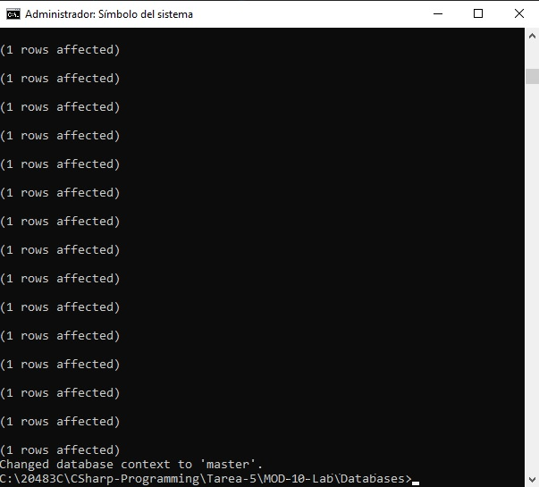
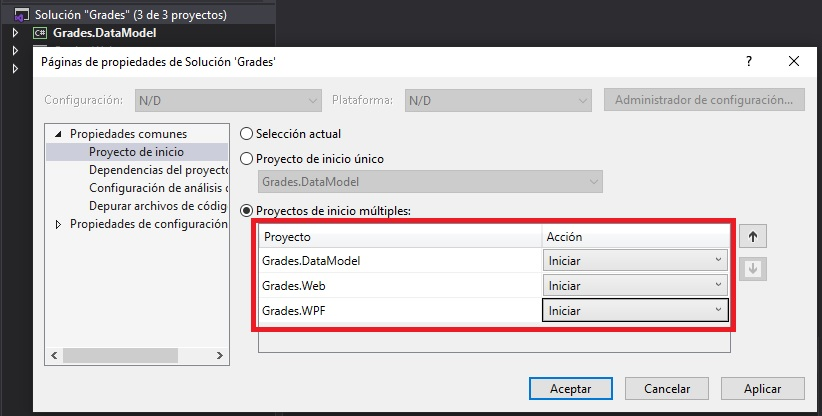
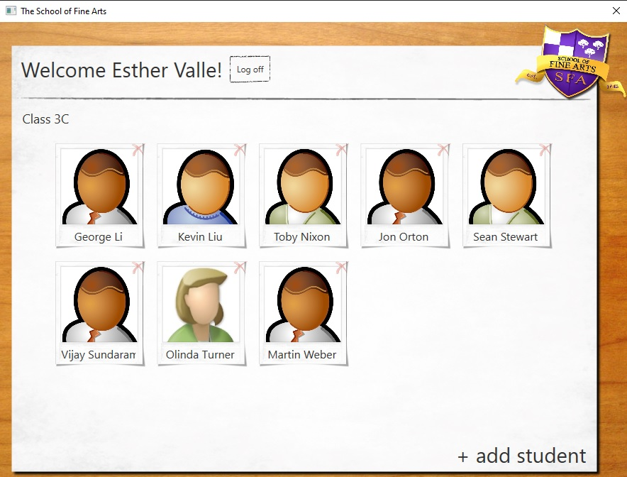

# Módulo 10: Mejora del rendimiento y la capacidad de respuesta de las aplicaciones

# Laboratorio: Mejora de la capacidad de respuesta y el rendimiento de la aplicación

Tiempo estimado:**75 minutos**

Fichero de Instrucciones: Instructions\20483C_MOD010_LAK.md

Entregar el url de GitHub con la solución y un readme con las siguiente información:

1. **Nombres y apellidos:** José René Fuentes Cortez
2. **Fecha:** 24 de Octubre 2020.
3. **Resumen del Modulo 2:** Este módulo consta de tres ejercicios:
    -  En el primer ejercio nos ayuda a actualizar la aplicación para actualizar las **Calificaciones** y así poder recuperar los datos de forma asincrónica.
    - En el ejercicio 2 los datos del estudiante serán validados antes de ser guardados por la aplicación.
    - En el ejercicio 3 hacemos que la aplicación pueda manipular los datos modificados del estudiante para que se  guarden en la base de datos.


4. **Dificultad o problemas presentados y como se resolvieron:** Ninguna.

**NOTA**: Si no hay descripcion de problemas o dificultades, y al yo descargar el código para realizar la comprobacion y el código no funcionar, el resultado de la califaciación del laboratorio será afectado.

---

## Configuración del Lab


## Pasos de preparación

1. Asegúrese de haber clonado el directorio 20483C de GitHub. Contiene los segmentos de código para los laboratorios y demostraciones de este curso. (**https://github.com/MicrosoftLearning/20483-Programming-in-C-Sharp/tree/master/Allfiles**)
2. Inicializar la base de datos:
   - En la lista **Aplicaciones**, haga clic en **Explorador de archivos**.
   - Vaya a la carpeta **[Repository Root]\AllFiles\Mod10\Labfiles\Databases** y luego haga doble clic en **SetupSchoolGradesDB.cmd**.
        > **Nota:** Si aparece un cuadro de diálogo de Windows protegió su PC, haga clic en Más información y luego en Ejecutar de todos modos.

- La representación visual a la respuesta del último ejercicio se muestra en la siguiente imagen:

 

   - Cierre **Explorador de archivos**.

## Ejercicio 1: Asegurarse de que la interfaz de usuario siga siendo receptiva al recuperar datos del profesor

### Tarea 1: compila y ejecuta la aplicación

1. Abra **Visual Studio 2019**.
2. En el menú **Archivo**, seleccione **Abrir** y luego haga clic en **Proyecto/Solución**.
3. En el cuadro de diálogo **Abrir proyecto**, vaya a **[Repository Root]\AllFiles\Mod10\Labfiles\Starter\Exercise 1**, haga clic en **Grades.sln** y luego haga clic en **Abrir**.
    > **Nota:** Si aparece algún cuadro de diálogo de advertencia de seguridad, desactive la casilla de verificación **Preguntarme por cada proyecto en esta solución** y luego haga clic en **Aceptar**.
4. En **Explorador de soluciones**, haga clic con el botón derecho en **Solución "Calificaciones"**, y a continuación, haga clic en **Propiedades**.
5. En la página **Proyecto de inicio**, haga clic en **Varios proyectos de inicio**, configure **Grades.Web** y **Grades.WPF **en **Inicio** y luego haga clic en **Aceptar**.

- La representación visual a la respuesta del último ejercicio se muestra en la siguiente imagen:

 

6. En el menú **Crear**, haga clic en **Crear solución**.
7. En el menú **Depurar**, haga clic en **Iniciar sin depurar**.
8. Cuando se cargue la aplicación, en el cuadro de texto **Nombre de usuario**, escriba **vallee**, y en el cuadro de texto **Password**, escriba **password99** y luego haga clic en **Iniciar sesión**.

- La representación visual a la respuesta del último ejercicio se muestra en la siguiente imagen:

 

9. Observe que la interfaz de usuario se congela brevemente mientras obtiene la lista de estudiantes para Esther Valle (intente mover la ventana de la aplicación después de iniciar sesión pero antes de que aparezca la lista de estudiantes).
10. Cierre la ventana de la aplicación.

### Tarea 2: Modificar el código que recupera los datos del profesor para que se ejecute de forma asincrónica

1. En el menú **Ver**, haga clic en **Lista de tareas**.
2. En la ventana **Lista de tareas**, haga doble clic en **TODO: Exercise 1: Task 2a: Convert GetTeacher into an async method that returns a Task\<Teacher>**.
3. En el editor de código, elimine la siguiente línea de código:
    ```cs
    public Teacher GetTeacher(string userName)
    ```
4. En la línea en blanco debajo del comentario, escriba el siguiente código:
    ```cs
    public async Task<Teacher> GetTeacher(string userName)
    ```
5. En la ventana **Lista de tareas**, haga doble clic en **TODO: Exercise 1: Task 2b: Perform the LINQ query to fetch Teacher information asynchronously**.
6. En el editor de código, modifique la declaración debajo del comentario como se muestra en negrita a continuación:
    ```cs
    var teacher = await Task.Run(() =>
        (from t in DBContext.Teachers
         where t.User.UserName == userName
         select t).FirstOrDefault());
    ```
7. En la ventana **Lista de tareas**, haga doble clic en la tarea **TODO: Exercise 1: Task 2c: Mark MainWindow.Refresh as an asynchronous method**.
8. En el editor de código, modifique la declaración debajo del comentario como se muestra en negrita a continuación:
    ```cs
    public async void Refresh()
    ```
9. En la ventana **Lista de tareas**, haga doble clic en la tarea **TODO: Exercise 1: Task 2d: Call GetTeacher asynchronously**.
10. En el editor de código, modifique la declaración debajo del comentario como se muestra en negrita a continuación:
    ```cs
    var teacher = await utils.GetTeacher(SessionContext.UserName);
    ```

### Tarea 3: Modificar el código que recupera y muestra la lista de estudiantes para que un profesor la ejecute de forma asincrónica

1. En la ventana **Lista de tareas**, haga doble clic en la tarea **TODO: Exercise 1: Task 3a: Mark StudentsPage.Refresh as an asynchronous method**.
2. En el editor de código, modifique la declaración debajo del comentario como se muestra en negrita a continuación:
    ```cs
    public async void Refresh()
    ```
3. En la ventana **Lista de tareas**, haga doble clic en **TODO: Exercise 1: Task 3b: Implement the OnGetStudentsByTeacherComplete callback to display the students for a teacher here**.
4. En la línea en blanco debajo del comentario, escriba el siguiente código:
    ```cs
    private void OnGetStudentsByTeacherComplete(IEnumerable<Student> students)
    {

    }
    ```
5. En la ventana **Lista de tareas**, haga doble clic en la tarea **Exercise 1: Task 3c: Relocate the remaining code in this method to create the OnGetStudentsByTeacherComplete callback (in the Callbacks region)**.
6. En el editor de código, mueva todo el código entre el comentario y el final del método **Refresh **al **Portapapeles**.
7. En la ventana **Lista de tareas**, haga doble clic en **TODO: Exercise 1: Task 3b: Implement the OnGetStudentsByTeacherComplete callback to display the students for a teacher here**.
8. Haga clic en la línea en blanco entre las llaves y pegue el código del **Portapapeles**.
9. En la ventana **Lista de tareas**, haga doble clic en la tarea **TODO: Exercise 1: Task 3d: Use a Dispatcher object to update the UI**.
10. En el editor de código, haga clic al final de la línea de comentarios, presione Entrar y luego escriba el siguiente código:
    ```cs
    this.Dispatcher.Invoke(() => {
    ```
11. Inmediatamente después de la última línea de código del método, escriba el siguiente código:
    ```cs
    });
    ```
12. En la ventana **Lista de tareas**, haga doble clic en **TODO: Exercise 1: Task 3e: Convert GetStudentsByTeacher into an async method that invokes a callback**.
13. En el editor de código, elimine la siguiente línea de código:
    ```cs
    public List<Student> GetStudentsByTeacher(string teacherName)
    ```
14. En la línea en blanco debajo del comentario, escriba el siguiente código:
    ```cs
    public async Task GetStudentsByTeacher(string teacherName,  Action<IEnumerable<Student>> callback)
    ```
15. En el editor de código, modifique la declaración de retorno debajo de la línea **if(!IsConnected())** para regresar sin pasar un valor al llamador:
    ```cs
    return;
    ```
16. En la ventana **Lista de tareas**, haga doble clic en la tarea **TODO: Exercise 1: Task 3f: Perform the LINQ query to fetch Student data asynchronously**.
17. En el editor de código, modifique la declaración debajo del comentario como se muestra en negrita a continuación:
    ```cs
    var students = await Task.Run(() =>
        (from s in DBContext.Students
         where s.Teacher.User.UserName == teacherName
         select s).OrderBy(s => s.LastName).ToList());
    ```
18. En la ventana **Lista de tareas**, haga doble clic en **TODO: Exercise 1: Task 3g: Run the callback by using a new task rather than returning a list of students**.
19. En el editor de código, elimine el siguiente código:
    ```cs
    return students;
    ```
20. En la línea en blanco debajo del comentario, escriba el siguiente código:
    ```cs
    await Task.Run(() => callback(students));
    ```
21. En la ventana **Lista de tareas**, haga doble clic en tarea **TODO: Exercise 1: Task 3h: Invoke GetStudentsByTeacher asynchronously and pass the OnGetStudentsByTeacherComplete callback as the second argument**.
22. En el editor de código, modifique la declaración debajo del comentario como se muestra en negrita a continuación:
    ```cs
    await utils.GetStudentsByTeacher(SessionContext.UserName, OnGetStudentsByTeacherComplete);
    ```

### Tarea 4: compila y prueba la aplicación

1. En el menú **Crear**, haga clic en **Crear solución**.
2. En el menú **Depurar**, haga clic en **Iniciar sin depurar**.
3. Cuando se cargue la aplicación, en el cuadro de texto **Nombre de usuario**, escriba **vallee**, y en el cuadro de texto **Password**, escriba **password99** y luego haga clic en **Iniciar sesión**.

- La representación visual a la respuesta del último ejercicio se muestra en la siguiente imagen:

 

4. Verifique que la aplicación responda mejor que antes mientras busca la lista de estudiantes de **Esther Valle** y luego cierre la ventana de la aplicación.
5. En el menú **Archivo**, haga clic en **Cerrar solución**.

> **Resultado:** Después de completar este ejercicio, debería haber actualizado la aplicación **Calificaciones** para recuperar datos de forma asincrónica.

## Ejercicio 2: Proporcionar comentarios visuales durante operaciones de larga duración

### Tarea 1: Crear el control de usuario BusyIndicator

1. En **Visual Studio**, en el menú **Archivo**, seleccione **Abrir** y luego haga clic en **Proyecto/Solución**.
2. En el cuadro de diálogo **Abrir proyecto**, vaya a **[Repository Root]\AllFiles\Mod10\Labfiles\Starter\Exercise 2**, haga clic en **Grades.sln** y luego haga clic en **Abrir**.
    > **Nota:** Si aparece algún cuadro de diálogo de advertencia de seguridad, desactive la casilla de verificación **Preguntarme por cada proyecto en esta solución** y luego haga clic en **Aceptar**.
3. En **Explorador de soluciones**, haga clic con el botón derecho en **Solución "Calificaciones"**, y a continuación, haga clic en **Propiedades**.
4. En la página **Proyecto de inicio**, haga clic en **Varios proyectos de inicio**, configure **Grades.Web** y **Grades.WPF** en **Inicio** y luego haga clic en **Aceptar**.
5. En el menú **Crear**, haga clic en **Crear solución**.
6. En **Explorador de soluciones**, haga clic con el botón derecho en **Grades.WPF**, seleccione **Agregar**, y a continuación, haga clic en **Control de usuario**.
7. En el cuadro de texto **Nombre**, escriba **BusyIndicator.xaml** y luego haga clic en **Agregar**.
8. En **Explorador de soluciones**, expanda **Grades.WPF** y luego arrastre **BusyIndicator.xaml **a la carpeta **Controles**.
   > **Nota:** Es mejor crear el control de usuario a nivel de proyecto y luego moverlo a la carpeta **Controles **cuando se crea. Esto asegura que el control de usuario se cree en el mismo espacio de nombres que otros recursos del proyecto.
9. En el archivo **BusyIndicator.xaml**, en el elemento **UserControl**, elimine los siguientes atributos:
    ```xml
    d:DesignWidth="450" d:DesignHeight="800"
    ```
10. Modifique el elemento **Grid** para incluir un atributo **Fondo**, como muestra el siguiente marcado:
    ```xml
    <Grid Background="#99000000">

    </Grid>
    ```
11. Escriba el siguiente marcado entre las etiquetas **Grid** de apertura y cierre:
    ```xml
    <Border CornerRadius="6"
            HorizontalAlignment="Center"
            VerticalAlignment="Center">
        <Border.Background>
            <LinearGradientBrush>
                <GradientStop Color="LightGray" Offset="0" />
                <GradientStop Color="DarkGray" Offset="1" />
            </LinearGradientBrush>
        </Border.Background>
        <Border.Effect>
            <DropShadowEffect Opacity="0.75" />
        </Border.Effect>
    </Border>
    ```
12. En la línea en blanco antes de la etiqueta **Borde** de cierre, escriba el siguiente código:
    ```xml
    <Grid Margin="10">
        <Grid.RowDefinitions>
            <RowDefinition Height="Auto" />
            <RowDefinition Height="Auto" />
        </Grid.RowDefinitions>

    </Grid>
    ```
13. En la línea en blanco antes de la etiqueta **Grid** de cierre, escriba el siguiente código:
    ```xml
    <ProgressBar x:Name="progress"
                 IsIndeterminate="True"
                 Width="200"
                 Height="25"
                 Margin="20" />
    ```
14. Haga clic después del final del elemento **ProgressBar** y luego presione Entrar.
15. En la nueva línea, escriba el siguiente código:
    ```xml
    <TextBlock x:Name="txtMessage"
               Grid.Row="1"
               FontSize="14"  
               FontFamily="Verdana"
               Text="Please Wait..."
               TextAlignment="Center" />
    ```
16. En el menú **Archivo**, haga clic en **Guardar todo**.
17. En **Explorador de soluciones**, expanda **Grades.WPF** y luego haga doble clic en **MainWindow.xaml**.
18. Hacia la parte inferior del archivo **MainWindow.xaml**, ubique **TODO: Exercise 2: Task 1b: Add the BusyIndicator control to MainWindow**.
19. Haga clic al final del comentario, presione Entrar y luego escriba el siguiente código:
    ```xml
    <y:BusyIndicator x:Name="busyIndicator"
                     Margin="0"
                     Visibility="Collapsed" />
    ```
20. En el menú **Crear**, haga clic en **Crear solución**.

### Tarea 2: Agregar métodos de controlador de eventos StartBusy y EndBusy

1. En la ventana **Lista de tareas**, haga doble clic en la tarea **TODO: Exercise 2: Task 2a: Implement the StartBusy event handler**.
2. En la línea en blanco debajo del comentario, escriba el siguiente código:
    ```cs
    private void StartBusy(object sender, EventArgs e)
    {
        busyIndicator.Visibility = Visibility.Visible;
    }
    ```
3. En la ventana **Lista de tareas**, haga doble clic en **TODO: Ejercicio 2: Tarea 2b: Implementar el controlador de eventos EndBusy**.
4. En la línea en blanco debajo del comentario, escriba el siguiente código:
    ```cs
    private void EndBusy(object sender, EventArgs e)
    {
        busyIndicator.Visibility = Visibility.Hidden;
    }
    ```

### Tarea 3: Elevar los eventos StartBusy y EndBusy

1. En la ventana **Lista de tareas**, haga doble clic en la tarea **TODO: Exercise 2: Task 3a: Add the StartBusy public event**
2. En la línea en blanco debajo del comentario, escriba el siguiente código:
    ```cs
    public event EventHandler StartBusy;
    ```
3. En la ventana **Lista de tareas**, haga doble clic en la tarea **TODO: Exercise 2: Task 3b: Add the EndBusy public event**
4. En la línea en blanco debajo del comentario, escriba el siguiente código:
    ```cs
    public event EventHandler EndBusy;
    ```
5. En la ventana **Lista de tareas**, haga doble clic en **TODO: Exercise 2: Task 3c: Implement the StartBusyEvent method to raise the StartBusy event**.
6. En la línea en blanco debajo del comentario, escriba el siguiente código:
    ```cs
    private void StartBusyEvent()
    {
        if (StartBusy != null)
            StartBusy(this, new EventArgs());
    }
    ```
7. En la ventana **Lista de tareas**, haga doble clic en **TODO: Exercise 2: Task 3d: Implement the EndBusyEvent method to raise the EndBusy event**.
8. En la línea en blanco debajo del comentario, escriba el siguiente código:
    ```cs
    private void EndBusyEvent()
    {
        if (EndBusy != null)
            EndBusy(this, new EventArgs());
    }
    ```
9. En **Explorador de soluciones**, haga doble clic en **MainWindow.xaml**.
10. En el archivo **MainWindow.xaml**, ubique el **TODO: Exercise 2: Task 3e: Wire up the StartBusy and EndBusy event handlers for the StudentsPage view**.
11. Inmediatamente debajo del comentario, modifique el elemento **StudentsPage** para incluir los atributos **StartBusy** y **EndBusy**, como muestra el siguiente código:
    ```xml
    <y:StudentsPage x:Name="studentsPage"
                    StartBusy="StartBusy"
                    EndBusy="EndBusy"
                    StudentSelected="studentsPage_StudentSelected"
                    Visibility="Collapsed" />
    ```
12. En la ventana **Lista de tareas**, haga doble clic en la tarea **TODO: Exercise 2: Task 3f: Raise the StartBusy event**.
13. En la línea en blanco debajo del comentario, escriba el siguiente código:
    ```cs
    StartBusyEvent();
    ```
14. En la ventana **Lista de tareas**, haga doble clic en la tarea **TODO: Exercise 2: Task 3g: Raise the EndBusy event**.
15. En la línea en blanco debajo del comentario, escriba el siguiente código:
    ```cs
    EndBusyEvent();
    ```

### Tarea 4: compila y prueba la aplicación

1. En el menú **Crear**, haga clic en **Crear solución**.
2. En el menú **Depurar**, haga clic en **Iniciar sin depurar**.
3. Cuando se cargue la aplicación, en el cuadro de texto **Nombre de usuario**, escriba **vallee**, y en el cuadro de texto **Password**, escriba **password99** y luego haga clic en **Iniciar sesión * *.
4. Verifique que la aplicación muestre el indicador de ocupado mientras espera que se cargue la lista de estudiantes y luego cierre la ventana de la aplicación.
5. En el menú **Archivo**, haga clic en **Cerrar solución**.

> **Resultado:** Después de completar este ejercicio, debería haber actualizado la aplicación **Calificaciones** para mostrar un indicador de progreso mientras la aplicación está recuperando datos.