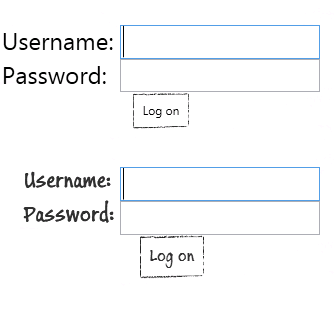

# Módulo 9: Diseño de la interfaz de usuario para una aplicación gráfica

# Laboratorio: Personalización de fotografías de estudiantes y diseño de la aplicación


Tiempo estimado:** 90 minutos **

Fichero de Instrucciones: Instructions\20483C_MOD09_LAK.md

Entregar el url de GitHub con la solución y un readme con las siguiente información:

1. **Nombres y apellidos:** José René Fuentes Cortez
2. **Fecha:** 14 de Octubre 2020.
3. **Resumen del Modulo 2:** Este módulo consta de tres ejercicios:
    -  En el primer ejercio nos ayuda a actualizar la aplicación para refactorizar el código duplicado en métodos reutilizables.
    - En el ejercicio 2 los datos del estudiante serán validados antes de ser guardados por la aplicación.
    - En el ejercicio 3 hacemos que la aplicación pueda manipular los datos modificados del estudiante para que se  guarden en la base de datos.


4. **Dificultad o problemas presentados y como se resolvieron:** Ninguna.

**NOTA**: Si no hay descripcion de problemas o dificultades, y al yo descargar el código para realizar la comprobacion y el código no funcionar, el resultado de la califaciación del laboratorio será afectado.

---

## Configuración del Lab

## Pasos de preparación

1. Asegúrese de haber clonado el directorio 20483C de GitHub. Contiene los segmentos de código para los laboratorios y demostraciones de este curso. (** https: //github.com/MicrosoftLearning/20483-Programming-in-C-Sharp/tree/master/Allfiles**)
2. Inicializar la base de datos:
   - En la lista **Aplicaciones**, haga clic en **Explorador de archivos**.
   - Navegue a la carpeta **[Repository Root]\Allfiles\Mod09\Labfiles\Databases**, y luego haga doble clic en **SetupSchoolGradesDB.cmd**.
        > **Nota:** Si aparece un cuadro de diálogo de Windows protegió su PC, haga clic en Más información y luego en Ejecutar de todos modos.
   - Cierre **Explorador de archivos**.

## Ejercicio 1: Personalización de la apariencia de las fotografías de los estudiantes

### Tarea 1: Crear el control de usuario StudentPhoto

1. Abra **Visual Studio 2019**.
2. En **Visual Studio**, en el menú **Archivo**, seleccione **Abrir** y luego haga clic en **Proyecto/Solución**.
3. En el cuadro de diálogo **Abrir proyecto**, vaya a **[Repository Root]\Allfiles\Mod09\Labfiles\Starter\Exercise 1**, haga clic en **Grades.sln** y luego haga clic en **Abrir**.
   > **Nota:** Si aparece algún cuadro de diálogo de advertencia de seguridad, desactive la casilla de verificación **Preguntarme por cada proyecto en esta solución** y luego haga clic en **Aceptar**.
4. En **Explorador de soluciones**, haga clic con el botón derecho en **Solución "Calificaciones" **y, a continuación, haga clic en **Propiedades**.
5. En la página **Proyecto de inicio**, haga clic en **Varios proyectos de inicio**. Establezca **Grades.Web** y **Grades.WPF **en **Inicio** y luego haga clic en **Aceptar**.
6. En **Explorador de soluciones**, expanda **Grades.WPF** y luego expanda **Controles**.
7. Haga clic con el botón derecho en **Controles**, seleccione **Agregar **y, a continuación, haga clic en **Nuevo elemento**.
8. En el cuadro de diálogo **Agregar nuevo elemento - Grades.WPF**, en la lista de plantillas, haga clic en **Control de usuario (WPF)**.
9. En el cuadro de texto **Nombre**, escriba **Foto del estudiante** y luego haga clic en **Agregar**.
10. En el editor XAML, modifique el marcado para que se vea como el siguiente (los cambios se resaltan como texto en negrita):
    ```xml
    <UserControl x:Class="Grades.WPF.StudentPhoto"
                 xmlns="http://schemas.microsoft.com/winfx/2006/xaml/presentation"
                 xmlns:x="http://schemas.microsoft.com/winfx/2006/xaml"
                 xmlns:mc="http://schemas.openxmlformats.org/markup-compatibility/2006"
                 xmlns:d="http://schemas.microsoft.com/expression/blend/2008"
                 >
        <Grid>
            <Image Stretch="UniformToFill" Source="{Binding File}" Margin="8"  />
            <Image Margin="0" Source="../Images/Image_Frame.png" Stretch="Fill" />
            <TextBlock Text="{Binding Name}"
                       Style="{StaticResource LabelCenter}"
                       FontSize="16"
                       VerticalAlignment="Bottom"
                       Margin="8,0,14.583,8" />
        </Grid>
    </UserControl>
    ```
11. En **Explorador de soluciones**, expanda **StudentPhoto.xaml** y luego haga doble clic en **StudentPhoto.xaml.cs**.
12. En el editor de código, elimine todas las directivas **using** y luego escriba el siguiente código:
    ```cs
    using System.Windows.Controls;
    using System.Windows.Media.Animation;
    ```
13. Modifique el código **Grades.WPF.Controls** del espacio de nombres para que se parezca al siguiente código:
    ```cs
    namespace Grades.WPF
    ```

### Tarea 2: Mostrar las fotografías de los alumnos en la vista de página de alumnos

1. En **Explorador de soluciones**, expanda **Vistas** y luego haga doble clic en **StudentsPage.xaml**.
2. Localice el comentario **\<!-- TODO: Exercise 1: Task 2a: Define the DataTemplate for the "list" ItemsControl including the StudentPhoto user control -->**, haga clic al final del comentario, presione Entrar y luego escriba el siguiente marcado:
    ```xml
    <ItemsControl.ItemTemplate>
        <DataTemplate>
            <Grid Margin="8">
                 <local:StudentPhoto Height="150" Width="127.5" Cursor="Hand"
    ```
    > **Nota:** Cuando escribe una etiqueta de apertura para un elemento, como **\<ItemsControl.ItemTemplate>**, el editor XAML crea automáticamente una etiqueta de cierre correspondiente, como **\</ItemsControl.ItemTemplate >**. Para los propósitos de estas instrucciones, y para asegurarse de que el código aparezca en el lugar correctamente comentado, elimine cualquier etiqueta de cierre que se genere automáticamente. Los agregará en el punto apropiado en el marcado XAML en pasos posteriores.

### Tarea 3: Permitir que el usuario muestre los detalles de un estudiante

1. En **StudentsPage.xaml**, ubique el comentario **\<!-- TODO: Exercise 1: Task 3a: Set the handler for the click event for the StudentPhoto control -->**, y encima del comentario , haga clic al final del marcado **Cursor = "Hand"**.
2. Presione la barra espaciadora y luego escriba el siguiente marcado:
    ```xml
    MouseLeftButtonUp="Student_Click" />
    ```
3. En la ventana **Lista de tareas**, haga doble clic en **TODO: Exercise 1: Task 3b: Review the following event handler**.
4. Revise el método **Student_Click **que genera el evento **StudentSelected** para mostrar los detalles del estudiante cuando un usuario hace clic en su foto.

### Tarea 4: Agregar un botón Eliminar a la vista StudentsPage

1. En **StudentsPage.xaml**, ubique **\<!-- TODO: Exercise 1: Task 4a: Add the "Remove" button to the DataTemplate -->**, haga clic en al final del comentario, presione Entrar y luego escriba el siguiente marcado:
    ```xml
    <Grid VerticalAlignment="Top"
          HorizontalAlignment="Right"
          Background="#00000000"
          Opacity="0.3"
          Width="20"
          Height="20"
          ToolTipService.ToolTip="Remove from class"
          Tag="{Binding}" >
        <Image Source="../Images/delete.png" Stretch="Uniform" />
    </Grid>
    ```
2. En la ventana **Lista de tareas**, haga doble clic en **TODO: Exercise 1: Task 4b: Review the following event handler**.
3. El código de este método aumenta la opacidad de la cuadrícula que contiene el botón de eliminación y reduce la opacidad de la cuadrícula que contiene la foto cuando el usuario mueve el mouse sobre la imagen de eliminación.
4. En la ventana **Lista de tareas**, haga doble clic en **TODO: Exercise 1: Task 4c: Review the following event handler**.
5. El código de este método reduce la opacidad de la cuadrícula que contiene el icono de eliminación y aumenta la opacidad de la cuadrícula que contiene la foto cuando el usuario aleja el mouse de la imagen eliminada.
6. En la ventana **Lista de tareas**, haga doble clic en **TODO: Exercise 1: Task 4d: Review the following event handler**.
7. El código de este método elimina a un alumno de la clase del profesor actual cuando un usuario hace clic en el icono de eliminar.
8. En **StudentsPage.xaml**, ubique el comentario **\<!-- TODO: Exercise 1: Task 4d: Add event handlers to highlight the "Remove" button as the mouse enters and exits this control -->**, y encima del comentario, haga clic al final del código **Tag="{Binding}"**(antes de la etiqueta de cierre>), presione Entrar y luego escriba el siguiente marcado:
    ```xml
    MouseEnter="RemoveStudent_MouseEnter"
    MouseLeave="RemoveStudent_MouseLeave"
    MouseLeftButtonUp="RemoveStudent_Click"
    ```
9. Haga clic en al final de la marca **\<Image Source="../Images/delete.png" Stretch="Uniform" /></Grid\>**, presione Entrar y luego escriba el siguiente código :
    ```xml
            </Grid>
        </DataTemplate>
    </ItemsControl.ItemTemplate>
    ```

### Tarea 5: Mostrar todos los alumnos del profesor actual

1. En la ventana **TODO: Exercise 1: Task 5a: Bind the list of students to the "list" ItemsControl**.
2. En este método, revise el código que encuentra todos los estudiantes para el profesor actual y construye una lista de estudiantes.
3. En la ventana **Lista de tareas**, haga doble clic en **TODO: Exercise 1: Task 5a: Bind the list of students to the "list" ItemsControl**.
4. En el editor de código, haga clic en la línea en blanco debajo del comentario y luego escriba el siguiente código:
    ```cs
    list.ItemsSource = resultData;
    ```

### Tarea 6: compila y prueba la aplicación

1. En el menú **Crear**, haga clic en **Crear solución**.
2. En el menú **Depurar**, haga clic en **Iniciar sin depurar**.
3. Cuando se inicie la aplicación, en el cuadro de texto **Nombre de usuario**, escriba **vallee**, en el cuadro de texto **Password**, escriba **password99** y luego haga clic en **Iniciar sesión **.
4. Verifique que la lista de estudiantes aparezca con fotografías.
5. En la lista de estudiantes, coloque el mouse sobre la **x **roja para el estudiante **Weber**.
6. Verifique que la fotografía del estudiante se vuelva transparente y que la **x **roja se vuelva opaca.
7. Aleje el cursor de la x roja y verifique que la fotografía del estudiante se vuelva opaca y que la x roja se vuelva transparente.
8. Haga clic en la **x **roja para **Weber**, verifique que aparezca el cuadro de mensaje **Estudiante** y luego haga clic en **Sí**.
9. Verifique que **Weber **se elimine de la lista de estudiantes.
10. Cierre la aplicación y luego cierre **Visual Studio**.

> **Resultado:** Después de completar este ejercicio, la aplicación mostrará las fotografías de cada estudiante en la página **Lista de estudiantes**.

## Ejercicio 2: Estilo de la vista de inicio de sesión

### Tarea 1: Definir y aplicar estilos para la vista LogonPage

1. En **Visual Studio**, en el menú **Archivo**, seleccione **Abrir** y luego haga clic en **Proyecto/Solución**.
2. En el cuadro de diálogo **Abrir proyecto**, busque **[Repository Root]\Allfiles\Mod09\Labfiles\Starter\Exercise 2**, haga clic en **Grades.sln** y luego haga clic en **Abrir**.
    > **Nota:** Si aparece algún cuadro de diálogo de advertencia de seguridad, desactive la casilla de verificación **Preguntarme por cada proyecto en esta solución** y luego haga clic en **Aceptar**.
3. En **Explorador de soluciones**, haga clic con el botón derecho en **Solución "Calificaciones" **y, a continuación, haga clic en **Propiedades**.
4. En la página **Proyecto de inicio**, haga clic en **Varios proyectos de inicio**, configure **Grades.Web** y **Grades.WPF **en **Inicio** y luego haga clic en **Aceptar**.
5. En **Explorador de soluciones**, expanda **Grades.WPF**, expanda **Vistas** y luego haga doble clic en **LogonPage.xaml**.
6. En el editor XAML, busque el comentario **\<!-- TODO: Exercise 2: Task 1a: Define the LoginTextBoxStyle --\>**.
7. Haga clic en al final del comentario, presione Entrar y luego escriba el siguiente marcado:
    ```xml
    <UserControl.Resources>
        <Style x:Key="LoginTextBoxStyle" BasedOn="{StaticResource TextBoxStyle}" TargetType="{x:Type TextBox}">
            <Setter Property="Margin" Value="5" />
            <Setter Property="FontSize" Value="24"/>
            <Setter Property="MaxLength" Value="16" />
        </Style>
    ```
8. Localice **\<!-- TODO: Exercise 2: Task 1b: Apply the LoginTextBoxStyle to the "username" TextBox -->**.
9. En la línea de marcado debajo del comentario, elimine la propiedad **FontSize** y luego modifique el marcado como se muestra en negrita a continuación:
    ```xml
    <TextBox x:Name="username" Grid.Row="1" Grid.Column="1" Style="{StaticResource  LoginTextBoxStyle}" />
    ```
10. Localice el **\<!-- TODO: Exercise 2: Task 1c: Define the PasswordBoxStyle -->**.
11. Haga clic en al final del comentario, presione Entrar y luego escriba el siguiente marcado:
    ```xml
        <Style x:Key="PasswordBoxStyle" TargetType="{x:Type PasswordBox}">
            <Setter Property="Margin" Value="5" />
            <Setter Property="FontSize" Value="24"/>
            <Setter Property="MaxLength" Value="16" />
        </Style>
    </UserControl.Resources>
    ```
12. Localice **TODO: Exercise 2: Task 1d: Apply the PasswordBoxStyle to the "password" TextBox**.
13. En la línea de marcado debajo del comentario, elimine la propiedad **FontSize** y luego modifique el marcado como se muestra en negrita a continuación:
    ```xml
    <PasswordBox x:Name="password" Grid.Row="2" Grid.Column="1" Style="{StaticResource PasswordBoxStyle}" />
    ```
### Tarea 2: Definir estilos globales para la aplicación

1. En **Explorador de soluciones**, expanda **Temas** y luego haga doble clic en **Generic.xaml**.
2. En el editor XAML, ubique el **\<!-- TODO: Exercise 2: Task 2a: Define the label styling used throughout the application -->**comentario cerca del final del archivo.
3. Haga clic en la línea en blanco debajo del comentario y escriba el siguiente marcado:
    ```xml
    <Setter Property="TextWrapping" Value="NoWrap"/>
    <Setter Property="FontFamily" Value="Buxton Sketch"/>
    <Setter Property="FontSize" Value="19"/>
    <Setter Property="Foreground" Value="#FF303030" />
    ```
4. Localice el comentario **\<!-- TODO: Exercise 2: Task 2b: Define the text styling used throughout the application -->**.
5. Haga clic en la línea en blanco debajo del comentario, luego escriba el siguiente marcado:
    ```xml
    <Setter Property="TextWrapping" Value="NoWrap"/>
    <Setter Property="FontFamily" Value="Buxton Sketch"/>
    <Setter Property="FontSize" Value="12"/>
    <Setter Property="TextAlignment" Value="Left" />
    <Setter Property="Foreground" Value="#FF303030" />
    ```

### Tarea 3: compila y prueba la aplicación

1. En el menú **Crear**, haga clic en **Crear solución**.
2. En el menú **Depurar**, haz clic en **Iniciar sin depurar**.
3. Cuando se inicie la aplicación, en el cuadro de texto **Nombre de usuario**, escriba **vallee**, y en el cuadro de texto **Password**, escriba **password99** y luego haga clic en **Iniciar sesión * *.
4. En la ventana **The School of Fine Arts**, verifique que el estilo de los elementos de texto de la aplicación haya cambiado.
    
5. Cierre la aplicación.
6. En el menú **Archivo**, haga clic en **Cerrar solución**.

> **Resultado:** Después de completar este ejercicio, la vista de inicio de sesión tendrá un estilo con una apariencia uniforme.

## Ejercicio 3: Animación del control StudentPhoto (si el tiempo lo permite)

### Tarea 1: Definir animaciones para el control StudentPhoto

1. En **Visual Studio**, en el menú **Archivo**, seleccione **Abrir** y luego haga clic en **Proyecto/Solución**.
2. En el cuadro de diálogo **Abrir proyecto**, vaya a **[Repository Root]\Allfiles\Mod09\Labfiles\Starter\Exercise 3**, haga clic en **Grades.sln** y luego haga clic en **Abrir**.
    > **Nota:** Si aparece algún cuadro de diálogo de advertencia de seguridad, desactive la casilla de verificación **Preguntarme por cada proyecto en esta solución** y luego haga clic en **Aceptar**.
3. En **Explorador de soluciones**, haga clic con el botón derecho en **Solución "Calificaciones" **y, a continuación, haga clic en **Propiedades**.
4. En la página **Proyecto de inicio**, haga clic en **Varios proyectos de inicio**. Establezca **Grades.Web** y **Grades.WPF **en **Inicio** y luego haga clic en **Aceptar**.
5. En **Explorador de soluciones**, en el proyecto **Grades.WPF**, expanda **Controles** y luego haga doble clic en **StudentPhoto.xaml**.
6. En el editor XAML, busque el comentario **\<!-- TODO: Exercise 3: Task 1a: Define a ScaleTransform called "scale" --\>**.
7. Haga clic en la línea en blanco debajo del comentario, luego escriba el siguiente marcado:
    ```xml
    <UserControl.RenderTransform>
        <ScaleTransform x:Name="scale" />
    </UserControl.RenderTransform>
    ```
8. En el editor XAML, ubique el comentario **\<!-- TODO: Exercise 3: Task 1b: Define animations for the "scale" transform-->**.
9. Haga clic en la línea en blanco debajo del comentario, luego escriba el siguiente marcado.
    ```xml
    <UserControl.Resources>
        <Storyboard x:Key="sbMouseEnter">
            <DoubleAnimation To="1.1"
                             BeginTime="00:00:00"
                             Duration="00:00:00.05"
                             Storyboard.TargetName="scale"
                             Storyboard.TargetProperty="ScaleX" />
            <DoubleAnimation To="1.1"
                             BeginTime="00:00:00"
                             Duration="00:00:00.15"
                             Storyboard.TargetName="scale"
                             Storyboard.TargetProperty="ScaleY" />
        </Storyboard>
        <Storyboard x:Key="sbMouseLeave">
            <DoubleAnimation To="1"
                             BeginTime="00:00:00"
                             Duration="00:00:00.05"
                             Storyboard.TargetName="scale"
                             Storyboard.TargetProperty="ScaleX" />
            <DoubleAnimation To="1"
                             BeginTime="00:00:00"
                             Duration="00:00:00.15"
                             Storyboard.TargetName="scale"
                             Storyboard.TargetProperty="ScaleY" />
        </Storyboard>
    </UserControl.Resources>
    ```'

### Tarea 2: Agregar controladores de eventos para activar las animaciones

1. En **Explorador de soluciones**, expanda **StudentPhoto.xaml** y luego haga doble clic en **StudentPhoto.xaml.cs**.
2. En la ventana **Lista de tareas**, haga doble clic en la tarea **TODO: Exercise 3: Task 2a: Handle mouse events to trigger the storyboards that animate the photograph**.
3. En el editor de código, haga clic en la línea en blanco debajo del comentario y luego escriba el siguiente código:
    ```cs
    public void OnMouseEnter()
    {
        // Trigger the mouse enter animation to grow the size of the photograph currently under the mouse pointer
        (this.Resources["sbMouseEnter"] as Storyboard).Begin();
    }

    public void OnMouseLeave()
    {
        // Trigger the mouse leave animation to shrink the size of the photograph currently under the mouse pointer to return it to its original size
        (this.Resources["sbMouseLeave"] as Storyboard).Begin();
    }
    ```
4. En **Explorador de soluciones**, en **Vistas**, expanda **StudentsPage.xaml** y luego haga doble clic en **StudentsPage.xaml.cs**.
5. En la ventana **Lista de tareas**, haga doble clic en **TODO: Exercise 3: Task 2b: Forward the MouseEnter and MouseLeave events to the photograph control**
6. En el editor de código, haga clic en el espacio en blanco debajo del comentario y luego escriba el siguiente código:
    ```cs
    private void Student_MouseEnter(object sender, MouseEventArgs e)
    {
        // Call the OnMouseEnter event handler on the specific photograph currently under the mouse pointer
        ((StudentPhoto)sender).OnMouseEnter();
    }

    private void Student_MouseLeave(object sender, MouseEventArgs e)
    {
        // Call the OnMouseLeave event handler on the specific photograph currently under the mouse pointer
        ((StudentPhoto)sender).OnMouseLeave();
    }
    ```
7. En **Explorador de soluciones**, haga doble clic en **StudentsPage.xaml**.
8. En el editor XAML, busque el comentario **\<!-- TODO: Exercise 3: Task 2c: Specify the handlers for the MouseEnter and MouseLeave events -->** .
9. Debajo del comentario, haga clic en al final del marcado **MouseLeftButtonUp = "Student_Click"**, presione la barra espaciadora y luego escriba el siguiente marcado:
    ```xml
    MouseEnter="Student_MouseEnter" MouseLeave="Student_MouseLeave"
    ```

### Tarea 3: compila y prueba la aplicación

1. En el menú **Crear**, haga clic en **Crear solución**.
2. En el menú **Depurar**, haz clic en **Iniciar sin depurar**.
3. Cuando se inicie la aplicación, en el cuadro de texto **Nombre de usuario**, escriba **vallee**, y en el cuadro de texto **Password**, escriba **password99** y luego haga clic en **Iniciar sesión * *.
4. Coloque el mouse sobre uno de los estudiantes en la lista de estudiantes y verifique que la fotografía se anima; debe expandirse y contraerse cuando el mouse pasa sobre ella.
5. Cierre la aplicación.
6. En el menú **Archivo**, haga clic en **Cerrar solución**.

> **Resultado:** Después de completar este ejercicio, se animará el control Fotografía.