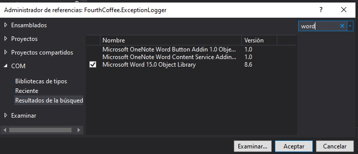
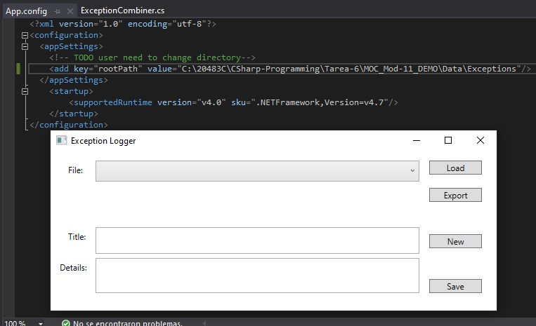
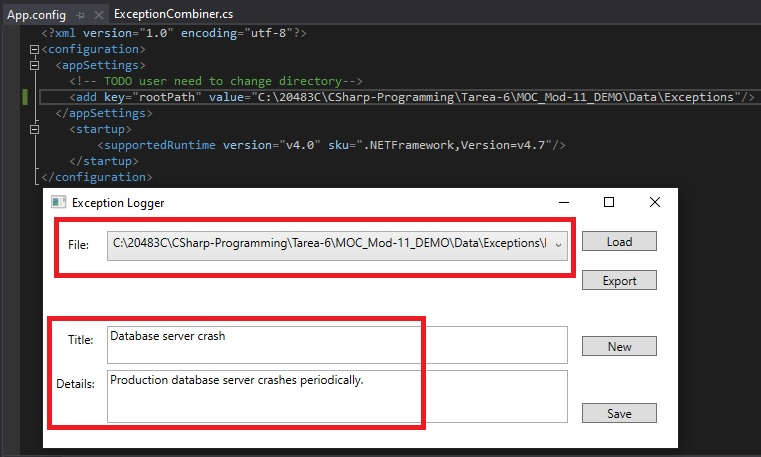
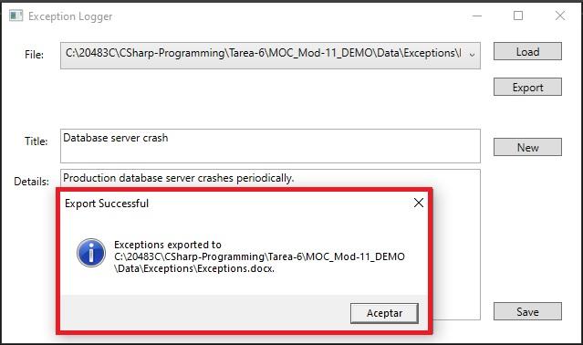
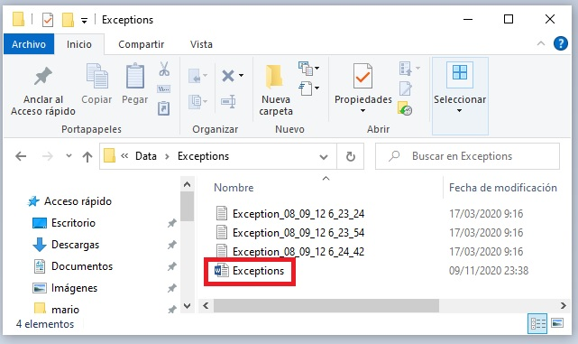
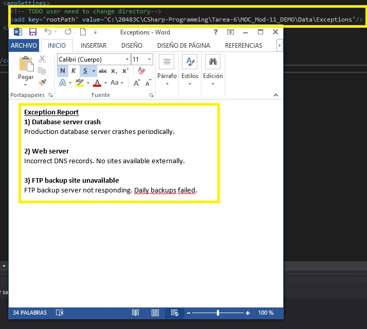
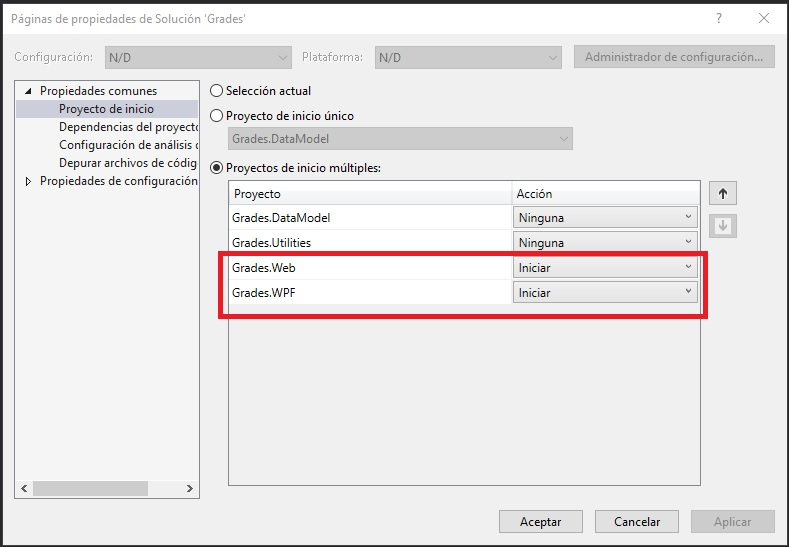

# Módulo 11: Integración con código no administrado


Fichero de Instrucciones: Instructions\20483C_MOD11_DEMO.md

Entregar el url de GitHub con la solución y un readme con las siguiente información:

1. **Nombres y apellidos:** José René Fuentes Cortez
2. **Fecha:** 24 de Octubre 2020.
3. **Resumen del Modulo 11:** Este módulo solo haremos la lección 1:
    -  En el primer ejercio nos ayuda a la creación y uso dinámico de objeto. Al mismo  tiempo practicamos interoperar con Microsoft Word.

4. **Dificultad o problemas presentados y como se resolvieron:** Ninguna.

**NOTA**: Si no hay descripcion de problemas o dificultades, y al yo descargar el código para realizar la comprobacion y el código no funcionar, el resultado de la califaciación del laboratorio será afectado.

---


## Lección 1: Creación y uso de objetos dinámicos

### Demostración: Interoperación con Microsoft Word

#### Pasos de preparación

1. Asegúrese de haber clonado el directorio 20483C de GitHub. Contiene los segmentos de código para los laboratorios y demostraciones de este curso. (**https: //github.com/MicrosoftLearning/20483-Programming-in-C-Sharp/tree/master/Allfiles**)
2. Vaya a **[Repository Root]\Allfiles\Mod11\Democode\Starter\FourthCoffee.ExceptionLogger** y luego abra el archivo **FourthCoffee.ExceptionLogger.sln**.
    > **Nota:** Si aparece algún cuadro de diálogo de advertencia de seguridad, desactive la casilla de verificación **Preguntarme por cada proyecto en esta solución** y luego haga clic en **Aceptar**.

#### Pasos de demostración

1. En **Explorador de soluciones**, haga clic con el botón derecho en el proyecto **FourthCoffee.ExceptionLogger**, luego haga clic en **Agregar** y luego haga clic en **Referencia**.
2. En el cuadro de diálogo** Administrador de referencias - FourthCoffee.ExceptionLogger**, realice los siguientes pasos y luego haga clic en **Aceptar**:
    - Expanda **COM** y luego haga clic en **Bibliotecas de tipos**.
    - En el cuadro de texto **Buscar**, escriba **Palabra**.
    - En la lista de ensamblado, seleccione **Biblioteca de objetos de Microsoft Word [Número de versión]**, y luego seleccione la casilla de verificación **Biblioteca de objetos de Microsoft Word [Número de versión]**.
    > **Nota:** [Número de versión] puede ser mayor que 14.

- La representación visual a la respuesta del último ejercicio se muestra en la siguiente imagen:

 

3. En Visual Studio, en el menú **Ver**, haga clic en **Lista de tareas**.
4. En la ventana **Lista de tareas**, haga doble clic en la tarea **TODO: 01: Traer el espacio de nombres Microsoft.Office.Interop.Word al alcance.**.
5. En el editor de código, haga clic en la línea en blanco debajo del comentario y luego escriba el siguiente código:
    ```cs
    using Microsoft.Office.Interop.Word;
    ```
6. Haga doble clic en la tarea **TODO: 02: Declare a global object to encapsulate Microsoft Word**.
7. En el editor de código, haga clic en la línea en blanco debajo del comentario y luego escriba el siguiente código:
    ```cs
    dynamic _word;
    ```
8. Haga doble clic en la tarea **TODO: 03: Crear una instancia del objeto _word**.
9. En el editor de código, haga clic en la línea en blanco debajo del comentario y luego escriba el siguiente código:
    ```cs
    this._word = new Application();
    ```
10. Haga doble clic en la tarea **TODO: 04: Create a blank Word document**.
11. En el editor de código, haga clic en la línea en blanco debajo del comentario y luego escriba el siguiente código:
    ```cs
    this._word.Documents.Add().Activate();
    ```
12. En el editor de código, observe los siguientes métodos auxiliares que envuelven la API COM de Word:
    - El método **GetEndOfDocument** coloca el cursor al final del documento. **- 1** convierte la propiedad **End** en un valor de índice basado en 0. Sin **- 1**, CLR lanzará una excepción **IndexOutOfRange**.
    - El método **AppendText** agrega texto al final del documento, en negrita y / o cursiva.
    - El método **InsertCarriageReturn** inserta un retorno de carro al final del documento.
    - El método **Guardar** elimina cualquier archivo con el mismo nombre y luego guarda el documento de Word actual.
13. Haga doble clic en el archivo **App.config** dentro del proyecto **FourthCoffee.ExceptionLogger** y cambie **[Repository Root]** a su destino de repositorio.
14. En el menú **Crear**, haga clic en **Crear solución**.
15. En el menú **Depurar**, haga clic en **Iniciar sin depurar**.

- La representación visual a la respuesta del último ejercicio se muestra en la siguiente imagen:

 

16. En la aplicación **Exception Logger**, haga clic en **Exportar**.

- La representación visual a la respuesta del último ejercicio se muestra en la siguiente imagen:

 

17. En el cuadro de diálogo **Exportación satisfactoria**, haga clic en **Aceptar**.

- La representación visual a la respuesta del último ejercicio se muestra en la siguiente imagen:

 

18. Cierre la aplicación **Exception Logger**.
19. Abra el Explorador de archivos y busque la carpeta **[Repository Root]\Allfiles\Mod11\Democode\Data\Exceptions**.

- La representación visual a la respuesta del último ejercicio se muestra en la siguiente imagen:

 

20. Haga doble clic en **Exceptions.docx** y luego vea el informe de excepciones combinado en el documento de Word.

- La representación visual a la respuesta del último ejercicio se muestra en la siguiente imagen:

 

21. Cierre Microsoft Word.
22. Cierre el Explorador de archivos.
23. Cierre Visual Studio.

## Lección 2: Administrar la vida útil de los objetos y controlar los recursos no administrados

### Demostración: Actualización del laboratorio de informes de calificaciones

#### Pasos de preparación

1. Asegúrese de haber clonado el directorio 20483C de GitHub. Contiene los segmentos de código para los laboratorios y demostraciones de este curso. (**https://github.comMicrosoftLearning/20483-Programming-in-C-Sharp/tree/master/Allfiles**)
2. Inicializar la base de datos:
    - En la **lista de aplicaciones**, haga clic en **Explorador de archivos**.
    - En **Explorador de archivos**, navegue hasta la carpeta **[Repository Root]\Allfiles\Mod11\Labfiles\Databases** y luego haga doble clic en **SetupSchoolGradesDB.cmd**.
        > **Nota:** Si aparece un cuadro de diálogo de Windows protegió su PC, haga clic en Más información y luego en Ejecutar de todos modos.
    - Cierre **Explorador de archivos**.

#### Pasos de demostración

1. Abra la solución **Grades.sln** de la carpeta **[Repository Root]\Allfiles\ Mod11\Labfiles\Solution\Exercise 2**.
    > **Nota:** Si aparece algún cuadro de diálogo de advertencia de seguridad, desactive la casilla de verificación **Preguntarme por cada proyecto en esta solución** y luego haga clic en **Aceptar**.
2. En **Explorador de soluciones**, haga clic con el botón derecho en **"Calificaciones" de la solución**, y a continuación, haga clic en **Propiedades**.
3. En la página **Proyecto de inicio**, haga clic en **Varios proyectos de inicio**. Establezca **Grades.Web** y **Grades.WPF** en **Inicio** y luego haga clic en **Aceptar**.

- La representación visual a la respuesta del último ejercicio se muestra en la siguiente imagen:

 

4. Construya la solución.
5. En el proyecto **Grades.Utilities**, abra **WordWrapper.cs**.
6. Revise el código en esta clase y explique a los estudiantes que en el Ejercicio 1, escribirán parte del código para iniciar Word y crear y guardar un documento.
7. Revise la definición de la clase y la implementación del patrón de disposición y explique a los estudiantes que en el Ejercicio 2, escribirán este código para controlar la vida útil del objeto **Word**.
8. En el proyecto **Grades.WPF**, en la carpeta **Vistas**, expanda **StudentProfile.xaml** y luego abra **StudentProfile.xaml.cs**, y luego busque **GenerateStudentReport** método.
9. Revise el código en este método y explique a los estudiantes que en el Ejercicio 1, escribirán este código para usar la clase **WordWrapper** para generar los informes de calificaciones y luego, en el Ejercicio 2, actualizarán el código para asegurarse que la clase **WordWrapper** está dispuesta correctamente.
10. Abra **Administrador de tareas**.
11. En la ventana **Administrador de tareas**, haga clic en **Más detalles**.
12. Ejecute la aplicación e inicie sesión como **vallee** con la contraseña **Password99**.
13. Genere un informe de calificaciones para **Kevin Liu**. Cuando haga clic en **guardar informe**, en la ventana **Administrador de tareas**, verifique que aparezca **Microsoft Word** y luego desaparezca del grupo **Procesos**.
14. Cierre la aplicación y luego cierre **Administrador de tareas**.
15. Abra el informe de calificaciones de Kevin Liu en Word, revise el informe y luego cierre Word.
16. Cierre Visual Studio.

© 2018 Microsoft Corporation. Todos los derechos reservados.

El texto de este documento está disponible bajo la [Licencia Creative Commons Attribution 3.0] (https://creativecommons.org/licenses/by/3.0/legalcode), se pueden aplicar términos adicionales. Todo el resto del contenido de este documento (incluidas, entre otras, marcas comerciales, logotipos, imágenes, etc.) **no** está incluido en la concesión de la licencia Creative Commons. Este documento no le proporciona ningún derecho legal sobre la propiedad intelectual de ningún producto de Microsoft. Puede copiar y utilizar este documento para fines internos de referencia.

Este documento se proporciona "tal cual". La información y las opiniones expresadas en este documento, incluidas las URL y otras referencias a sitios web de Internet, pueden cambiar sin previo aviso. Usted asume el riesgo de utilizarlo. Algunos ejemplos son solo ilustrativos y son ficticios. No se pretende ni se infiere ninguna asociación real. Microsoft no ofrece ninguna garantía, expresa o implícita, con respecto a la información proporcionada aquí.