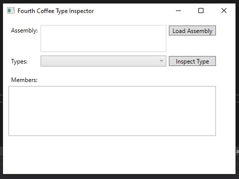

# Módulo 12: Creación de tipos y ensamblajes reutilizables


Fichero de Instrucciones: Instructions\20483C_MOD012_DEMO.md

Entregar el url de GitHub con la solución y un readme con las siguiente información:

1. **Nombres y apellidos:** José René Fuentes Cortez
2. **Fecha:** 24 de Octubre 2020.
3. **Resumen del Modulo 12:** Este módulo consta de cuatro lecciones de la cuales haremos tres la 1, 2 y 4:
    - La primera lección nos ayuda a examinar los metadatos de los objetos y a inspeccionar ensamblados.
    - En la segunda lección creamos y usamos atributos personalizados, usando Reflection para el consumo de los mismos.
    - En el ejercicio 4 hacemos que la aplicación pueda hacer Versioning, Signing y implementar Assemblies en el GAC.

4. **Dificultad o problemas presentados y como se resolvieron:** Ninguna.

**NOTA**: Si no hay descripcion de problemas o dificultades, y al yo descargar el código para realizar la comprobacion y el código no funcionar, el resultado de la califaciación del laboratorio será afectado.

---


## Lección 1: Examinar metadatos de objetos

### Demostración: Ensambles de inspección

#### Pasos de preparación

Asegúrese de haber clonado el directorio 20483C de GitHub. Contiene los segmentos de código para los laboratorios y demostraciones de este curso. (**https://github.com/MicrosoftLearning/20483-Programming-in-C-Sharp/tree/master/Allfiles**)

#### Pasos de demostración

1. Abra **Visual Studio 2019**.
2. En Visual Studio, en el menú **archivo**, seleccione **abrir** y luego haga clic en **Proyecto/Solución**.
3. En el cuadro de diálogo **abrir proyecto**, busque la carpeta **[Repository Root]\AllFiles\Mod12\Democode\Starter\FourthCoffee.TypeInspector**, haga clic en **FourthCoffee.TypeInspector.sln** y luego haga clic en **abrir**.
    > **Nota:** Si aparece algún cuadro de diálogo de advertencia de seguridad, desactive la casilla de verificación **Preguntarme por cada proyecto en esta solución** y luego haga clic en **aceptar**.
4. En Visual Studio, en el menú **Ver**, haga clic en **Lista de tareas**.
5. En la ventana **Lista de tareas**, haga doble clic en la tarea **TODO: 01: Traer el espacio de nombres System.Reflection al alcance**.
6. En el editor de código, haga clic en la línea en blanco debajo del comentario y luego escriba el siguiente código:
    ```cs
    using System.Reflection;
    ```
7. En la ventana **Lista de tareas**, haga doble clic en la tarea **TODO: 02: Crear un objeto de ensamblaje**.
8. En el editor de código, haga clic en la línea en blanco debajo del comentario y luego escriba el siguiente código:
    ```cs
    return Assembly.ReflectionOnlyLoadFrom(path);
    ```
9. En la ventana **Lista de tareas**, haga doble clic en la tarea **TODO: 03: Obtener todos los tipos del ensamblaje actual**.
10. En el editor de código, haga clic en la línea en blanco debajo del comentario y luego escriba el siguiente código:
    ```cs
    return assembly.GetTypes();
    ```
11. En la ventana **Lista de tareas**, haga doble clic en la tarea **TODO: 04: Obtener un tipo específico del ensamblaje actual**.
12. En el editor de código, haga clic en la línea en blanco debajo del comentario y luego escriba el siguiente código:
    ```cs
    return assembly.GetType(typeName);
    ```
13. En el editor de código, busque el método **RenderMethods** y luego revise el uso de las propiedades **IsPublic**, **IsStatic**, **ReturnType** y **Name** de la Clase **MethodInfo**.
14. Busque el método **RenderProperties** y luego revise el uso de las propiedades **DeclaringType** y **Name** de la clase **PropertyInfo**.
15. En el menú **Crear**, haga clic en **Crear solución**.
16. En el menú **Depurar**, haga clic en **Iniciar sin depurar**.

- La representación visual a la respuesta del último ejercicio se muestra en la siguiente imagen:

 

17. En la aplicación **Fourth Coffee Type Inspector**, haga clic en **Load Assembly**.

- La representación visual a la respuesta del último ejercicio se muestra en la siguiente imagen:

 

18. En el cuadro de diálogo **abrir**, busque la carpeta **[Raíz del repositorio]\AllFiles\Mod12\Democode\Starter\FourthCoffee.TypeInspector\FourthCoffee.Core\bin\Debug**, haga clic en **FourthCoffee.Core.dll** y luego haga clic en **abrir**.

- La representación visual a la respuesta del último ejercicio se muestra en la siguiente imagen:

 

La lista **Tipos** ahora contiene una lista de todos los tipos que expone el ensamblaje.

19. En la lista **Tipos**, haga clic en **FourthCoffee.Core.Encryptor** y luego haga clic en **Inspeccionar tipo**. 

 

La lista **Miembros** ahora muestra todos los métodos que expone el tipo.

- La representación visual a la respuesta del último ejercicio se muestra en la siguiente imagen:

 

20. Cierre **Cuarto Inspector de Tipo de Café**.
21. En Visual Studio, cierre la solución.

## Lección 2: Creación y uso de atributos personalizados

### Demostración: Consumir atributos personalizados mediante la reflexión

#### Pasos de preparación

Asegúrese de haber clonado el directorio 20483C de GitHub. Contiene los segmentos de código para los laboratorios y demostraciones de este curso. (**https: //github.com/MicrosoftLearning/20483-Programming-in-C-Sharp/tree/master/Allfiles**)

#### Pasos de demostración

1. Abra **Visual Studio 2019**.
2. En Visual Studio, en el menú **archivo**, seleccione **abrir** y luego haga clic en **Proyecto / Solución**.
3. En el cuadro de diálogo **abrir proyecto**, vaya a la carpeta **[Repository Root]\AllFiles\Mod12\Democode\Starter\FourthCoffee.MetadataExtractor**, haga clic en **FourthCoffee.MetadataExtractor.sln** y luego haga clic en **abrir**.
    > **Nota:** Si aparece algún cuadro de diálogo de advertencia de seguridad, desactive la casilla de verificación **Preguntarme por cada proyecto en esta solución** y luego haga clic en **aceptar**.
4. En Visual Studio, en el menú **Ver**, haga clic en **Lista de tareas**.
5. En la ventana **Lista de tareas**, haga doble clic en la tarea **TODO: 01: Invocar el método Type.GetCustomAttribute**.
6. En el editor de código, haga clic en la línea en blanco debajo del comentario y luego escriba el siguiente código:
    ```cs
    var typeAttribute = type.GetCustomAttribute<DeveloperInfo>(false);
    ```
7. En la ventana **Lista de tareas**, haga doble clic en la tarea **TODO: 02: Invocar el método MemberInfo.GetCustomAttribute**.
8. En el editor de código, haga clic en la línea en blanco debajo del comentario y luego escriba el siguiente código:
    ```cs
    var memberAttribute = member.GetCustomAttribute<DeveloperInfo>(false);
    ```
9. En el menú **Crear**, haga clic en **Crear solución**.
10. En el menú **Depurar**, haga clic en **Iniciar sin depurar**.
11. En la aplicación **Fourth Coffee Metadata Extractor**, haga clic en **Load**. 

- La representación visual a la respuesta del último ejercicio se muestra en la siguiente imagen:

 

El cuadro de lista ahora contiene una lista de todos los miembros en el tipo **Encryptor** y los detalles de cualquier atributo **DeveloperInfo **que se encontró.

- La representación visual a la respuesta del último ejercicio se muestra en la siguiente imagen:

 

12. Cerrar **Cuarto Extractor de Metadatos de Café**.
13. En Visual Studio, cierre la solución.

## Lección 4: Control de versiones, firma e implementación de ensamblados

### Demostración: Firmar e instalar un ensamblado en el GAC

#### Pasos de preparación

Asegúrese de haber clonado el directorio 20483C de GitHub. Contiene los segmentos de código para los laboratorios y demostraciones de este curso. (**https://github.com/MicrosoftLearning/20483-Programming-in-C-Sharp/tree/master/Allfiles**)

#### Pasos de demostración

1. Abra **Visual Studio 2019**.
2. En Visual Studio, en el menú **archivo**, seleccione **abrir** y luego haga clic en **Proyecto / Solución**.
3. En el cuadro de diálogo **abrir proyecto**, busque la carpeta **[Repository Root]\AllFiles\Mod12\Democode\Starter\FourthCoffee.Core**, haga clic en **FourthCoffee.Core.sln**, y luego haga clic en **abrir**.
    > **Nota:** Si aparece algún cuadro de diálogo de advertencia de seguridad, desactive la casilla de verificación **Preguntarme por cada proyecto en esta solución** y luego haga clic en **aceptar**.
4. Abra **Menú de Windows** y escriba **Símbolo del sistema para desarrolladores para VS 2017**, haga clic derecho en la aplicación
    luego seleccione **Ejecutar como administrador**.

- La representación visual a la respuesta del último ejercicio se muestra en la siguiente imagen:

 
    
5. Pegue el siguiente comando y luego presione **Enter**:
    ```cs
    cd [Repository Root]\AllFiles\Mod12\Democode\Starter\FourthCoffee.Core\FourthCoffee.Core
    ```
6. Pegue el siguiente comando y luego presione **Enter**:
    ```cs
    generateKeyFile.cmd
    ```
- La representación visual a la respuesta del último ejercicio se muestra en la siguiente imagen:

 

7. Cambie a Visual Studio 2019.
8. En **Explorador de soluciones**, haga clic con el botón derecho en **FourthCoffee.Core** y, a continuación, haga clic en **Propiedades**.
9. En la pestaña **Firma**, seleccione **Firmar el ensamblaje**.
10. En la lista **Elija un archivo de clave de nombre seguro**, haga clic en **Examinar**.

- La representación visual a la respuesta del último ejercicio se muestra en la siguiente imagen:

 

11. En el cuadro de diálogo **Seleccionar archivo**, haga clic en **FourthCoffeeKeyFile.snk** y luego haga clic en **abrir**.
12. En el menú **Crear**, haga clic en **Crear solución**.

- La representación visual a la respuesta del último ejercicio se muestra en la siguiente imagen:

 

13. Cambie al Explorador de archivos.
14. En la carpeta **[Repository Root]\AllFiles\Mod12\Democode\Starter\FourthCoffee.Core\FourthCoffee.Core**, haga clic con el botón derecho en el archivo **installAssemblyInGac.cmd** y luego haga clic en **Editar**.
    > **Nota:** Si aparece un cuadro de diálogo de Windows protegió su PC, haga clic en **Más información** y luego haga clic en **Ejecutar de todos modos**.
15. En el Bloc de notas, vea el comando **Gacutil**.

- La representación visual a la respuesta del último ejercicio se muestra en la siguiente imagen:

 

16. Cierre el Bloc de notas y luego cierre el Explorador de archivos.
17. Vuelva a **Símbolo del sistema para desarrolladores para VS 2017** y luego ejecute el comando **installAssemblyInGac**. Verifique que el comando se complete correctamente.
18. Ejecute el comando **verifyGacInstall** y luego asegúrese de que el número de elementos encontrados sea igual a uno.

- La representación visual a la respuesta del último ejercicio se muestra en la siguiente imagen:

 

19. Cierre la ventana **administrador: Símbolo del sistema para desarrolladores para VS 2017**.
20. En Visual Studio, cierre la solución.

### Demostración: especificar los datos para incluir en el laboratorio de informes de calificaciones

#### Pasos de preparación

Asegúrese de haber clonado el directorio 20483C de GitHub. Contiene los segmentos de código para los laboratorios y demostraciones de este curso. (**https://github.com/MicrosoftLearning/20483-Programming-in-C-Sharp/tree/master/Allfiles**)

#### Pasos de demostración

1. Abra la solución **Grades.sln** de la carpeta **[Repository Root]\AllFiles\Mod12\Labfiles\Solution\Exercise 2**.
    > **Nota:** Si aparece algún cuadro de diálogo de advertencia de seguridad, desactive la casilla de verificación **Preguntarme por cada proyecto en esta solución** y luego haga clic en **aceptar**.
2. En el proyecto **Grades.Utilities**, abra **IncludeInReport.cs**.
3. Localice la definición de la clase **IncludeInReportAttribute** y luego explique a los estudiantes que en el Ejercicio 1 harán de esta clase una clase de atributo y definirán sus miembros.
4. En el proyecto **Grades.WPF**, abra **Data.cs**.
5. Busque la clase **LocalGrade** y luego señale a los estudiantes los atributos **IncluirInforme **En **Nombre del sujeto**, **Fecha de evaluación**, **Evaluación** y **Comentarios *. * propiedades.
6. En el proyecto **Grades.Utilities**, abra **IncludeInReport.cs**.
7. Localice la estructura **FormatField** y luego explique a los estudiantes que en el Ejercicio 2 definirán esta estructura para especificar el formato que se aplicará a un elemento.
8. En la clase **IncludeProcessor**, busque el método **GetItemsToInclude**.
9. Explique a los estudiantes que agregarán código a este método para encontrar todos los campos públicos y propiedades en el objeto **dataForReport** y procesarán cada elemento que esté etiquetado con el atributo **IncludeInReport** para formatearlo correctamente e incluirlo en el informe.
10. En el proyecto **Grades.WPF**, en la carpeta **Vistas**, expanda **StudentProfile.xaml** y luego abra **StudentProfile.xaml.cs**.
11. Ubique el método **GenerateStudentReport** y luego explique a los estudiantes que agregan código a este método para usar la clase **IncludeProcessor** para determinar qué campos en el objeto **Grade** Están etiquetados con el **IncludeInReport**, formatéelos de forma adecuada e inclúyalos en el informe.
12. Explique a los estudiantes que usarán la herramienta **Strong Name** para generar un par de claves y firmar el ensamblaje de **Grades.Utilities** Con el par de claves y luego albergar el ensamblaje en el GAC.
13. Por último, generarán un informe y comprobarán que se incluyan las propiedades correctas en el informe y que el formato se aplique correctamente.
14. Cierre Visual Studio.

© 2018 Microsoft Corporation. Todos los derechos reservados.

El texto de este documento está disponible bajo la [Licencia Creative Commons Attribution 3.0] (https://creativecommons.org/licenses/by/3.0/legalcode), se pueden aplicar términos adicionales. Todo el resto del contenido de este documento (incluidas, entre otras, marcas comerciales, logotipos, imágenes, etc.) **no **Está incluido en la concesión de la licencia Creative Commons. Este documento no le proporciona ningún derecho legal sobre la propiedad intelectual de ningún producto de Microsoft. Puede copiar y utilizar este documento para fines internos de referencia.

Este documento se proporciona "tal cual". La información y las opiniones expresadas en este documento, incluidas las URL y otras referencias a sitios web de Internet, pueden cambiar sin previo aviso. Usted asume el riesgo de utilizarlo. Algunos ejemplos son solo ilustrativos y son ficticios. No se pretende ni se infiere ninguna asociación real. Microsoft no ofrece ninguna garantía, expresa o implícita, con respecto a la información proporcionada aquí.