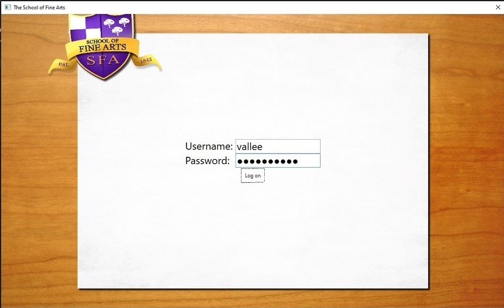
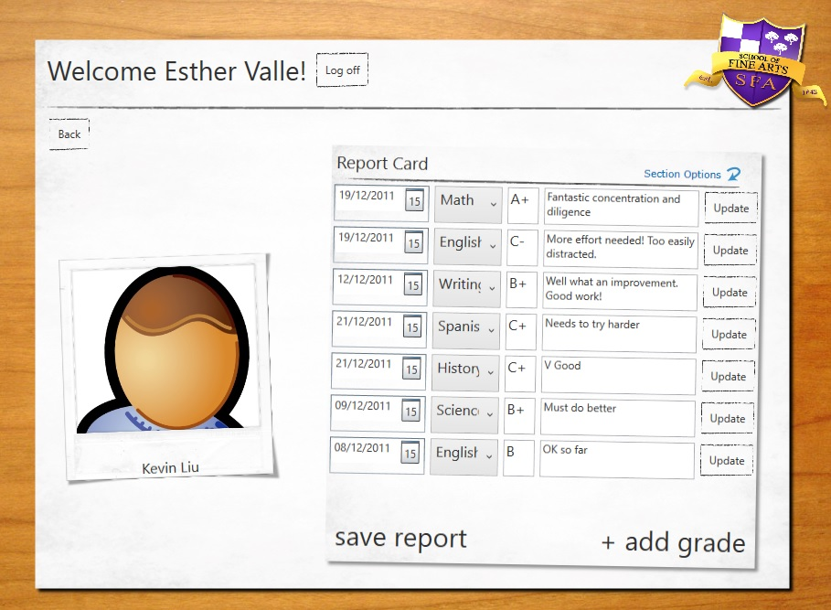
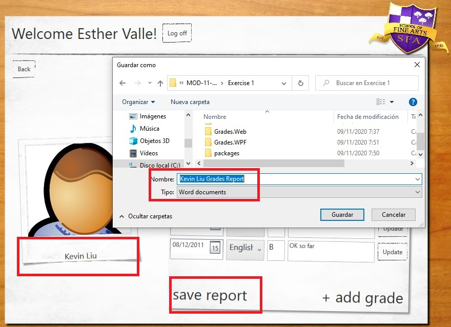
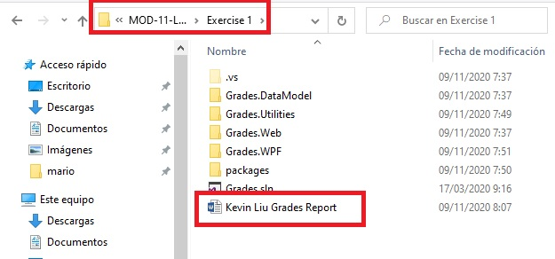

# Módulo 11: Integración con código no administrado

# Laboratorio: Actualización del informe de calificaciones


Tiempo estimado:** 60 minutos **

Fichero de Instrucciones: Instructions\20483C_MOD11_LAK.md

Entregar el url de GitHub con la solución y un readme con las siguiente información:

1. **Nombres y apellidos:** José René Fuentes Cortez
2. **Fecha:** 14 de Octubre 2020.
3. **Resumen del Modulo 11:** Este módulo consta de tres ejercicios:
    -  En el primer ejercio nos ayuda a actualizar la aplicación para generar informes de calificaciones en formato **docx**.
    - En el ejercicio 2 los datos del estudiante serán validados antes de ser guardados por la aplicación.
    - En el ejercicio 3 hacemos que la aplicación pueda manipular los datos modificados del estudiante para que se  guarden en la base de datos.


4. **Dificultad o problemas presentados y como se resolvieron:** Ninguna.

**NOTA**: Si no hay descripcion de problemas o dificultades, y al yo descargar el código para realizar la comprobacion y el código no funcionar, el resultado de la califaciación del laboratorio será afectado.

---

## Configuración del Lab


## Pasos de preparación

1. Asegúrese de haber clonado el directorio 20483C de GitHub. Contiene los segmentos de código para los laboratorios y demostraciones de este curso. (** https: //github.com/MicrosoftLearning/20483-Programming-in-C-Sharp/tree/master/Allfiles**)
2. Inicializar la base de datos:
    - En la lista **Aplicaciones**, haga clic en **Explorador de archivos**.
    - En **Explorador de archivos**, navegue hasta la carpeta **[Repository Root]\Allfiles\Mod11\Labfiles\Databases** y luego haga doble clic en **SetupSchoolGradesDB.cmd**.
        > **Nota:** Si aparece un cuadro de diálogo de Windows protegió su PC, haga clic en Más información y luego en Ejecutar de todos modos.
    - Cierre **Explorador de archivos**.

## Ejercicio 1: Generación del informe de calificaciones mediante Word

### Tarea 1: Examinar la clase WordWrapper que proporciona un contenedor funcional alrededor de la API dinámica (COM) para Word

1. Abra **Visual Studio 2019**.
2. En **Visual Studio**, en el menú **Archivo**, seleccione **Abrir** y luego haga clic en **Proyecto/Solución**.
3. En el cuadro de diálogo **Abrir proyecto**, vaya a **[Repository Root]\Allfiles\Mod11\Labfiles\Starter\Exercise 1**, haga clic en **Grades.sln** y luego haga clic en **Abrir**.
    > **Nota:** Si aparece algún cuadro de diálogo de advertencia de seguridad, desactive la casilla de verificación **Preguntarme por cada proyecto en esta solución** y luego haga clic en **Aceptar**.
4. En **Explorador de soluciones**, haga clic con el botón derecho en **Solución "Calificaciones" **y, a continuación, haga clic en **Propiedades**.
5. En el cuadro de diálogo **Páginas de propiedades de "Calificaciones" de Soluciones**, haga clic en **Varios proyectos de inicio**. Establezca **Grades.Web** y **Grades.WPF **en **Inicio** y luego haga clic en **Aceptar**.

- La representación visual a la respuesta del último ejercicio se muestra en la siguiente imagen:

 

6. En **Explorador de soluciones**, expanda **Grades.Utilities** y luego haga doble clic en **WordWrapper.cs**.
7. Examine el código que se encuentra actualmente dentro de esta clase.
8. En el menú **Ver**, haga clic en **Lista de tareas**.
9. En la ventana **Lista de tareas**, haga doble clic en la tarea **TODO: Exercise 1: Task 1a: Create a dynamic variable called _word for activating Word**.
10. En el editor de código, haga clic en la línea en blanco debajo del comentario y luego escriba el siguiente código:
    ```cs
     dynamic _word = null;
    ```
11. En la ventana **Lista de tareas**, haga doble clic en la tarea **TODO: Exercise 1: Task 1b: Instantiate _word as a new Word Application object**.
12. En el editor de código, haga clic en la línea en blanco debajo del comentario y luego escriba el siguiente código:
    ```cs
    this._word = new Application { Visible = false };
    ```
13. En la ventana **Lista de tareas**, haga doble clic en la tarea **TODO: Exercise 1: Task 1c: Create a new Word document**.
14. En el editor de código, haga clic en la línea en blanco debajo del comentario y luego escriba el siguiente código:
    ```cs
    var doc = this._word.Documents.Add();
    doc.Activate();
    ```
15. En la ventana **Lista de tareas**, haga doble clic en la tarea **TODO: Exercise 1: Task 1d: Save the document using the specified filename**.
16. En el editor de código, haga clic en la línea en blanco debajo del comentario y luego escriba el siguiente código:
    ```cs
    var currentDocument = this._word.ActiveDocument;
    currentDocument.SaveAs(filePath);
    ```
17. En la ventana **Lista de tareas**, haga doble clic en la tarea **TODO: Exercise 1: Task 1e: Close the document**.
18. En el editor de código, haga clic en la línea en blanco debajo del comentario y luego escriba el siguiente código:
    ```cs
    currentDocument.Close();
    ```

### Tarea 2: Revise el código en el método GeneratedStudentReport para generar un documento de Word

1. En la ventana **Lista de tareas**, haga doble clic en la tarea **TODO: Exercise 1: Task 2a: Generate a student grade report as a Word document**.
2. Examine el código que se encuentra en este método para generar el informe del estudiante.
3. En la ventana **Lista de tareas**, haga doble clic en **TODO: Exercise 1: Task 2b: Generate the report by using a separate task**.
4. En el editor de código, haga clic en la línea en blanco debajo del comentario y luego escriba el siguiente código:
    ```cs
    Task.Run(() => GenerateStudentReport(SessionContext.CurrentStudent, dialog.FileName));
    ```

### Tarea 3: compila y prueba la aplicación

1. En el menú **Crear**, haga clic en **Crear solución**.
2. En el menú **Depurar**, haga clic en **Iniciar sin depurar**.
3. Cuando se cargue la aplicación, en el cuadro de texto **Nombre de usuario**, escriba **vallee**, y en el cuadro de texto **Password**, escriba **password99** y luego haga clic en **Iniciar sesión**.

- La representación visual a la respuesta del último ejercicio se muestra en la siguiente imagen:

 

4. Haga clic en **Kevin Liu** y luego en **guardar informe**.

- La representación visual a la respuesta del último ejercicio se muestra en la siguiente imagen:

 

5. En el cuadro de diálogo **Guardar como**, vaya a **[Repository Root]\Allfiles\Mod11\Labfiles\Starter\Exercise 1**.
6. En el cuadro de texto **Nombre de archivo**, elimine el contenido existente, escriba **Informe de calificaciones de Kevin Liu** y luego haga clic en **Guardar**.

- La representación visual a la respuesta del último ejercicio se muestra en la siguiente imagen:

 

7. Cierre la aplicación y luego en **Visual Studio**, en el menú **Archivo**, haga clic en **Cerrar solución**.
8. Abra **Explorador de archivos**, busque la carpeta **[Raíz del repositorio]\Allfiles\Mod11\Labfiles\Starter\Exercise1** y luego verifique que se haya generado el informe.
9. Haga doble clic en **Kevin Liu Grades Report.docx**.
10. Revise el informe de calificaciones y luego cierre **Microsoft Word**.

- La representación visual a la respuesta del último ejercicio se muestra en la siguiente imagen:

 

> **Resultado:** Después de completar este ejercicio, la aplicación generará informes de calificaciones en formato **docx**.

## Ejercicio 2: Control de la vida útil de los objetos de Word mediante la implementación del patrón Dispose

### Tarea 1: Ejecute la aplicación para generar un informe de calificaciones y ver la tarea de Word en el Administrador de tareas

1. En **Visual Studio**, en el menú **Archivo**, seleccione **Abrir** y luego haga clic en **Proyecto/Solución**.
2. En el cuadro de diálogo **Abrir proyecto**, busque **[Repository Root]\Allfiles\Mod11\Labfiles\Starter\Exercise 2**, haga clic en **Grades.sln** y luego haga clic en **Abrir**.
    > **Nota:** Si aparece algún cuadro de diálogo de advertencia de seguridad, desactive la casilla de verificación **Preguntarme por cada proyecto en esta solución** y luego haga clic en **Aceptar**.
3. En **Explorador de soluciones**, haga clic con el botón derecho en **Solución "Calificaciones" **y, a continuación, haga clic en **Propiedades**.
4. En el cuadro de diálogo **Páginas de propiedades de Soluciones 'Calificaciones'**, haga clic en **Varios proyectos de inicio**, establezca **Grades.Web** y **Grades.WPF **en **Inicio** y luego haga clic en **Aceptar**.
5. En el menú **Crear**, haga clic en **Crear solución**.
6. En el menú **Depurar**, haga clic en **Iniciar sin depurar**.
7. Cuando se cargue la aplicación, en el cuadro de texto **Nombre de usuario**, escriba **vallee**, y en el cuadro de texto **Password**, escriba **password99** y luego haga clic en **Iniciar sesión * *.
8. Haga clic en **Kevin Liu** y luego en **guardar informe**.
9. En el cuadro de diálogo **Guardar como**, vaya a **[Raíz del repositorio]\Allfiles\Mod11\Labfiles\Starter\Exercise 2**.
10. En el cuadro de texto **Nombre de archivo**, elimine el contenido existente, escriba **Informe de calificaciones de Kevin Liu** y luego haga clic en **Guardar**.
11. Cierre la aplicación.
12. Abra **Explorador de archivos**, busque la carpeta **[Raíz del repositorio]\Allfiles\Mod11\Labfiles\Starter\Ejercicio 2** y luego verifique que se haya generado el informe.

### Tarea 2: Actualiza la clase WordWrapper para terminar Word correctamente

1. En **Visual Studio**, en la ventana **Lista de tareas**, haga doble clic en **TODO: Exercise 2: Task 2a: Specify that the WordWrapper class implements the IDisposable interface**.
2. En el editor de código, en la línea debajo del comentario, haga clic al final del código de **clase pública WordWrapper** y luego escriba el siguiente código:
    ```cs
    :IDisposable
    ```
3. En la ventana **Lista de tareas**, haga doble clic en la tarea **TODO: Exercise 2: Task 2b: Create the protected Dispose(bool) method**.
4. En el editor de código, haga clic en la línea en blanco debajo del comentario y luego escriba el siguiente código:
    ```cs
    protected virtual void Dispose(bool isDisposing)
    {
        if (!this.isDisposed)
        {
            if (isDisposing)
            {
                // Release managed resources here
                if (this._word != null)
                {
                    this._word.Quit();
                }
            }

            // Release unmanaged resources here
            if (this._word != null)
            {
                System.Runtime.InteropServices.Marshal.ReleaseComObject(this._word);
            }

            this.isDisposed = true;
        }
    }
    ```
5. En la ventana **Lista de tareas**, haga doble clic en la tarea **TODO: Exercise 2: Task 2c: Create the public Dispose method**.
6. En el editor de código, haga clic al final del comentario, presione Entrar y luego escriba el siguiente código:
    ```cs
    public void Dispose()
    {
        this.Dispose(true);
        GC.SuppressFinalize(this);
    }
    ```
7. En la ventana **Lista de tareas**, haga doble clic en **TODO: Exercise 2: Task 2d: Create a finalizer that calls the Dispose method**.
8. En el editor de código, haga clic en la línea en blanco debajo del comentario y luego escriba el siguiente código:
    ```cs
    private bool isDisposed = false;
    ```

### Tarea 3: Envuelve el objeto que genera el documento de Word en una declaración de uso

1. En la ventana **Lista de tareas**, haga doble clic en la tarea **TODO: Exercise 2: Task 3: Ensure that the WordWrapper is disposed when the method finishes**.
2. Debajo del comentario, modifique el código **WordWrapper wrapper = new WordWrapper ();** para que tenga el siguiente aspecto:
    ```cs
    using (var wrapper = new WordWrapper())
    {
    ```
3. Al final del método, después de la línea de código **wrapper.SaveAs (reportPath);**, agregue una llave de cierre para finalizar el bloque **using**.
4. Su código debe tener el siguiente aspecto:
    ```cs
    public void GenerateStudentReport(LocalStudent studentData, string reportPath)
    {
        // TODO: Exercise 2: Task 3: Ensure that the WordWrapper is disposed when the method finishes
        using (var wrapper = new WordWrapper())
        {
            // Create a new Word document in memory
            wrapper.CreateBlankDocument();

            // Add a heading to the document
            wrapper.AppendHeading(String.Format("Grade Report: {0} {1}", studentData.FirstName, studentData.LastName));
            wrapper.InsertCarriageReturn();
            wrapper.InsertCarriageReturn();

            // Output the details of each grade for the student
            foreach (var grade in SessionContext.CurrentGrades)
            {
                wrapper.AppendText(grade.SubjectName, true, true);
                wrapper.InsertCarriageReturn();
                wrapper.AppendText("Assessment: " + grade.Assessment, false, false);
                wrapper.InsertCarriageReturn();
                wrapper.AppendText("Date: " + grade.AssessmentDateString, false, false);
                wrapper.InsertCarriageReturn();
                wrapper.AppendText("Comment: " + grade.Comments, false, false);
                wrapper.InsertCarriageReturn();
                wrapper.InsertCarriageReturn();
            }

            // Save the Word document
            wrapper.SaveAs(reportPath);
        }
    }
    ```


### Tarea 4: Use el Administrador de tareas para observar que Word termina correctamente después de generar un informe

1. En el menú **Crear**, haga clic en **Crear solución**.
2. Haga clic con el botón derecho en la **barra de tareas** y luego haga clic en **Administrador de tareas**.
3. En **Visual Studio**, en el menú **Depurar**, haga clic en **Iniciar sin depurar**.
4. Cuando se cargue la aplicación, en el cuadro de texto **Nombre de usuario**, escriba **vallee**, y en el cuadro de texto **Password**, escriba **password99** y luego haga clic en **Iniciar sesión * *.
5. Haga clic en **Kevin Liu** y luego en **guardar informe**.
6. En el cuadro de diálogo **Guardar como**, busque **[Raíz del repositorio]\Mod11\Labfiles\Starter\Ejercicio 2**.
7. En el cuadro de texto **Nombre de archivo**, elimine el contenido existente y luego escriba **Informe de calificaciones de Kevin Liu**.
8. Al hacer clic en **Guardar**, en la ventana **Administrador de tareas**, observe los **Procesos** y verifique que **Microsoft Word **aparece y luego desaparece de la lista.
9. Cierre **Administrador de tareas** y luego cierre la aplicación.
10. En **Visual Studio**, en el menú **Archivo**, haga clic en **Cerrar solución**.

> **Resultado:** Después de completar este ejercicio, la aplicación terminará **Word **correctamente después de haber generado un informe de calificaciones.