# Módulo 13: Cifrado y descifrado de datos

# Laboratorio: Cifrado del informe de calificaciones

Tiempo estimado:** 60 minutos **

Fichero de Instrucciones: Instructions\20483C_MOD13_LAK.md

Entregar el url de GitHub con la solución y un readme con las siguiente información:

1. **Nombres y apellidos:** José René Fuentes Cortez
2. **Fecha:** 24 de Octubre 2020.
3. **Resumen del Modulo 13:** Este módulo consta de dos ejercicios:
    -  En el primer ejercio nos ayuda a actualizar la aplicación para actualizar las **Calificaciones** y cifrar los informes generados.
    - En el ejercicio 2 los datos cifrados del ejercicio anterior se decriptan para obtener los informenes en texto plano.


4. **Dificultad o problemas presentados y como se resolvieron:** Ninguna.

**NOTA**: Si no hay descripcion de problemas o dificultades, y al yo descargar el código para realizar la comprobacion y el código no funcionar, el resultado de la califaciación del laboratorio será afectado.

---

## Configuración del Lab


## Pasos de preparación
 
1. Asegúrese de haber clonado el directorio 20483C de GitHub. Contiene los segmentos de código para los laboratorios y demostraciones de este curso. https://github.com/MicrosoftLearning/20483-Programming-in-C-Sharp/tree/master/Allfiles.
2. Inicialice la base de datos.
   - En la lista **Aplicaciones**, haga clic en **Explorador de archivos**.
   - En **Explorador de archivos**, navegue hasta la carpeta **[Repository Root]\AllFiles\Mod13\Labfiles\Databases** y luego haga doble clic en **SetupSchoolGradesDB.cmd**.

- La representación visual a la respuesta del último ejercicio se muestra en la siguiente imagen:

 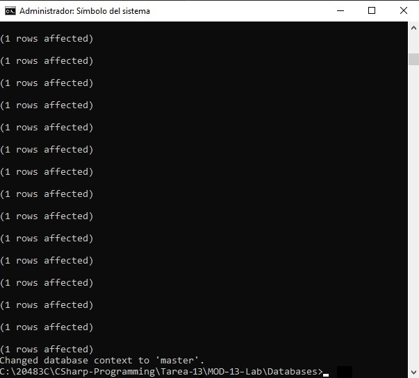
   
    > **NOTA:** Si aparece un cuadro de diálogo de Windows protegió su PC, haga clic en **Más información** y luego haga clic en **Ejecutar de todos modos**.
   - Cierre **Explorador de archivos**.

## Ejercicio 1: Cifrado del informe de calificaciones

### Tarea 1: Crear un certificado asimétrico

1. Abra **Visual Studio 2019**.
2. En **Visual Studio**, en el menú **Archivo**, seleccione **Abrir** y luego haga clic en **Proyecto/Solución**.
3. En el cuadro de diálogo **Abrir proyecto**, vaya a **[Repository Root]\AllFiles\Mod13\Labfiles\Starter\Exercise 1**, haga clic en **Grades.sln** y luego haga clic en **Abrir**.
   > **Nota:** Si aparece algún cuadro de diálogo de advertencia de seguridad, desactive la casilla de verificación **Preguntarme por cada proyecto en esta solución** y luego haga clic en **Aceptar**.
4. En **Explorador de soluciones**, haga clic con el botón derecho en Solución **"Calificaciones"** y, a continuación, haga clic en **Propiedades**.
5. En la página **Proyecto de inicio**, haga clic en **Varios proyectos de inicio**, configure **Grades.Web** y **Grades.WPF **en **Inicio** y luego haga clic en **Aceptar**.

- La representación visual a la respuesta del último ejercicio se muestra en la siguiente imagen:

 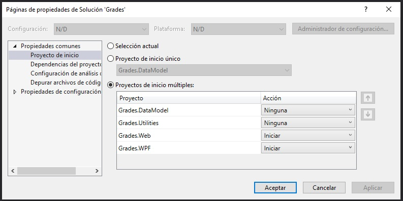

6. En **Explorador de soluciones**, expanda el nodo **Grades.Utilities** y luego haga doble clic en el archivo **CreateCertificate.cmd**.
7. Revise el contenido de este archivo.
8. Vaya a la lista **Aplicaciones**, haga clic en **Explorador de archivos**.
9. Busque **Símbolo del sistema para desarrolladores para VS 2017** y haga clic con el botón derecho en el icono **Símbolo del sistema para desarrolladores para VS 2017** y haga clic en **Ejecutar como administrador**.
10. En el cuadro de diálogo **Control de cuentas de usuario** y luego haga clic en **Sí**.
11. En la ventana **Símbolo del sistema**, escriba lo siguiente y luego presione Entrar.
    ```cs
    cd "[Repository Root]\AllFiles\Mod13\Labfiles\Starter\Exercise 1\Grades.Utilities"
    ```
12. En la ventana **Símbolo del sistema**, escriba lo siguiente y luego presione Entrar.
    ```cs
    CreateCertificate.cmd
    ```
13. Verifique que el comando devuelva un mensaje de éxito y luego cierre la ventana **Símbolo del sistema**.

- La representación visual a la respuesta del último ejercicio se muestra en la siguiente imagen:

 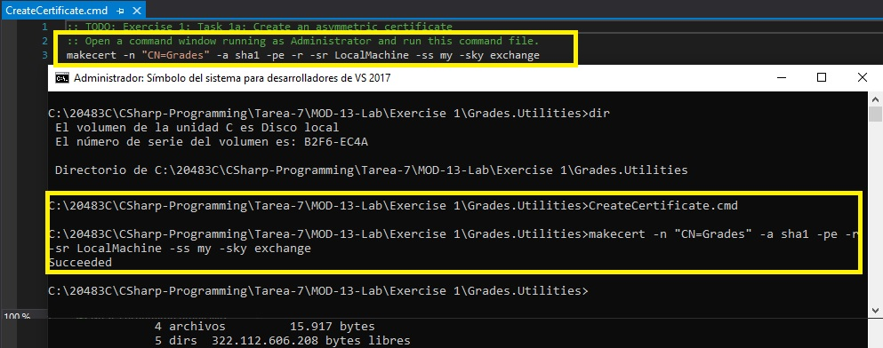

### Tarea 2: Recuperar el certificado de calificación

1. En **Visual Studio 2019**, en el menú **Ver**, haga clic en **Lista de tareas**.
2. En la ventana **Lista de tareas**, haga doble clic en **TODO: Exercise 1: Task 2a: Loop through the certificates in the X509 store to return the one matching _certificateSubjectName**.
3. En el editor de código, haga clic en la línea en blanco debajo del comentario y luego escriba el siguiente código:
    ```cs
    foreach (var cert in store.Certificates)
        if (cert.SubjectName.Name.Equals(this._certificateSubjectName, StringComparison.InvariantCultureIgnoreCase))
            return cert;
    ```

### Tarea 3: Cifrar los datos

1. En la ventana **Lista de tareas**, haga doble clic en **TODO: Exercise 1: Task 3a: Get the public key from the X509 certificate**.
2. En el editor de código, elimine la siguiente línea de código:
    ```cs
    throw new NotImplementedException();
    ```
3. En la línea en blanco debajo del comentario, escriba el siguiente código:
    ```cs
    var provider = (RSACryptoServiceProvider)this._certificate.PublicKey.Key;
    ```
4. En la ventana **Lista de tareas**, haga doble clic en **TODO: Exercise 1: Task 3b: Create an instance of the AesManaged algorithm**.
5. En el editor de código, haga clic en la línea en blanco debajo del comentario y luego escriba el siguiente código:
    ```cs
    using (var algorithm = new AesManaged())
    {
    ```
6. En la ventana **Lista de tareas**, haga doble clic en **TODO: Exercise 1: Task 3c: Create an underlying stream for the unencrypted data**.
7. En el editor de código, haga clic en la línea en blanco debajo del comentario y luego escriba el siguiente código:
    ```cs
    using (var outStream = new MemoryStream())
    {
    ```
8. En la ventana **Lista de tareas**, haga doble clic en **TODO: Exercise 1: Task 3d: Create an AES encryptor based on the key and IV**.
9. En el editor de código, haga clic en la línea en blanco debajo del comentario y luego escriba el siguiente código:
    ```cs
    using (var encryptor = algorithm.CreateEncryptor())
    {
      var keyFormatter = new RSAPKCS1KeyExchangeFormatter(provider);
      var encryptedKey = keyFormatter.CreateKeyExchange(algorithm.Key,  algorithm.GetType());
    ```
10. En la ventana **Lista de tareas**, haga doble clic en **TODO: Exercise 1: Task 3e: Create byte arrays to get the length of the encryption key and IV**.
11. En el editor de código, haga clic en la línea en blanco debajo del comentario y luego escriba el siguiente código:
    ```cs
    var keyLength = BitConverter.GetBytes(encryptedKey.Length);
    var ivLength = BitConverter.GetBytes(algorithm.IV.Length);
    ```
12. En la ventana **Lista de tareas**, haga doble clic en **TODO: Exercise 1: Task 3f: Write the following to the out stream**.
13. En el editor de código, haga clic en la línea en blanco debajo del bloque de comentarios y luego escriba el siguiente código:
    ```cs
    outStream.Write(keyLength, 0, keyLength.Length);
    outStream.Write(ivLength, 0, ivLength.Length);
    outStream.Write(encryptedKey, 0, encryptedKey.Length);
    outStream.Write(algorithm.IV, 0, algorithm.IV.Length);
    ```
14. En la ventana **Lista de tareas**, haga doble clic en **TODO: Exercise 1: Task 3g: Create a CryptoStream that will write the encrypted data to the underlying buffer**.
15. En el editor de código, haga clic en la línea en blanco debajo del comentario y luego escriba el siguiente código:
    ```cs
    using (var encrypt = new CryptoStream(outStream, encryptor,     CryptoStreamMode.Write))
    {
    ```
16. En la ventana **Lista de tareas**, haga doble clic en la tarea **TODO: Exercise 1: Task 3h: Write all the data to the stream**.
17. En el editor de código, haga clic en la línea en blanco debajo del comentario y luego escriba el siguiente código:
    ```cs
    encrypt.Write(bytesToEncrypt, 0, bytesToEncrypt.Length);
    encrypt.FlushFinalBlock();
    ```
18. En la ventana **Lista de tareas**, haga doble clic en la tarea **TODO: Exercise 1: Task 3i: Return the encrypted buffered data as a byte[].**.
19. En el editor de código, haga clic en la línea en blanco debajo del comentario y luego escriba el siguiente código:
    ```cs
                    return outStream.ToArray();
                }
            }
        }
    }
    ```

### Tarea 4: Escribe los datos cifrados en el disco

1. En la ventana **Lista de tareas**, haga doble clic en la tarea **TODO: Exercise 1: Task 4a: Write the encrypted bytes to disk**.
2. En el editor de código, haga clic en la línea en blanco debajo del comentario y luego escriba el siguiente código:
    ```cs
    File.WriteAllBytes(filePath, encryptedBytes);
    ```

### Tarea 5: compila y prueba la aplicación

1. En el menú **Crear**, haga clic en **Crear solución**.
2. En el menú **Depurar**, haga clic en **Iniciar sin depurar**.
3. Cuando se cargue la aplicación, en el cuadro de texto **Nombre de usuario**, escriba **vallee**, y en el cuadro de texto **Password**, escriba **password99** y luego haga clic en **Iniciar sesión**.

- La representación visual a la respuesta del último ejercicio se muestra en la siguiente imagen:

 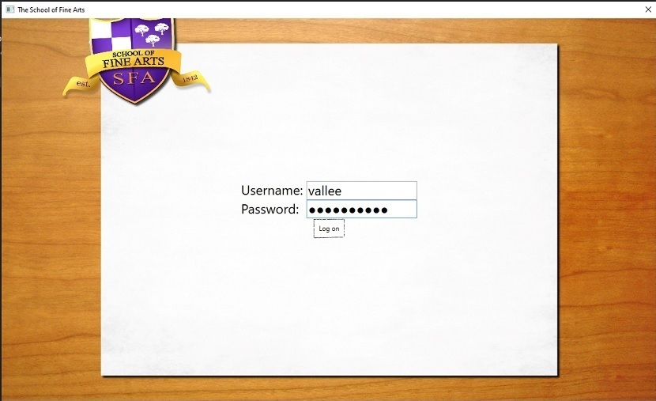

4. En la vista **Class 3C**, haga clic en **George Li**.
5. En la vista **Boleta de calificaciones**, haga clic en **guardar informe**.

- La representación visual a la respuesta del último ejercicio se muestra en la siguiente imagen:

 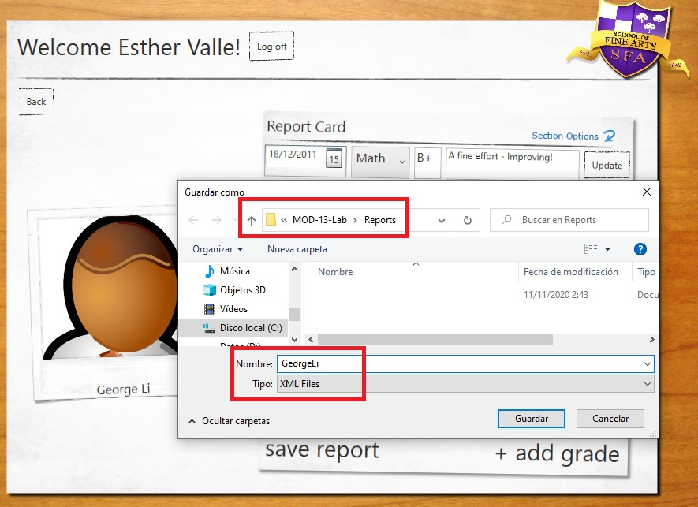

6. En el cuadro de diálogo **Guardar como**, busque la carpeta **[Repository Root]\AllFiles\Mod13\Labfiles\Reports**, en el cuadro de texto **Nombre de archivo**, escriba **GeorgeLi * * y luego haga clic en **Guardar**.

- La representación visual a la respuesta del último ejercicio se muestra en la siguiente imagen:

 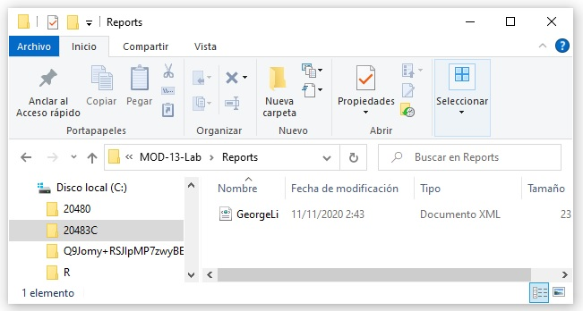

7. En la vista **Boleta de calificaciones**, haga clic en **Atrás**.
8. En la vista **Clase 3C**, haga clic en **Kevin Liu**.
9. En la vista **Boleta de calificaciones**, haga clic en **guardar informe**.

- La representación visual a la respuesta del último ejercicio se muestra en la siguiente imagen:

 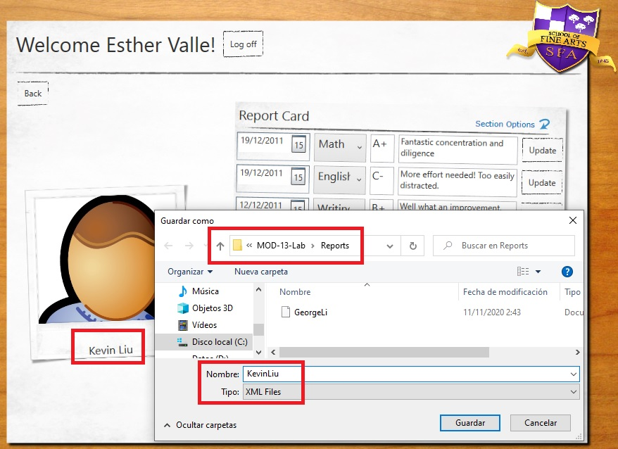

10. En el cuadro de diálogo **Guardar como**, busque la carpeta **[Repository Root]\AllFiles\Mod13\Labfiles\Reports**, en el cuadro de texto **Nombre de archivo**, escriba **KevinLiu * * y luego haga clic en **Guardar**.

- La representación visual a la respuesta del último ejercicio se muestra en la siguiente imagen:

 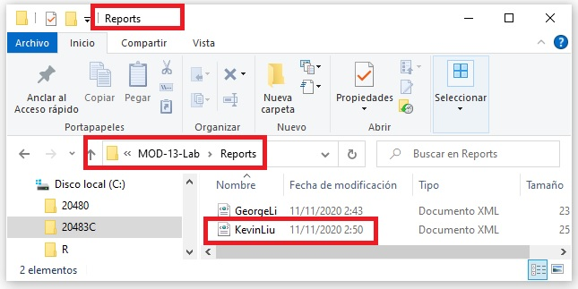

11. En la vista **Boleta de calificaciones**, haga clic en **Cerrar sesión** y luego cierre la aplicación.
12. En el menú **Archivo**, haga clic en **Cerrar solución**.
13. Abra **Microsoft Edge**, y en la barra de direcciones, escriba **[Repository Root]\AllFiles\Mod13\Labfiles\Reports\KevinLiu.xml**, y luego presione Enter.

- La representación visual a la respuesta del último ejercicio se muestra en la siguiente imagen:

 

14. Tenga en cuenta que la página está en blanco porque el archivo está cifrado y luego cierre **Microsoft Edge**.
15. Abra **Explorador de archivos** y luego busque la carpeta **[Repository Root]\AllFiles\Mod13\Labfiles\Reports**.

- La representación visual a la respuesta del último ejercicio se muestra en la siguiente imagen:

 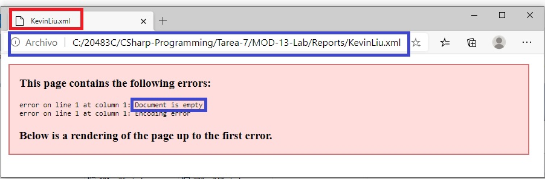
ç
16. Haga clic con el botón derecho en **KevinLiu.xml** y luego haga clic en **Editar**.
17. Revise los datos cifrados, cierre **Bloc de notas** y luego cierre **Explorador de archivos**.

- La representación visual a la respuesta del último ejercicio se muestra en la siguiente imagen:

 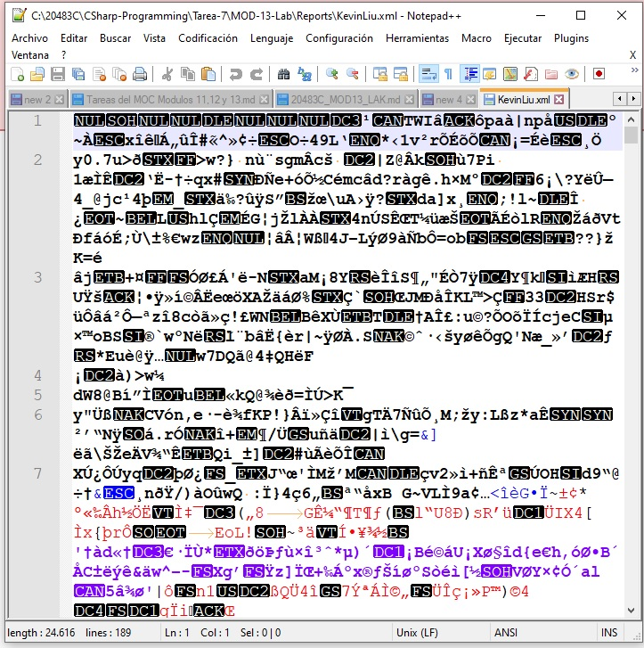


> **Resultado:** Después de completar este ejercicio, debería haber actualizado la aplicación **Calificaciones** para cifrar los informes generados.

## Ejercicio 2: Descifrado del informe de calificaciones

### Tarea 1: Descifrar los datos

1. En **Visual Studio**, en el menú **Archivo**, seleccione **Abrir** y luego haga clic en **Proyecto/Solución**.
2. En el cuadro de diálogo **Abrir proyecto**, vaya a **[Repository Root]\AllFiles\Mod13\Labfiles\Starter\Exercise 2**, haga clic en **School-Reports.sln** y luego haga clic en * *Abierto**.
    > **Nota:** Si aparece algún cuadro de diálogo de advertencia de seguridad, desactive la casilla de verificación **Preguntarme por cada proyecto en esta solución** y luego haga clic en **Aceptar**.
3. En la ventana **Lista de tareas**, haga doble clic en **TODO: Exercise 2: Task 1a: Get the private key from the X509 certificate**.
4. En el editor de código, elimine la siguiente línea de código:
    ```cs
    throw new NotImplementedException();
    ```
5. En la línea en blanco debajo del comentario, escriba el siguiente código:
    ```cs
    var provider = (RSACryptoServiceProvider)this._certificate.PrivateKey;
    ```
6. En la ventana **Lista de tareas**, haga doble clic en la tarea **TODO: Exercise 2: Task 1b: Create an instance of the AESManaged algorithm which the data is encrypted with**.
7. En la línea en blanco debajo del comentario, escriba el siguiente código:
    ```cs
    using (var algorithm = new AesManaged())
    {
    ```
8. En la ventana **Lista de tareas**, haga doble clic en la tarea **TODO: Exercise 2: Task 1c: Create a stream to process the bytes**.
9. En la línea en blanco debajo del comentario, escriba el siguiente código:
    ```cs
    using (var inStream = new MemoryStream(bytesToDecrypt))
    {
    ```
10. En la ventana **Lista de tareas**, haga doble clic en **TODO: Exercise 2: Task 1d: Create byte arrays to get the length of the encryption key and IV**.
11. En la línea en blanco debajo del comentario, escriba el siguiente código:
    ```cs
    var keyLength = new byte[4];
    var ivLength = new byte[4];
    ```
12. En la ventana **Lista de tareas**, haga doble clic en **TODO: Exercise 2: Task 1e: Read the key and IV lengths starting from index 0 in the in stream**.
13. En la línea en blanco debajo del comentario, escriba el siguiente código:
    ```cs
    inStream.Seek(0, SeekOrigin.Begin);
    inStream.Read(keyLength, 0, keyLength.Length);
    inStream.Read(ivLength, 0, ivLength.Length);
    ```
14. En la ventana **Lista de tareas**, haga doble clic en la tarea **TODO: Exercise 2: Task 1f: Convert the lengths to ints for later use**.
15. En la línea en blanco debajo del comentario, escriba el siguiente código:
    ```cs
    var convertedKeyLength = BitConverter.ToInt32(keyLength, 0);
    var convertedIvLength = BitConverter.ToInt32(ivLength, 0);
    ```
16. En la ventana **Lista de tareas**, haga doble clic en la tarea **TODO: Exercise 2: Task 1g: Determine the starting position and length of data**.
17. En la línea en blanco debajo del comentario, escriba el siguiente código:
    ```cs
    var dataStartPos = convertedKeyLength + convertedIvLength + keyLength.Length +  ivLength.Length;
    var dataLength = (int)inStream.Length - dataStartPos;
    ```
18. En la ventana **Lista de tareas**, haga doble clic en la tarea **TODO: Exercise 2: Task 1h: Create the byte arrays for the encrypted key, the IV, and the encrypted data.**.
19. En la línea en blanco debajo del comentario, escriba el siguiente código:
    ```cs
    var encryptionKey = new byte[convertedKeyLength];
    var iv = new byte[convertedIvLength];
    var encryptedData = new byte[dataLength];
    ```
20. En la ventana **Lista de tareas**, haga doble clic en **TODO: Exercise 2: Task 1i: Read the key, IV, and encrypted data from the in stream**.
21. En la línea en blanco debajo del comentario, escriba el siguiente código:
    ```cs
    inStream.Read(encryptionKey, 0, convertedKeyLength);
    inStream.Read(iv, 0, convertedIvLength);
    inStream.Read(encryptedData, 0, dataLength);
    ```
22. En la ventana **Lista de tareas**, haga doble clic en **TODO: Exercise 2: Task 1j: Decrypt the encrypted AesManaged encryption key**.
23. En la línea en blanco debajo del comentario, escriba el siguiente código:
    ```cs
    var decryptedKey = provider.Decrypt(encryptionKey, false);
    ```
24. En la ventana **Lista de tareas**, haga doble clic en **TODO: Exercise 2: Task 1k: Create an underlying stream for the decrypted data**.
25. En la línea en blanco debajo del comentario, escriba el siguiente código:
    ```cs
    using (var outStream = new MemoryStream())
    {
    ```
26. En la ventana **Lista de tareas**, haga doble clic en **TODO: Exercise 2: Task 1l: Create an AES decryptor based on the key and IV**.
27. En la línea en blanco debajo del comentario, escriba el siguiente código:
    ```cs
    using (var decryptor = algorithm.CreateDecryptor(decryptedKey, iv))
    {
    ```
28. En la ventana **Lista de tareas**, haga doble clic en **TODO: Exercise 2: Task 1m: Create a CryptoStream that will write the decrypted data to the underlying buffer** del búfer subyacente.
29. En la línea en blanco debajo del comentario, escriba el siguiente código:
    ```cs
    using (var decrypt = new CryptoStream(outStream, decryptor, CryptoStreamMode.Write))
    {
    ```
30. En la ventana **Lista de tareas**, haga doble clic en la tarea **TODO: Exercise 2: Task 1n: Write all the data to the stream**. 
31. En la línea en blanco debajo del comentario, escriba el siguiente código:
    ```cs
    decrypt.Write(encryptedData, 0, dataLength);
    decrypt.FlushFinalBlock();
    ```
32. En la ventana **Lista de tareas**, haga doble clic en la tarea **TODO: Exercise 2: Task 1o: Return the decrypted buffered data as a byte[].**.
33. En la línea en blanco debajo del comentario, escriba el siguiente código:
    ```cs
                        return outStream.ToArray();
                    }
                }
            }
        }
    }
    ```

### Tarea 2: Construye y prueba la solución

1. En el menú **Crear**, haga clic en **Crear solución**.
2. En el menú **Depurar**, haga clic en **Iniciar sin depurar**.
3. Cuando se cargue la aplicación, haga clic en **Examinar**.
4. En el cuadro de diálogo **Buscar carpeta**, busque la carpeta **[Repository Root]\AllFiles\Mod13\Labfiles\Reports** y luego haga clic en **Aceptar**.

- La representación visual a la respuesta del último ejercicio se muestra en la siguiente imagen:

 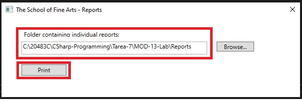

5. Haga clic en **Imprimir**.
6. En el cuadro de diálogo **Guardar salida de impresión como**, busque la carpeta **[Repository Root]\AllFiles\Mod13\Labfiles\Reports\ClassReport**, en el cuadro de texto **Nombre de archivo**, escriba **3CReport**, y luego haga clic en **Guardar**.

- La representación visual a la respuesta del último ejercicio se muestra en la siguiente imagen:

 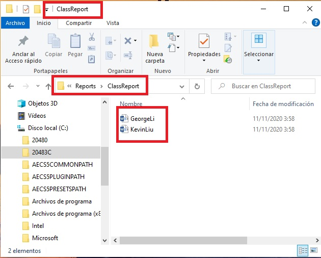

7. En el cuadro de diálogo **The School of Fine Arts**, haga clic en **Aceptar** y luego cierre la aplicación.
8. Abra **Explorador de archivos** y busque la carpeta **[Repository Root]\AllFiles\Mod13\Labfiles\Reports\ClassReport**.
9. Haga doble clic en **ClassReport**.

- La representación visual a la respuesta del último ejercicio se muestra en la siguiente imagen:

 

10. Revise el informe no cifrado y luego cierre el archivo.

- La representación visual a la respuesta del último ejercicio se muestra en la siguiente imagen:

 

> **Resultado:** Después de completar este ejercicio, debería tener un informe compuesto sin cifrar que se generó a partir de los informes cifrados.